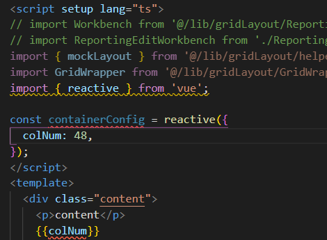

[toc]

### js加密

### getBoundingClientRect

`Element.getBoundingClientRect()` 方法返回元素的大小及其**相对于视口**的位置。

返回值是一个 [`DOMRect`](https://developer.mozilla.org/zh-CN/docs/Web/API/DOMRect) 对象，这个对象是由该元素的 [`getClientRects()`](https://developer.mozilla.org/zh-CN/docs/Web/API/Element/getClientRects) 方法返回的一组矩形的集合，就是该元素的 CSS 边框大小。

返回的结果是包含完整元素的最小矩形，并且拥有`left`, `top`, `right`, `bottom`, `x`, `y`, `width`, 和 `height`这几个以像素为单位的只读属性用于描述整个边框。

除了`width` 和 `height` 以外的属性是**相对于视图窗口的左上角**来计算的。

当计算边界矩形时，会考虑视口区域（或其他可滚动元素）内的滚动操作。

也就是说，**当滚动位置发生了改变，top和left属性值就会随之立即发生变化**（因此，它们的值是相对于视口的，而不是绝对的）。

如果你需要获得相对于整个网页左上角定位的属性值，那么只要给top、left属性值加上**当前的滚动位置**（通过 window.scrollX 和 window.scrollY），这样就可以获取与当前的滚动位置无关的值。

#### getBoundingClientRect 返回负值？

左: `parentRect.top` 与 `parentRect.bottom` 为负值?

右: `clientRect.top` 为负值?

为何??

向下滚动到不在视口内即可达到`top/bottom`为负值的情况

# [DOMRect](https://developer.mozilla.org/zh-CN/docs/Web/API/DOMRect)

一个 **`DOMRect`** 代表一个矩形。

## [属性](https://developer.mozilla.org/zh-CN/docs/Web/API/DOMRect#属性)

`DOMRect` 从其父类 *[`DOMRectReadOnly`](https://developer.mozilla.org/zh-CN/docs/Web/API/DOMRectReadOnly)* 继承属性。不同之处在于它们不再是只读的。

- [`DOMRectReadOnly.x` (en-US)](https://developer.mozilla.org/en-US/docs/Web/API/DOMRectReadOnly/x)

  `DOMRect` 原点的 x 坐标。

- [`DOMRectReadOnly.y` (en-US)](https://developer.mozilla.org/en-US/docs/Web/API/DOMRectReadOnly/y)

  `DOMRect` 原点的 y 坐标。

- [`DOMRectReadOnly.width` (en-US)](https://developer.mozilla.org/en-US/docs/Web/API/DOMRectReadOnly/width)

  `DOMRect` 的宽度。

- [`DOMRectReadOnly.height` (en-US)](https://developer.mozilla.org/en-US/docs/Web/API/DOMRectReadOnly/height)

  `DOMRect` 的高度。

- [`DOMRectReadOnly.top` (en-US)](https://developer.mozilla.org/en-US/docs/Web/API/DOMRectReadOnly/top)

  **返回 `DOMRect` 的顶坐标值（与 `y` 具有相同的值**，如果 `height` 为负值，则为 `y + height` 的值）。

- [`DOMRectReadOnly.right` (en-US)](https://developer.mozilla.org/en-US/docs/Web/API/DOMRectReadOnly/right)

  返回 `DOMRect` 的右坐标值（与 `x + width` 具有相同的值，如果`width` 为负值，则为 `x` 的值）。

- [`DOMRectReadOnly.bottom` (en-US)](https://developer.mozilla.org/en-US/docs/Web/API/DOMRectReadOnly/bottom)

  返回 `DOMRect` 的底坐标值（与 `y + height` 具有相同的值，如果 `height` 为负值，则为 `y` 的值）。

- [`DOMRectReadOnly.left` (en-US)](https://developer.mozilla.org/en-US/docs/Web/API/DOMRectReadOnly/left)

  **返回 `DOMRect` 的左坐标值（与 `x` 具有相同的值**，如果 `width` 为负值，则为 `x + width` 的值）。

### 如何拖动更新布局

dragstart时, 需要正确处理可能影响偏移的变量;

move过程中需要更新`△X/△Y`;

### smart-charts

gridItem **方法** 核对

> autoSize 实际上没有调用

props

watch

### setup & reactive

setup中如何把reactive中的属性转成模板可直接访问的变量

没有办到, 模板中通过`config.col`的方式进行访问

### 动画库

[Animate.css](https://animate.style/)

[animista.net](https://animista.net/play/basic/scale-up)
