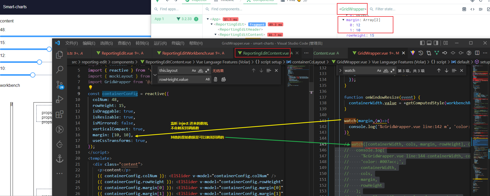
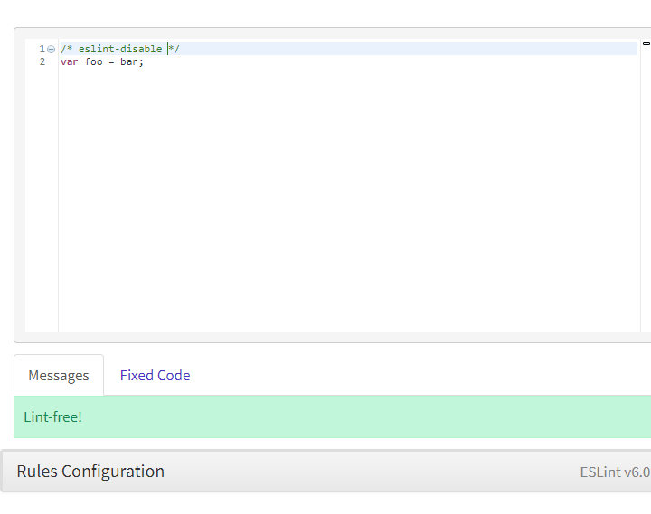

[TOC]

### Vue3 inject 如何使用ts


### Vue3 watch [array] 不生效



更正: 监听的是props传入的数据; 而不是inject

### [#](https://v3.cn.vuejs.org/guide/reactivity-computed-watchers.html#侦听响应式对象)侦听响应式对象

使用侦听器来比较一个数组或对象的值，这些值是响应式的，要求它有一个由值构成的副本。

```js
const numbers = reactive([1, 2, 3, 4])

watch(
  () => [...numbers],
  (numbers, prevNumbers) => {
    console.log(numbers, prevNumbers)
  }
)

numbers.push(5) // logs: [1,2,3,4,5] [1,2,3,4]
```


### 什么是基于MIT协议的开源项目

开源项目是指开源者把代码共享出来，让大家可以学习，分享，讨论，贡献，属于一种共创型的项目。那什么又是 `MIT协议` 呢？它是目前限制最少的开源许可协议之一，只要程序的开发者在修改后的源代码中保留原作者的许可信息即可，说简单点就是鼓励白嫖，想怎么用就怎么用，都是合法合规的。

#### 以怎样的心态去参与别人的开源项目

**顺应你的兴趣，做这个项目中你最感兴趣的东西**

可能一些小伙伴会把在企业里工作的模式代入到开源工作中，会去等待任务的派发，会去询问有没有什么需要帮忙的。实际上这并不符合开源精神的本质，就好像 `antfu` 大佬推特上说的。

> I don't have anything for you. You know yourself the best, and I don't. I can't come up with a task that fits your interest and skills out of nowhere. It's best for you to find the thing you really want to do, and will enjoy working on, by yourself.

大概意思就是，你需要找到你感兴趣的地方，并且去实现它，并让你自己感受到快乐。

要以合作共创的心态去跟每个开源项目相处，友善的，彼此尊重的交流。要知道开发者们使用的开源项目有很大一部分都是开源作者们利用自己的休息，陪老婆孩子的时间做出来的，这样才或多或少的帮助到了开发者们。

遇见问题，跟预期不符合的情况，这个时候可以首先到 `issue` 列表中搜索关键词看看有没有人遇到跟你相同的问题。如果没有，你可以提一个 `issue` 寻求解决方案（务必友善！）。并积极提供报错信息、环境、在线运行信息、期望的结果（可以用图片或者视频的形式）。有能力的可以直接去定位问题所在、直接提供解决方案、或者直接发一个 `pr` 解决，毕竟我们都关注在怎么更好的解决问题上，而不是宣泄自己的不满情绪。


### commit的时候把我的代码全删掉了

CTMD


### /* eslint-disable */ 不生效



官网的例子,  不知道怎么配置成这个吊样的!!!


MD原来是`vue-tsc` 报出来的错.. ts的锅

可以使用`tsc`的注释`// @ts-nocheck`来禁用检查


### [vue-tsc](https://github.com/johnsoncodehk/volar/tree/master/packages/vue-tsc)

Usage: `vue-tsc --noEmit && vite build`

Vue 3 command line Type-Checking tool base on IDE plugin [Volar](https://github.com/johnsoncodehk/volar).


### eslint

https://eslint.org/docs/user-guide/getting-started

https://eslint.cn/docs/user-guide/command-line-interface


- `.eslintignore` http://eslint.cn/docs/user-guide/configuring#eslintignore
  - `.eslintignore` 文件是一个纯文本文件，其中的每一行都是一个 glob 模式表明哪些路径应该忽略检测。
  - 当 ESLint 运行时，在确定哪些文件要检测之前，它会在当前工作目录中查找一个 `.eslintignore` 文件。
