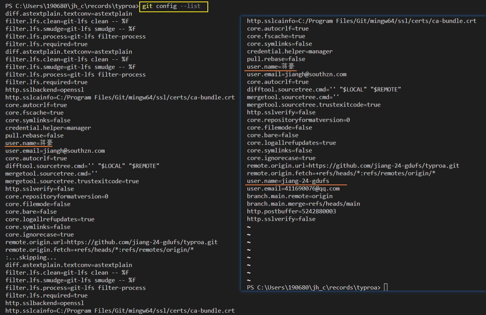
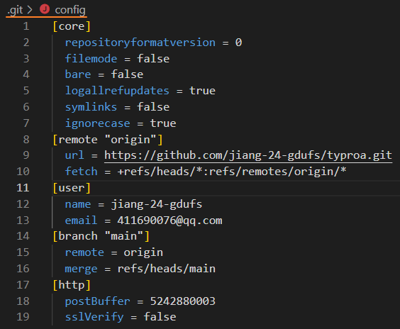
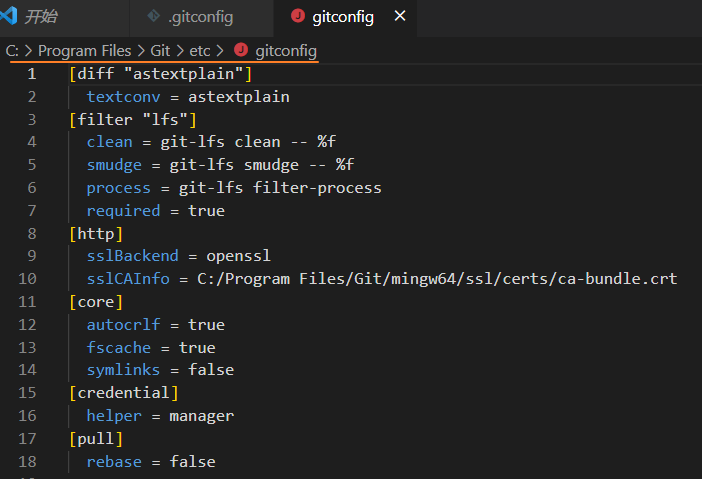

[toc]

### .git hooks


可以使用vscode打开并看其文件的注释指明使用的方法


### iScene-next .gitlab

内部为提交MR/issue的模板`.md`文件


### git config 有多个的用户



在git中，我们使用git config 命令用来配置git的配置文件，git配置级别主要有以下3类：

- 仓库级别 local 【优先级最高】

- 用户级别 global【优先级次之】

- 系统级别 system【优先级最低】

通常：

git **仓库级别对应的配置文件**是当前仓库下的.git/config



git 用户级别对应的配置文件是用户宿主目录下的~/.gitconfig 【宿主目录：C:\Users\\*useName*\.gitconfig】


git系统级别对应的配置文件是git安装目录下的 /etc/gitconfig




**git config -l查看所有的配置信息**，

**依次是系统级别、用户级别、仓库级别**


**git config [--local|--global|--system] -l 查看仓库|用户|系统配置**


#### git config 常用配置选项

- git config -e 编辑配置文件 
  - git config --local -e 编辑仓库级别配置文件
  - git config --global -e 编辑用户级别配置文件
  - git config --system -e 编辑系统级别配置文件

- git config 添加配置项目 
  - git config --global user.email “you@example.com”
  - git config --global user.name “Your Name”


### vscode lf crlf设置

iScene-next/.editorconfig

```
root = true

[*]
charset = utf-8
indent_style = space
indent_size = 2
end_of_line = lf
insert_final_newline = true
trim_trailing_whitespace = true
quote_type = single

```

##### 额外使用插件: EditorConfig for VS Code

This plugin [attempts] to override user/workspace settings with settings found in `.editorconfig` files. 

[EditorConfig](https://editorconfig.org/)


### echart 使用地图组件

先使用geoJSON文件进行注册


### 浏览器调试技巧

console.log() 太多影响调试，但是又不想删除，使用 console.debug()，可以在单独的选项卡查看


### URLSearchParams

[URLSearchParams() - Web API 接口参考 | MDN ](https://developer.mozilla.org/zh-CN/docs/Web/API/URLSearchParams/URLSearchParams)

```
var URLSearchParams = new URLSearchParams(init);
```

### [参数](https://developer.mozilla.org/zh-CN/docs/Web/API/URLSearchParams/URLSearchParams#参数)

- *`init`* 可选

  一个 [`USVString`](https://developer.mozilla.org/zh-CN/docs/Web/API/USVString) 实例，一个 [`URLSearchParams`](https://developer.mozilla.org/zh-CN/docs/Web/API/URLSearchParams) 实例，一个 [`USVString`](https://developer.mozilla.org/zh-CN/docs/Web/API/USVString)，或者一个包含 [`USVString`](https://developer.mozilla.org/zh-CN/docs/Web/API/USVString) 的记录。注意使用一个 `URLSearchParams` 实例作为参数已经被弃用了，以后的浏览器将会只使用一个 `USVString` 作为参数。

```js
// Pass in a string literal
var url = new URL('https://example.com?foo=1&bar=2');
// Retrieve from window.location
var url2 = new URL(window.location);

// Retrieve params via url.search, passed into ctor
var params = new URLSearchParams(url.search);
var params2 = new URLSearchParams(url2.search);

// Pass in a sequence
var params3 = new URLSearchParams([["foo", 1],["bar", 2]]);

// Pass in a record
var params4 = new URLSearchParams({"foo" : 1 , "bar" : 2});
```

```js
const paramsString = 'q=URLUtils.searchParams&topic=api';
const searchParams = new URLSearchParams(paramsString);

// Iterating the search parameters
for (const p of searchParams) {
  console.log(p);
}

searchParams.has('topic') === true;      // true
searchParams.get('topic') === "api";     // true
searchParams.getAll('topic');            // ["api"]
searchParams.get('foo') === null;        // true
searchParams.append('topic', 'webdev');
searchParams.toString();                 // "q=URLUtils.searchParams&topic=api&topic=webdev"
searchParams.set('topic', 'More webdev');
searchParams.toString();                 // "q=URLUtils.searchParams&topic=More+webdev"
searchParams.delete('topic');
searchParams.toString();                 // "q=URLUtils.searchParams"

```


[`URLSearchParams.entries()`](https://developer.mozilla.org/zh-CN/docs/Web/API/URLSearchParams/entries)

 返回一个[`iterator`](https://developer.mozilla.org/zh-CN/docs/Web/JavaScript/Reference/Iteration_protocols)可以遍历所有键/值对的对象。

[`URLSearchParams.get()`](https://developer.mozilla.org/zh-CN/docs/Web/API/URLSearchParams/get)

 获取指定搜索参数的第一个值。

[`URLSearchParams.getAll()`](https://developer.mozilla.org/zh-CN/docs/Web/API/URLSearchParams/getAll)

 获取指定搜索参数的所有值，返回是一个数组。(因为可以有相同的search参数)

