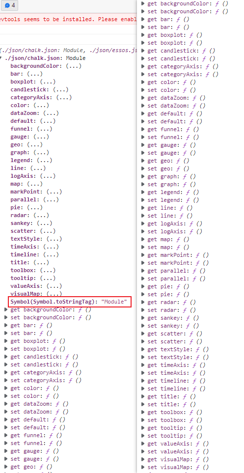
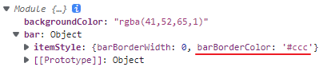

[TOC]

### 使用 node 读取文件夹下所有的文件

```js
const modulesFiles = require.context('./modules', true, /\.js$/) // webpack
const modulesFiles = import.meta.globEager("./module/*.js") // vite
```

[require.context](../_202003/~20200318.md) - webpack文档: [依赖管理 webpack ](https://webpack.docschina.org/guides/dependency-management/#requirecontext)

[import.meta.globEager](https://cn.vitejs.dev/guide/features.html#glob-import)


### Module对象

输出的是**Module对象**


module对象不是普通的对象, 因此在一些函数的结果与类型有关时可能会报错


`import`命令输入的变量都是**只读**的，因为它的本质是输入接口。

导出对象的每一个key都是用get/set拦截的



尝试修改不会报错但不会修改成功..


修改对象中的值




从get/set作用到的key上比较好理解其原因

这种写法很难查错，建议凡是输入的变量，都当作完全只读，不要轻易改变它的属性。
