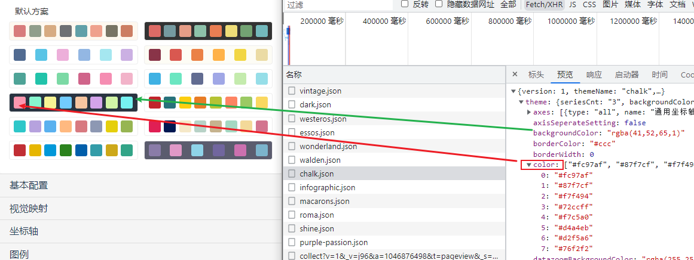

# [RUST](https://www.rust-lang.org/zh-CN/) 

Rust 语言是一种高效、可靠的通用高级语言。其高效不仅限于开发效率，它的执行效率也是令人称赞的，是一种少有的兼顾开发效率和执行效率的语言

- **高性能** - Rust 速度惊人且内存利用率极高。由于没有运行时和垃圾回收，它能够胜任对性能要求特别高的服务，可以在嵌入式设备上运行，还能轻松和其他语言集成。
- **可靠性** - Rust 丰富的类型系统和所有权模型保证了内存安全和线程安全，让您在编译期就能够消除各种各样的错误。
- **生产力** - Rust 拥有出色的文档、友好的编译器和清晰的错误提示信息， 还集成了一流的工具 —— 包管理器和构建工具， 智能地自动补全和类型检验的多编辑器支持， 以及自动格式化代码等等。

## Rust的应用

Rust 语言可以用于开发：

- **传统命令行程序** - Rust 编译器可以直接生成目标可执行程序，不需要任何解释程序。
- **Web 应用** - Rust 可以被编译成 **WebAssembly**，WebAssembly 是一种 JavaScript 的高效替代品。
- **网络服务器** - Rust 用极低的资源消耗做到安全高效，且具备很强的大规模并发处理能力，十分适合开发普通或极端的服务器程序。
- **嵌入式设备** - Rust 同时具有JavaScript 一般的高效开发语法和 C 语言的执行效率，支持底层平台的开发。

[Rust 程序设计语言 - Rust 程序设计语言 简体中文版 (kaisery.github.io)](https://kaisery.github.io/trpl-zh-cn/)

[介绍 - Rust 秘典（死灵书） (purewhite.io)](https://nomicon.purewhite.io/)

创建项目

添加依赖 (build 命令 下载依赖好慢好慢)

### echart 主题编辑

