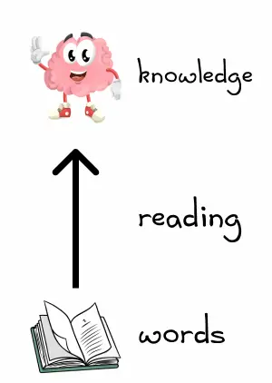

### md中如何在代码中使用反引号 `` ` ``


### md 中如何显示 ```

typora中默认支持, 会将```前添加一个空白符号并转义

````
```
sss
​```
````


````
```
sss
​```
````


### [DocstringAI - Automated Documentation Writer](https://www.docstring.ai/)

一个编辑器插件，只要选中函数代码，就会自动生成对应的 Javadoc 注释，可用来生成文档。

[AI Doc Writer](https://www.mintlify.com/)


### [如何阅读一本书](https://dkb.io/post/how-to-read-a-book)

很多人心目中，阅读书籍的过程是，从页面读取句子，理解以后进入大脑，获取知识，就是下图的箭头方向。



但是，如果你真的想从读书中有所收获，阅读过程应该是这样的：

你从页面读取句子，读了以后提出问题，再回过头读取句子，在书中寻找答案，最终获得知识。


### [WeekToDo | Free Minimalist Weekly Planner App](https://weektodo.me/)


# element-resize-detector

Optimized cross-browser resize listener for elements.


这个库完全不用打包工具真不错. 可以看看**源码实现**


### [如何通过 Git 和 Husky 添加提交钩子并实现代码任务自动化 🧐 - 掘金 (juejin.cn)](https://juejin.cn/post/6904150964266074119)

[Git hooks](https://link.juejin.cn/?target=https%3A%2F%2Fgit-scm.com%2Fdocs%2Fgithooks)是可以设置在 Git 生命周期的[在某些事件下运行](https://link.juejin.cn/?target=https%3A%2F%2Fgit-scm.com%2Fbook%2Fen%2Fv2%2FCustomizing-Git-Git-Hooks)的脚本。 这些事件包括提交的不同阶段，例如在提交之前（pre-commit,提交之后（post-commit）。

[Husky](https://link.juejin.cn?target=https%3A%2F%2Fgithub.com%2Ftypicode%2Fhusky)是一种工具:让我们可以轻松地接入 Git hooks ，并在我们需要的某些阶段运行脚本。

它的工作方式是在`package.json`文件中包含一个对象，该对象通过配置 Husky 来运行我们指定的脚本。 

之后，Husky 负责管理我们的脚本(hooks 将在 Git 生命周期中的哪一点运行)
