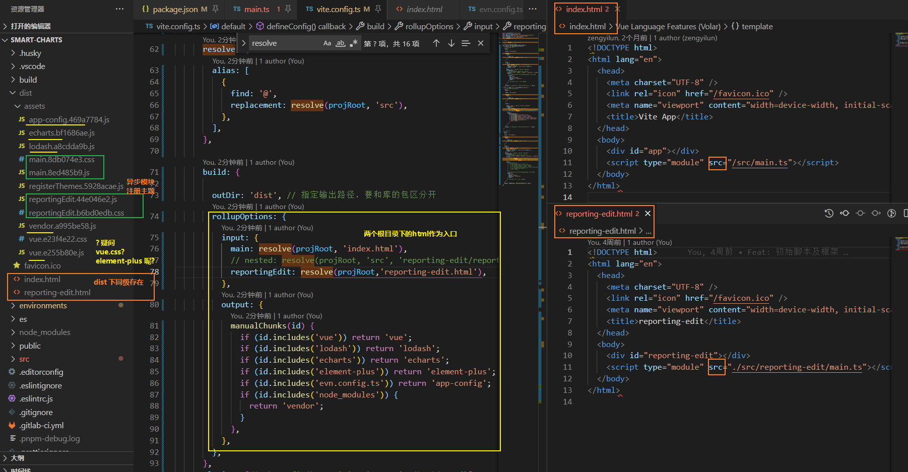

[toc]

### vite 多页面应用 + 打包库模式 如何配置

1. build 成多页面? or build 成库? -- 如何区分?
2. 

#### 打包多页面应用



开发环境时也是同一级吧?? 不过这个是以根目录作为本地服务器的.


详见文档: https://rollupjs.org/guide/en/#input


#### 打包库


#### 完整 vite 配置

```ts
import { defineConfig } from 'vite';
import vue from '@vitejs/plugin-vue';
import AutoImport from 'unplugin-auto-import/vite';
import Components from 'unplugin-vue-components/vite';
import { ElementPlusResolver } from 'unplugin-vue-components/resolvers';
import { projRoot } from './build/paths';
import { resolve } from 'path';

// https://vitejs.dev/config/
export default defineConfig(({ command, mode }) => {
  if (mode === 'lib' && command === 'build') {
    // 打包库到es目录下
    return {
      base: './',
      envDir: 'environments',
      resolve: {
        alias: [
          {
            find: '@',
            replacement: resolve(projRoot, 'src'),
          },
        ],
      },

      build: {
        lib: {
          entry: resolve(__dirname, 'src/lib/main.ts'),
          // name: 'SmartCharts',
          fileName: () => `smart-charts.js`,
          formats: ['es'],
        },
        outDir: 'es', // 指定输出路径，要和库的包区分开
        rollupOptions: {
          // 确保外部化处理那些你不想打包进库的依赖
          external: ['vue', 'lodash', 'echarts', 'interactjs', 'element-resize-detector'],
          output: {
            // 在 UMD 构建模式下为这些外部化的依赖提供一个全局变量
            globals: {
              vue: 'Vue',
              echarts: 'Echarts',
              interactjs: 'interactjs',
              lodash: '_',
            },
            // sourcemap: true, // 输出.map文件
          },
        },
      },
      plugins: [vue()],
    };
  } else if (mode !== 'lib' && command === 'build') {
    // 打包多页面应用到dist目录
    return {
      base: './',
      envDir: 'environments',
      resolve: {
        alias: [
          {
            find: '@',
            replacement: resolve(projRoot, 'src'),
          },
        ],
      },

      build: {
        outDir: 'dist', // 指定输出路径，要和库的包区分开
        rollupOptions: {
          input: {
            main: resolve(projRoot, 'index.html'),
            // reportingEdit: resolve(projRoot, 'src', 'reporting-edit/reporting-edit.html'),
            reportingEdit: resolve(projRoot, 'reporting-edit.html'),
          },
          output: {
            manualChunks(id) {
              if (id.includes('vue')) return 'vue';
              if (id.includes('lodash')) return 'lodash';
              if (id.includes('echarts')) return 'echarts';
              if (id.includes('element-plus')) return 'element-plus';
              if (id.includes('evn.config.ts')) return 'app-config';
              if (id.includes('node_modules')) {
                return 'vendor';
              }
            },
          },
        },
      },
      plugins: [vue()],
    };
  }

  /* 开发环境 */
  return {
    base: './',
    envDir: 'environments',
    resolve: {
      alias: [
        {
          find: '@',
          replacement: resolve(projRoot, 'src'),
        },
      ],
    },

    plugins: [
      vue(),
      AutoImport({
        resolvers: [ElementPlusResolver()],
      }),
      Components({
        resolvers: [ElementPlusResolver({ importStyle: 'sass' })],
      }),
    ],
  };
});
```


### 查看 antfu 大神在 vite 中的 PR

[Pull requrests](https://github.com/vitejs/vite/pulls?q=is%3Apr+author%3Aantfu+is%3Aclosed)

KILL CJS : [#8178](https://github.com/vitejs/vite/pull/8178)
