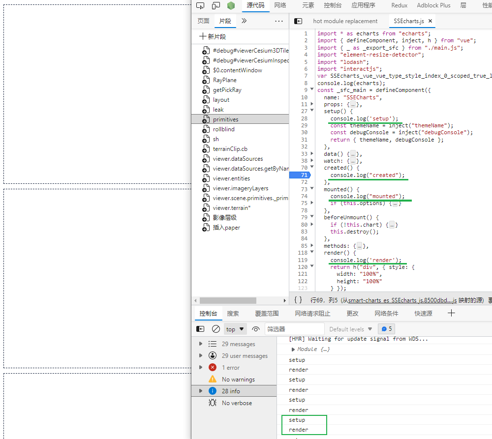

### 可以引用到vite中


### [Git - git-sparse-checkout Documentation (git-scm.com)](https://git-scm.com/docs/git-sparse-checkout)


### vite 打包成库Vue后组件不执行声明周期




是因为废弃了选项式API的配置方式, 使用 CompositionAPI


### 渲染函数如何给元素添加 ref 属性

```ts
render() {
    return h('div', {
      style: {
        width: '100%',
        height: '100%'
      },
      ref: 'echartContainer'

    });
  }
```

