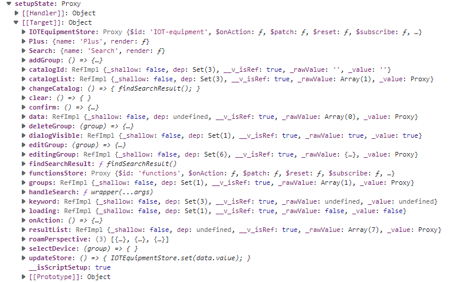

### Vue3 setupState

`getCurrentInstance.setupState`




### ts 如何给一个对象类型修改动态属性

```ts
interface num {type1: number; type2: number}
const b:num = {type1:0, type2:0}
const type = 'type1';
b[type] = 1 / error
```

