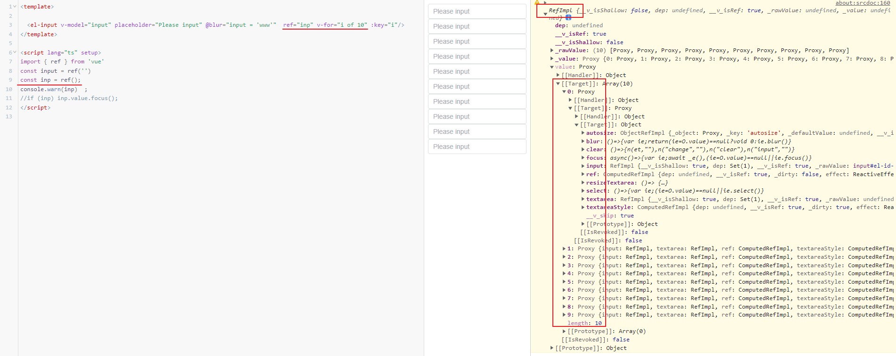

### ref 的动态绑定

`ref` 被用来给元素或子组件注册引用信息。引用信息将会被注册在父组件的 `$refs` 对象上。

- 如果在普通的 DOM 元素上使用，引用指向的就是那个 DOM 元素；
- 如果用在子组件上，引用就指向组件实例：

```html
<!-- 当动态绑定时，我们可以将 ref 定义为回调函数，显式地传递元素或组件实例 -->
<child-component :ref="(el) => child = el"></child-component>
```

关于 ref 注册时机的重要说明：因为 **ref 本身是作为渲染函数的结果**而创建的，**在初始渲染时你不能访问**它们——它们还不存在！

`$refs` 也是非响应式的，因此你不应该试图用它在模板中做数据绑定。


#### v-for循环的绑定呢?



绑定在数组中
