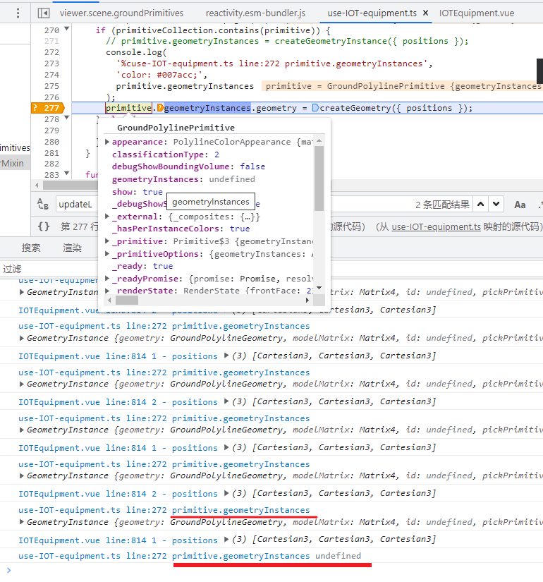

[TOC]

# 多地上调医保最低缴费年限标准，这会带来哪些影响？

　　最近，全国部分省市开始上调医保缴费的最低年限，个人退休时如果没有达到累计缴费年限，需要一次性补足差额，或者继续按月缴费。这也就意味着，很多人在退休之后还需要继续缴纳医保，才可以继续享受医保待遇。

​		在此之前，多个省份的省内最低缴费年限不统一，文件发布后，河北、辽宁、山东、广东等地上调了最低缴费年限，统一上调为男性30年，女性25年。而很多上述省份所属地区的最低缴费年限远远低于这一标准，例如广州职工医保最低缴费15年后就可以享受退休医保待遇。


对工作相对稳定的年轻人，医保缴纳时间延长，影响并不大。按规定，医保缴费大部分由单位承担，个人只需要承担2%。

主要影响两类人：

**一、临近退休的中年人**

原本退休后可以享受免费医保，新政实施后，若退休时还没达到累计缴费年限，按规定需要一次性补足差额，或者继续按月缴费，直至缴满25年或30年，否则将不能享受终身医保待遇。

**二、灵活就业人群**

受疫情等因素影响，目前国内有2亿多灵活就业的人，他们可以参加居民医保，交1年保1年，也可以自由职业者身份参加职工医保，报销比例相对更高，交满一定年限，退休后还能享受终身医保报销。

选择职工医保，单位和个人需要缴纳的费用，都需要自己承担，本身缴费就很高，一年一般要几千元，医保年限延长后，缴费将大大增加。

医保基金相当于我们看病报销费用的蓄水池，不同省份、不同地区，池子里的水多少不同。经济发达、劳动力充足的地方相对多点，反之就会少点。

近些年来，受疫情肆虐、人口老龄化等因素影响，很多地方医保基金出现亏空情况。随着人口老龄化的加重，**医保支出速度必将越来越快**。医保缴费年限延长目前是大势所趋。


### Cesium 动态更新 polyline 的顶点

```ts
function createGroundPolylinePrimitive(options: {
    positions: Cartesian3[];
  }): GroundPolylinePrimitive {
    const geometry = new GroundPolylineGeometry({
      positions: options.positions,
      width: 4.0,
    });
    const geometryInstance = new GeometryInstance({
      geometry,
      attributes: {
        color: ColorGeometryInstanceAttribute.fromColor(Color.YELLOW),
      },
    });
    return new GroundPolylinePrimitive({
      geometryInstances: geometryInstance,
      appearance: new PolylineColorAppearance(),
    });
  }

primitiveCollection.add(groundPolylinePrimitive); // 添加到场景中
//更新时需要移除并重新添加, 为了规避闪烁的问题, 要额外设置一些参数

new Cesium.GroundPolylinePrimitive({
      geometryInstances: geometryInstance,
      appearance: new Cesium.PolylineColorAppearance(),
      asynchronous: false,  // 
      allowPicking: false, // 
    });
```

- asynchronous: 默认为 `true`

  Determines if the primitive will be created asynchronously or block until ready. 

  If false initializeTerrainHeights() must be called first.

- allowPicking: 默认为 `true `

  Determines if the primitive will be created asynchronously or block until ready. 

  If false initializeTerrainHeights() must be called first.

#### Cesium.GroundPolylinePrimitive.initializeTerrainHeights() → Promise.`<void>`

Initializes the minimum and maximum terrain heights. This only needs to be called if you are creating the GroundPolylinePrimitive synchronously.

##### Returns:

A promise that will resolve once the terrain heights have been loaded.


更新方式

1. 更新geometry的时候读取geometryInstances属性结果为undefined, 上一轮迭代还是有对象的

   

   把 Primitive 的构造函数的 releaseGeometryInstances 选项设为 false

   - releaseGeometryInstances: 默认为 `true`

     When `true`, the primitive does not **keep a reference** to the input `geometryInstances` to save memory.

2. 不过顶点几何信息是更新不了的，可以把旧的移除掉，然后再创建; 

   这种方式默认会闪, 需要把 GroundPolylinePrimitive 构造函数的 asynchronous 参数设为 false.

   闪是因为 Cesium 默认用 worker 来生成顶点信息，asynchronous 参数设为 false 之后就会用主线程来创建，就不会闪，不过**顶点个数多**的话，就会导致主线程阻塞

3. 
