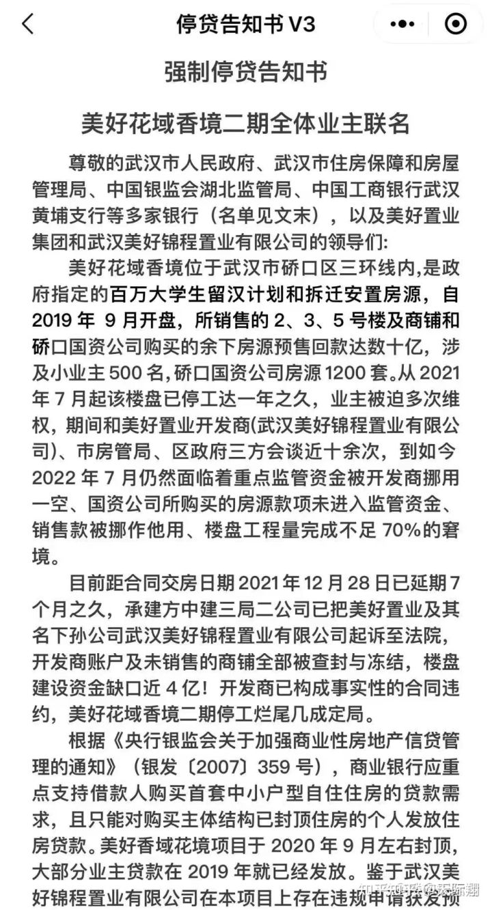

### gacm

一个极简的 Git 帐号管理工具，可以用它方便地切换和管理 Git 用户。

https://github.com/alqmc/gacm


### 业务面对烂尾楼集体停贷




**多家银行发公告回应“停贷”事件：**

**规模较小 总体风险可控**

今天，多家银行发布公告称，对近期网传“停贷”事件中涉及的楼盘展开排查，目前发布公告的银行均表示，涉及的贷款业务规模较小，不会对银行经营构成重大影响。

今天，工、农、中、建、交、邮储六家大型国有商业银行以及兴业银行、平安银行、光大银行等均发布公告，称已经对近期个别房地产企业风险暴露、住房开发项目延期交付情况展开排查，目前已发公告的多家银行均表示，涉及的业务规模较小，整体风险可控。


### 添加模型

```
switch (type) {
      case 'gltf':
      case 'glb':
        return this.addGltf(options);
      case 'json':
        return this.addTileset(options);
}
```


### 获取3Dtileset的空间位置点


**Cesium3Dtileset.boundingSphere.center**
Cartesian3 `{x: -2331354.657911519, y: 5383111.633049561, z: 2495229.869925826}`

```ts
/**
 *  拾取物体判断类型获取id 和 获取所在位置 
 *  model = [picked instanceof Cesium3DTileFeature, picked.primitive instanceof Cesium.Model]
 *  - Cesium3DTilesetFeature.tileset.id
 *  - picked.id.id
 *  mark = picked.primitive instanceof Cesium.Billboard
 *  - picked.id.id
 *  */

let pickedId;
if (picked instanceof Cesium.Cesium3DTileFeature) {
    pickedId = (picked.tileset as any).id;
    position = position = picked.tileset.boundingSphere.center;;
} else if (picked.primitive) {
    if (picked.primitive instanceof Cesium.Model) {
        pickedId = picked.id.id;
        position = Cesium.Matrix4.getTranslation(
            picked.primitive.modelMatrix,
            new Cesium.Cartesian3()
        );
    } else if (picked.primitive instanceof Cesium.Billboard) {
        pickedId = picked.id.id;
        position = picked.primitive.position;
    }
}
```

