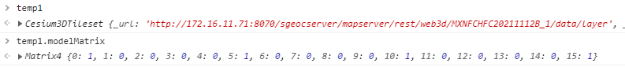
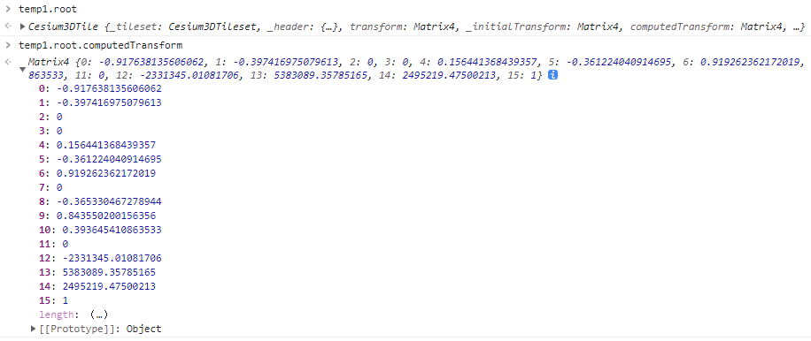

### 3Dtileset 的矩阵





#### transform : [Matrix4](https://cesium.com/learn/cesiumjs/ref-doc/Matrix4.html)[Scene/Cesium3DTile.js 77](https://github.com/CesiumGS/cesium/blob/1.95/Source/Scene/Cesium3DTile.js#L77)

The local transform of this tile.


旋转Cesium3DTileset 俯仰角

```js
// 获取平移点
cartesian = new Cesium.Cartesian3(temp1.root.computedTransform[12],temp1.root.computedTransform[13],temp1.root.computedTransform[14])
// 获取俯仰角
headingPitchRoll = new Cesium.HeadingPitchRoll(
      Cesium.Math.toRadians(60),
      Cesium.Math.toRadians(90),
      Cesium.Math.toRadians(0)
    );
// 生成新矩阵
m = Cesium.Transforms.headingPitchRollToFixedFrame(cartesian, headingPitchRoll, Cesium.Ellipsoid.WGS84, Cesium.Transforms.eastNorthUpToFixedFrame, new Cesium.Matrix4())
// 赋值
temp1.root.transform = m;
```

