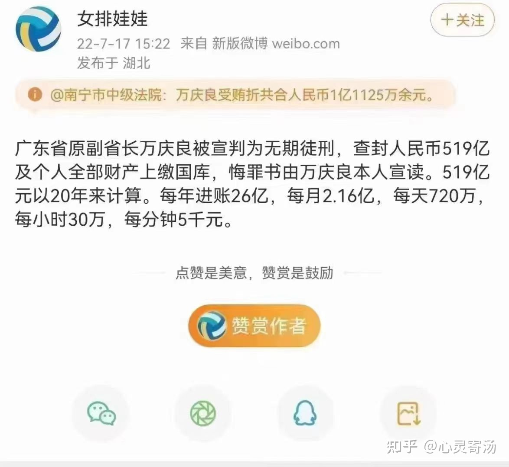

### 骗子套路

但凡等到这些以理财、养老、产业园等各种形式吸金的机构自己暴雷，那受骗者几乎无法维权，拿回投资（本金）的概率为零

这些吸金机构的业务模式要么有致命缺陷，根本无法持续，最终走向旁氏骗局，等资金链断裂后暴雷（非吸）；要么一开始就是以骗钱为目的（诈骗），编织了一系列谎言，等骗够了足够的金钱或者谎言无法持续的时候卷钱跑路

第一种典型的就是P2P，一开始想做银行的业务，学人家吃存贷差，结果运作起来发现吸储成本太高，给客户要20%（最早），给吸储业务团队要10%，给放贷团队要5%，总部职能要用5%，这成本就要40%，结果放出去利率也只有30-40%，还出现了一大堆坏账，老板根本赔不起，于是就用投资人的钱来补窟窿，结果窟窿越来越大，等投资人资金跟不上的时候就暴雷了，这时公司根本没有什么资产，就一堆烂账，投资人维权基本不可能有回款，即使抓到老板，判了刑，一般都是非吸定罪，几十亿的体量可能几年就出来了，投资人一点办法没有

本案的养老公寓是典型的第二种，直接以诈骗为目的，编织了一个养老的美梦，还许诺各种福利优惠，吸收资金之后没有投入具体业务，大部分成本都是以业务提成，运营费用，以及老板挪用等形式分出去了，等投资人反应过来的时候，幕后老板基本已经要么携款潜逃，要么转移资金，洗成干净的存在自己可控制的账户，被抓到了就是被判刑，但钱基本也是要么花光，要么追不回来，但是诈骗好像可以最高判死刑，其实对投资人来说也没实际意义

现在社会上各种名目，各种花样的骗钱形式太多了，而且都是盯着年纪稍大又有一定积蓄的老年人群体，真是用心险恶；我们作为普通人或非专业人士，在面对这些骗子的时候最重要的是不要贪心，不要轻易相信不知名的小机构，多和家人商量，多问问年轻人意见，这样至少能识别大部分的骗子套路





### 好吃懒做

每个人内心天生就是都想好吃懒做，马克吐温都觉得不劳而获才是最有意义的事情。世俗道理教奋斗才有美好，于是你用了20、30年的艰苦发现那都是狗屁。如果勤奋使人富有，牛将是最富有的动物。我们如同奶牛，母鸡一样无时无刻供养着其他人，供养着他们的一切。而他们跟我们却都是一样的物质结构组成。


### 设置 Cesium3DTileset 的转换矩阵

```js
function create3DTilesetMatrix(tilset: Cesium.Cesium3DTileset): Cesium.Matrix4 {
    // 旋转
    const mx = Cesium.Matrix3.fromRotationX(Cesium.Math.toRadians(x));
    const my = Cesium.Matrix3.fromRotationY(Cesium.Math.toRadians(y));
    const mz = Cesium.Matrix3.fromRotationZ(Cesium.Math.toRadians(z));
    const rotationX = Cesium.Matrix4.fromRotationTranslation(mx);
    const rotationY = Cesium.Matrix4.fromRotationTranslation(my);
    const rotationZ = Cesium.Matrix4.fromRotationTranslation(mz);

    const m = Cesium.Matrix4.IDENTITY.clone();

    const scale = Cesium.Matrix4.fromUniformScale(size);
    // 缩放
    Cesium.Matrix4.multiply(m, scale, m);
    // 旋转矩阵相乘
    Cesium.Matrix4.multiply(m, rotationX, m);
    Cesium.Matrix4.multiply(m, rotationY, m);
    Cesium.Matrix4.multiply(m, rotationZ, m);

    // 
    const computedTransform = Cesium.Matrix4.multiply(
      tilset.modelMatrix,
      tilset.root.transform,
      new Cesium.Matrix4()
    );
    const inverseTransform = Cesium.Matrix4.inverse(computedTransform, new Cesium.Matrix4());

    const newModelMatrix = Cesium.Matrix4.multiply(
      inverseTransform,
      tilset.modelMatrix,
      new Cesium.Matrix4()
    );
    Cesium.Matrix4.multiply(m, newModelMatrix, newModelMatrix);
    return Cesium.Matrix4.multiply(computedTransform, newModelMatrix, new Cesium.Matrix4());
  }
tileset.readyPromise.then(tileset=>{
  tileset.modelMatrix =   create3DTilesetMatrix(tileset)
})
```


### 移动 3DTileset

```ts
function updateModelPosition(target: ModelType, position: Cesium.Cartesian3) {
    if (!target) return;
    if (target instanceof Cesium.Cesium3DTileset) {
      // 更新位移, 获取当前位置computedTransfrom与目标位置的差值, 并更新modelMatrix
      const { computedTransform } = target.root;
      const targetTranslation = new Cesium.Cartesian3(
        computedTransform[12],
        computedTransform[13],
        computedTransform[14]
      );
      const movement = Cesium.Cartesian3.subtract(
        position,
        targetTranslation,
        new Cesium.Cartesian3()
      );
      const delta = new Cesium.Matrix4();
      Cesium.Matrix4.setTranslation(delta, movement, delta);
      Cesium.Matrix4.add(target.modelMatrix, delta, target.modelMatrix); // 平移使用add
    }
  }
```


### scene.primitives.remove

移除后的collection在调用 .add 会执行错误, 返回undefined

[cesium/PrimitiveCollection.js at 1.95 · CesiumGS/cesium · GitHub](https://github.com/CesiumGS/cesium/blob/1.95/Source/Scene/PrimitiveCollection.js#L149)

```js
PrimitiveCollection.prototype.remove = function (primitive) {
  // PERFORMANCE_IDEA:  We can obviously make this a lot faster.
  if (this.contains(primitive)) {
    const index = this._primitives.indexOf(primitive);
    if (index !== -1) {
      this._primitives.splice(index, 1);

      delete primitive._external._composites[this._guid];

      if (this.destroyPrimitives) { //
        primitive.destroy();
      }

      return true;
    }
    // else ... this is not possible, I swear.
  }

  return false;
};
```

