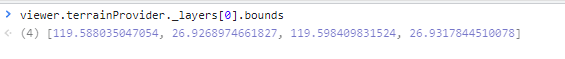
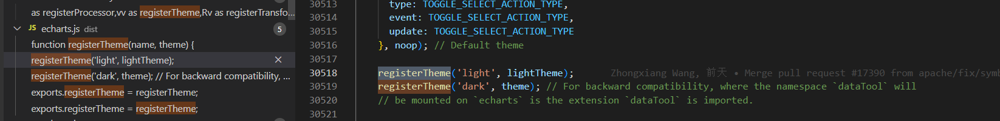

### viewer 定位地形数据

看看有没有这个bounds


### qnm (qunima hhh)

https://github.com/ranyitz/qnm

 A simple cli utility for querying the `node_modules` directory

- **分析依赖** (支持模糊搜索)
- **分析空间占用**
- **分析所有模块**

[node_modules 是该好好治一治了 (qq.com)](https://mp.weixin.qq.com/s/8-_OnWf_Yzq9HrN0KBAh5A)


### echart 默认主题 与 light 主题不相同

ECharts4 开始，除了默认主题外，内置了两套主题，分别为 **light** 和 **dark**。

ECharts5 除了一贯的默认主题外，还内置了`'dark'`主题。可以像这样切换成深色模式：

有点奇怪, 默认并不是 'light'



```ts
// 源码
export function init(
    dom: HTMLElement,
    theme?: string | object,
    opts?: EChartsInitOpts
): EChartsType {
    const isClient = !(opts && opts.ssr);
    if (isClient) {
        const existInstance = getInstanceByDom(dom);
        const chart = new ECharts(dom, theme, opts);
        chart.id = 'ec_' + idBase++;
        instances[chart.id] = chart;

        isClient && modelUtil.setAttribute(dom, DOM_ATTRIBUTE_KEY, chart.id);

        enableConnect(chart);

        lifecycle.trigger('afterinit', chart);

        return chart;
}
```

```ts
class EChart {
    constructor(
            dom: HTMLElement,
            // Theme name or themeOption.
            theme?: string | ThemeOption,
            opts?: EChartsInitOpts
        ) {
            super(new ECEventProcessor());

            opts = opts || {};

            // Get theme by name
            if (isString(theme)) {
                theme = themeStorage[theme] as object;
            }
    }
}
```

从注册的主题Store中读取, 没有注册则返回undefined, 则会应用默认样式
