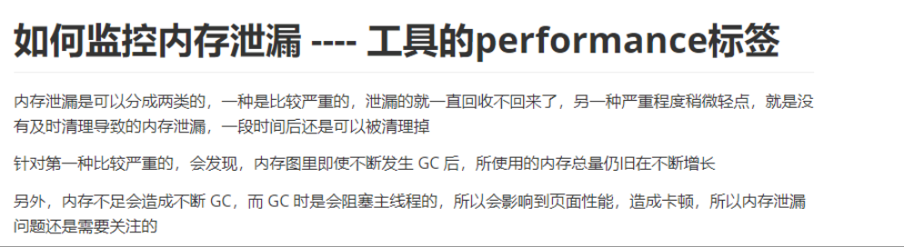

### Cesium 打包后启动服务

**1.傻瓜式打包**
 执行命令：npm run makeZipFile
 会在根目录生成一个"Cesium-<版本号>.zip"压缩包，与官方提供的分发包是一模一样的。
 **2.发布式打包**
 执行命令：npm run release
 在根目录下生成Build文件夹，内含Cesium子目录、CesiumUnminified子目录、Documentation子目录。
 release命令会生成和官方分发包一样的两个版本API，即Cesium子目录、CesiumUnminified子目录，分别代表
 Cesium：删除debug信息，压缩代码
 CesiumUnminified：不删除debug信息，不压缩代码。
 这个命令执行了combine、minifyRelease、generateDocumentation三个命令，代码中也是这么实现的
 **3.启动cesium自己的本地开发者站点&文档服务**
 执行命令：npm run start
 **注意：**此命令执行后会弹出一个首页（无首页先release再start），这个服务是使用express架设起来的，端口为8080，在根目录的server.cjs中设置端口号
 **4.npm run build**
 大部分项目执行这个命令都是打包生成一个dist文件夹，并且把编译压缩优化（生产环境下）的js放进去。但是Cesium却是在Source目录下生成了一个Cesium.js文件（默认Source文件夹中没有这个js文件），这里的Cesium.js文件并不是真正意义上对外输出（生产环境下）的js文件，仅仅是把Cesium源码中一千两百多个js文件做了一下引用。。所以这个Cesium.js也就相当于一个索引。这样外界使用时，只要引用这么一个Cesium.js文件，就会通过AMD模式自动引入其他Cesium的源码js文件来使用。
 **5.npm run minifyRelease**
 这个命令会把Source目录下所有的js文件打包放到Build/Cesium/目录下，删除debug信息，并且生成一个真正的供生产环境下来使用的Cesium.js文件。编译速度比较慢，具体解释看开头我参考的博文，解释的很清楚，怕丢了，我截图了一下。

 根据上面的解释，再看minify，combine，combineRelease就很清楚了。
**6.npm run combine**
 命令则是既不压缩优化，也不去掉调试信息。相当于生成具备调试信息的js文件。

### 桌面show

[活动--CHH第三届桌面Show活动 - 文化 - Chiphell - 分享与交流用户体验](https://www.chiphell.com/article-25725-1.html)

### H264

[H.264 is magic: a technical walkthrough of a remarkable technology. (sidbala.com)](https://sidbala.com/h-264-is-magic/)

### 世界的未来是一个火药桶

卡森·布洛克（Carson Block）是一个美国人，今年43岁。

2007年，他搬到上海，发现很多中国公司财务造假。他就开了一家咨询公司，根据成语"浑水摸鱼"起名为"浑水投资"，专门做空财务造假的中国公司。瑞幸咖啡就是他揭露的。

最近，他接受[采访](https://finance.sina.com.cn/stock/usstock/clues/hg/2020-07-08/doc-iirczymm0128209.shtml)，说现在的美国经济就像"一个巨大的、打破历史记录的火药桶"。

他的意思是，美国无限制地发行货币来挽救经济，结果钱都流入了股市，股市创出新高，好像疫情根本不存在。未来一定会出现大幅度的货币贬值，造成可怕的后果。

有一个朋友总在说，你最应该做的事情就是买房，而且是贷款买房，最近他又开始说了。理由是现在一个月还贷一万元，好像很多钱的样子；但过了20年，你还是每月还贷一万元，那时由于货币贬值，这点钱已经不足挂齿了。只要货币一直在贬值，而房子不贬值（通常如此），那么银行贷款就是对你的补助。

每当这种时候，我就觉得，经济学毫无用处。有了那么多经济学家，经济危机照样发生；明知货币贬值会严重伤害那些依靠养老金生活的人，货币贬值照样发生。

[75行代码入门 WebGL](https://avikdas.com/2020/07/08/barebones-webgl-in-75-lines-of-code.html)（英文）

WebGL 是浏览器对 OpenGL API 的调用接口，可以在浏览器里面实现 3D 动画。本文用一个简短的例子，介绍了这个 API。这只是一篇简介，另有[完整的 WebGL 教程](https://www.toptal.com/javascript/3d-graphics-a-webgl-tutorial)。

[为什么我停止使用 Redux](https://dev.to/g_abud/why-i-quit-redux-1knl)（英文）

作者认为，Redux 被赋予了太多的使命，变成了一个全面的解决方案，导致越来越复杂和难用。他介绍了两个简单的替代库。

[hugo-leetcode-dashboard](https://github.com/lryong/hugo-leetcode-dashboard)

一个将个人的 LeetCode 答题记录汇总的工具，展示题号、题目、你的解答、 题目通过率等，然后一键生成一个 Hugo 网站。

### 驾驶证过期换证

驾驶证到期换证，2022年6月经验分享

主要说广州本地的，异地的不了解情况。

不用去车管所，体检在医院完成，照片可以在12123上传，办理过程也在12123app

1、体检

下载app12123里面会有指引，去哪里体检。

体检内容很简单，四肢，可带眼镜的视力，色盲。

体检完，医院会把资料上传到系统。

2、12123app网上办理和上传照片

    app里面上传和拍照，不用去照相馆也可以。上传照片的格式要求，按小一寸照片的规格，
    
    最后的照片大小是70k以内。具体照片格式要求没公布，仅分享自己的经验

3、付款和邮寄

    付款也是在app里付款10元工本费，另外是20元邮递到付。

营销宣传领域苹果从来没输过，造成macos很牛的样子。实际体验，搭载macos的电脑你既不能当游戏机用，也不能当稍微复杂生产力工具用，对，就是被营销吹上天的生产力一词。

### 可选奶品牌

