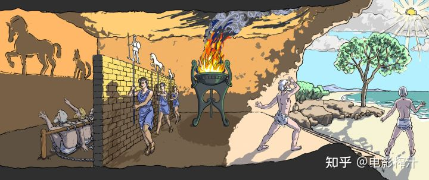
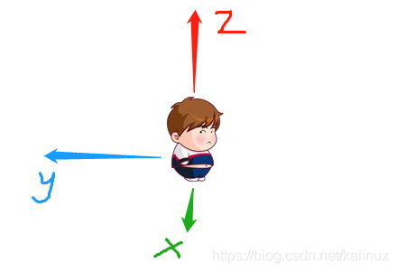

### 柏拉图“洞穴寓言”



寓言讲的是在一个洞穴中，一群囚犯从小就被锁在这里，没有自由。

他们身后有一堵墙，面前有一堵墙，所以这些人只能看到前面墙上的东西，看不到真实世界。

有人会在他们身后的火堆前模拟现实世界的事物经过，也会发出声音。

这些囚犯一辈子看到的都是墙上模糊的投影，所以他们认为这些投影就是“真实世界”。

柏拉图还指出，操控那堆火（既是人造光也是某种理念）和投影的人就是少数艺术家。

柏拉图的这个寓言还有下文，他说就算有个囚犯侥幸逃跑了，或者被释放了，但因为他已经习惯看那些模糊的投影，即便逃到真正的真实世界，也会不习惯真实世界刺眼的阳光，甚至不认为那就是真实，反而还会回到他已经习惯的洞穴。


### Iso8601 时间标准

When dates are represented with numbers they can be interpreted in different ways. For example, 01/05/12 could mean January 5, 2012, or May 1, 2012. 

On an individual level this uncertainty can be very frustrating, in a business context it can be very expensive.

ISO 8601通过制定国际商定的日期表示方式来解决这种不确定性

YYYY-MM-DD

ISO 8601 can be used by anyone who wants to use a standardized way of presenting:

- Date
- Time of day
- Coordinated Universal Time (UTC)
- Local time with offset to UTC
- Date and time
- Time intervals
- Recurring time intervals


### markManage 添加svg图片失败

img=svg,写到canvas中再添加到billboard中

"Failed to execute 'texImage2D' on 'WebGLRenderingContext': tainted canvases may not be loded."

设置跨域

```ts
const canvas = document.createElement('canvas');
const cxt = canvas.getContext('2d');
const img = new Image();
img.crossOrigin = 'anonyous'; // 解决图标跨域问题
img.src = labelStyle.image;
img.onload = () => {
    canvas.width = img.width;
    canvas.height = img.height;
    cxt!.drawImage(img, 0, 0, img.width, img.height);
    const entity = this.addBillboard(position, canvas, id, labelStyle);
};
```


### 锁定相机视角

```js
function _setview(clock) {
    switch (this._perspective) {
        case FlyPerspective.FIRST:
            // 获取当前时间视角
            const matrix = this._getModelMatrix();

            if (matrix) {
                this.viewer.camera.lookAtTransform(
                    matrix,
                    new Cesium.Cartesian3(-this._optCamera.followX, 0, this._optCamera.followZ)
                );
            }
            break;
        case FlyPerspective.THIRD:
            this.viewer.trackedEntity = this.flyPath;
            break;
        case FlyPerspective.FREE:
            this.viewer.camera._setTransform(Cesium.Matrix4.IDENTITY);
            this.viewer.trackedEntity = undefined;
            break;
    }
}
```

```js
/**
   * 停止飞行
   * @param {Boolean} [reset=true] 是否回到起点，默认true
   */
function  stop(reset = true) {
    const cesiumWidget = this.viewer.cesiumWidget;
    cesiumWidget.clock.shouldAnimate = false;
    if (reset && this.startTime) {
      this.viewer.clock.currentTime = this.startTime.clone();
      this.viewer.trackedEntity = this.flyPath;
      setTimeout(() => {
        if (this.viewer) this.viewer.trackedEntity = undefined;
      }, 100);
    } else {
        // 还原视角
      if (this._perspective === FlyPerspective.FIRST) {
        this.viewer.camera.lookAtTransform(Cesium.Matrix4.IDENTITY);
      } else {
        this.viewer.trackedEntity = undefined;
      }
    }

    this.viewer.clock.onTick.removeEventListener(this._setview, this);
  }
```


### HeadingPitchRange



heading就是以z轴为中心绕着圈跑，顺时针是正的

pitch就是以y轴为中心，绕着y轴跑圈儿，顺时针是正

然后我设置pitch = -90 ，理论上现在该看车顶了吧


#### HeadingPitchRoll(heading, pitch, roll)
