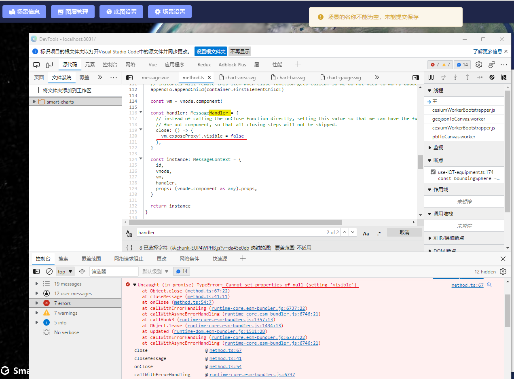

### element-plus 

Message 模块又报错, 不能自己close

https://github.com/element-plus/element-plus/issues/8796

element-plus 说是 Vue 版本的问题

目前排查不是`element-plus`组件的原因，是vue在综上提到的版本`transtion`组件存在问题，而ElMessage组件是用到了`transition`组件。

使用vue `3.2.32`后续版本测试可以修复

### 路径分析

调用高德地图API
