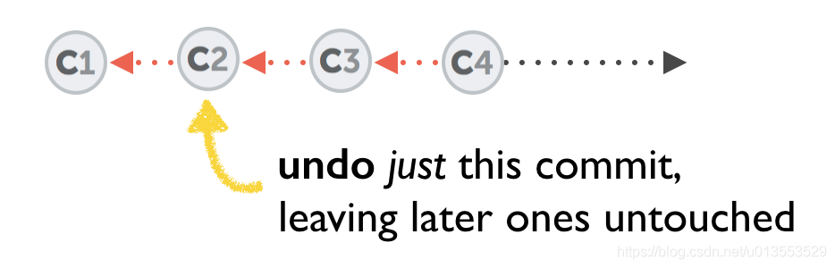
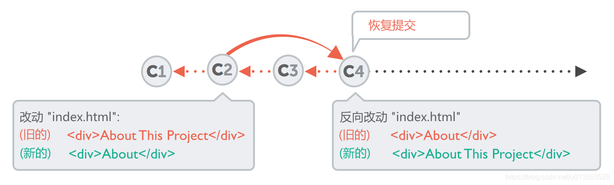
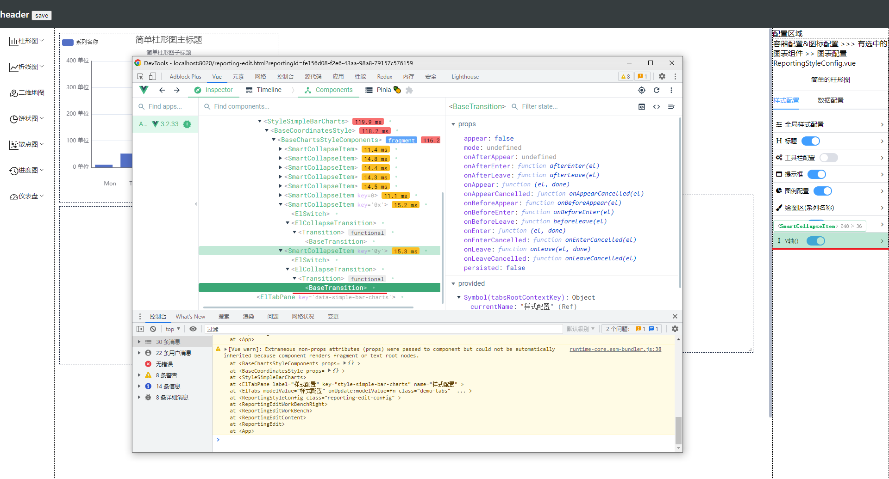
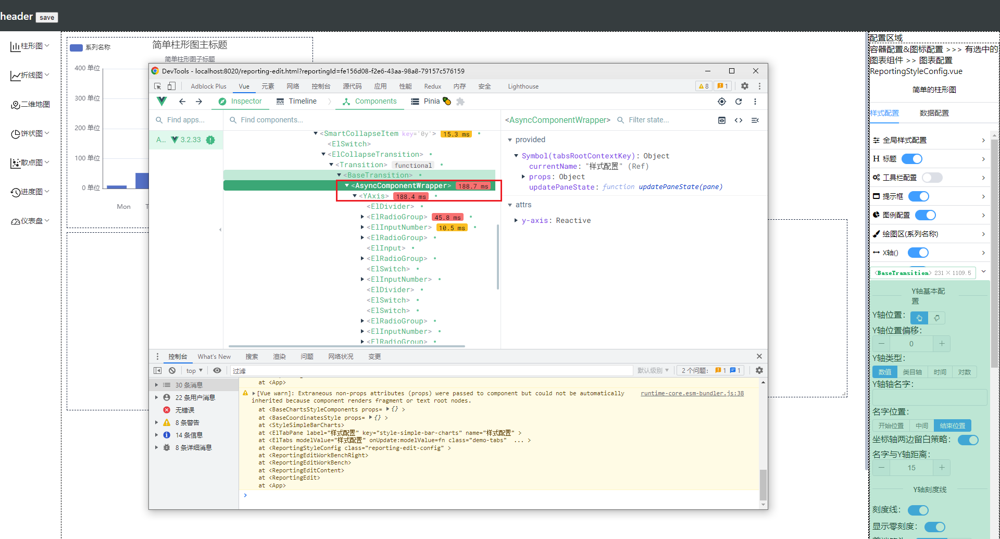
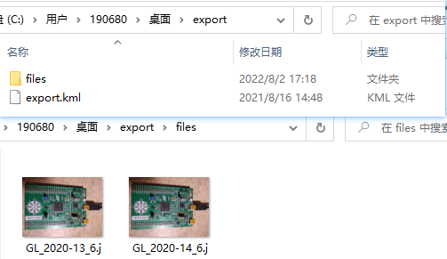

### git 如何丢掉一个commit节点

`reset --soft`  & recommit

`revert`

## 撤销某一个commit



如上图所示，撤销 C2 这个commit，但是保留C3、C4的改动。在这种情况下，可以使用`git revert`命令。
`git revert`命令并不会删除C2，而是创建一个新的commit，将C2中的改动再改回去。如下图所示。

在这个例子中，在revert之前是没有C4 commit的，假设C2的commit id为 0ad5a7a6，执行`git revert 0ad5a7a6`则会创建C4 commit。




`rebase`

## 从提交历史中删掉一个commit

如下图所示，从提交历史中删除C2 commit，而保留C3、C4的改动。


出现这种情况的时候，可能是因为我不小心提交了关键的、不应该公开的信息（例如密码、私钥），我需要从历史中把commit删掉。此时，就需要用到最强大也最危险的工具`git rebase -i`。

例如，我有3次提交，使用`git log`命令显示如下：

```
$ git log --pretty=format:"%h %s" HEAD~3..HEAD
a5f4a0d added cat-file
310154e updated README formatting and added blame
f7f3f6d changed my name a bit
1234
```

我想删除『a5f4a0d added cat-file』这个提交。

执行`git rebase -i HEAD~3`命令，结果如下：

```
$ git rebase -i HEAD~3
pick f7f3f6d changed my name a bit
pick 310154e updated README formatting and added blame
pick a5f4a0d added cat-file
1234
```

删除commit a5f4a0d，就是把『pick a5f4a0d added cat-file』这一行删掉。如下，

```
pick f7f3f6d changed my name a bit
pick 310154e updated README formatting and added blame
12
```

保存并退出编辑器，git就把 commit a5f4a0d删掉了。


**验证确实有效**

[How can I delete a commit in Git? | Learn Version Control with Git (git-tower.com)](https://www.git-tower.com/learn/git/faq/delete-commits)

[How can I undo a specific old commit? | Learn Version Control with Git (git-tower.com)](https://www.git-tower.com/learn/git/faq/undo-revert-old-commit)

[Git - Rewriting History (git-scm.com)](https://git-scm.com/book/en/v2/Git-Tools-Rewriting-History#Changing-Multiple-Commit-Messages)


### git rebase 修改过去的提交信息, 

vim: `pick` -> `reword`


### iscene-next 只能用yarn 安装依赖


### Vue3 如何确定组件是异步加载的





- Async 包裹

- 有没有什么日志输出呢


### kml 数据

code 打开  可以自己构造数据

```
<?xml version="1.0" encoding="UTF-8"?>
<kml xmlns="http://www.opengis.net/kml/2.2" xmlns:gx="http://www.google.com/kml/ext/2.2" xmlns:kml="http://www.opengis.net/kml/2.2" xmlns:atom="http://www.w3.org/2005/Atom">
<Document>
	<name>历年土地出让信息200711.kmz</name>
	<Style id="sh_star0">
		<IconStyle>
			<color>ff07ff80</color>
			<scale>0.945455</scale>
			<Icon>
				<href>https://maps.google.com/mapfiles/kml/shapes/star.png</href>
			</Icon>
		</IconStyle>
		<LabelStyle>
			<color>ffaffed0</color>
		</LabelStyle>
	</Style>
	<Style id="sn_star1">
		<IconStyle>
			<color>ff07ff80</color>
			<scale>0.8</scale>
			<Icon>
				<href>https://maps.google.com/mapfiles/kml/shapes/star.png</href>
			</Icon>
		</IconStyle>
		<LabelStyle>
			<color>ffaffed0</color>
		</LabelStyle>
	</Style>
	<StyleMap id="msn_star">
		<Pair>
			<key>normal</key>
			<styleUrl>#sn_star1</styleUrl>
		</Pair>
		<Pair>
			<key>highlight</key>
			<styleUrl>#sh_star0</styleUrl>
		</Pair>
	</StyleMap>
	<Folder id="02077A53441B76A44033">
		<name>历年土地出让信息200711</name>
		<open>1</open>
		<Folder id="310A37AB5A1B76A44C66">
			<name>2020_上半年土地出让信息</name>
			<open>1</open>
			<Folder id="034ACBD0081B76A45649">
				<name>鼓楼区</name>
				<open>1</open>
				<Placemark id="0944A1EEF91B76A4609B">
					<name>鼓楼_2020-13号</name>
					<description><![CDATA[]]></description>
					<LookAt>
						<longitude>119.2886849918627</longitude>
						<latitude>26.11263179488641</latitude>
						<altitude>0</altitude>
						<heading>-2.014896216198736</heading>
						<tilt>0</tilt>
						<range>1894.468021616241</range>
						<gx:altitudeMode>relativeToSeaFloor</gx:altitudeMode>
					</LookAt>
					<styleUrl>#msn_star</styleUrl>
					<Point>
						<gx:drawOrder>1</gx:drawOrder>
						<coordinates>119.2891221568988,26.11342263269799,0</coordinates>
					</Point>
				</Placemark>
				<Placemark id="01BFB354211B76A460B6">
					<name>鼓楼_2020-14号</name>
					<description><![CDATA[]]></description>
					<LookAt>
						<longitude>119.2935068515232</longitude>
						<latitude>26.11713348123356</latitude>
						<altitude>0</altitude>
						<heading>-2.339622681789368</heading>
						<tilt>0</tilt>
						<range>1899.532723134264</range>
						<gx:altitudeMode>relativeToSeaFloor</gx:altitudeMode>
					</LookAt>
					<styleUrl>#msn_star</styleUrl>
					<Point>
						<gx:drawOrder>1</gx:drawOrder>
						<coordinates>119.2921529248133,26.11781190626049,0</coordinates>
					</Point>
				</Placemark>
			</Folder>
		</Folder>
	</Folder>
</Document>
</kml>

```

文件结构


