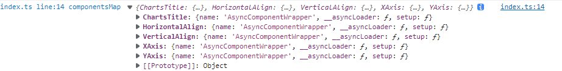

### 使用 glob 动态导入某个路径下所有的vue(异步)组件

```ts
import { defineAsyncComponent } from "vue";

const modules = import.meta.glob('./*/*.vue');
const componentNameReg = /.*\/(.*)\.vue$/
const componentsMap:{[key: string]: any} = {}

for (const [path, importFunc] of Object.entries(modules)) {

  const matches = path.match(componentNameReg);
  if (matches) {

    componentsMap[matches[1]] = defineAsyncComponent(importFunc)}
}
console.log('%cindex.ts line:14 componentsMap', 'color: #007acc;', componentsMap);
export default componentsMap
```


