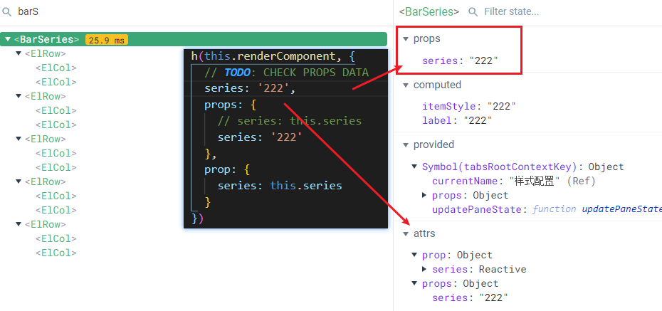

### 外交部讲话有点厉害

**问**：2022年8月3日，七国集团外长及欧盟外交与安全政策高级代表发表声明，称中方针对佩洛西访台采取的行动可能升高紧张局势，造成地区不稳，呼吁中共不要以武力单方面改变现状并通过和平方式解决两岸分歧。中方对此有何评论？
**答**：什么叫恶？什么叫无耻？如果世界上还有人不明白，请看看G7和欧盟外长的声明，这就是现实中万恶无耻的活生生标本。作恶多端，纠集同伙，变本加厉，万恶之尤。助纣为虐，沆瀣一气，指鹿为马，无耻之极。世界上为什么有那么多战争动荡不安定？就是因为有这些恶，还有这些无耻。
什么叫“基于规则的国际秩序”？联合国宪章宗旨没有这一条，只有关于国家主权和领土完整不容侵犯的明确规定。台湾是中国领土的一部分，插手台湾事务，就是侵犯中国的主权。G7和欧盟外长声明里的所谓“基于规则的国际秩序”，只能是自己可以作恶、别人不能还手的强盗逻辑。
台海现状为什么被改变？万恶之尤是境外敌对势力和台岛内分裂势力，他们必须对此负完全责任。对中国的栽赃抹黑掩盖不了有人企图把台湾从中国分裂出去的险恶用心。
台海局势变成这样，是谁威胁了谁？又是谁挑衅了谁？是中国的领土完整受到严重威胁，是中国的主权受到严重挑衅。面对赤裸裸挑衅，中国人民绝不可能吞下这一苦果，中国政府捍卫主权和领土完整的举措完全必要，十分恰当。这是14亿中国人民的共同强烈愿望。
G7及欧盟外长声明谈及对台海和平稳定的共同承诺，这是什么？又要做什么？另外请大家注意，他们关于一个中国政策后面括号中还有个注明：在可适用的情形下。那我要问，什么是不可适用的情形？你们准备做什么？对你们虚化掏空一个中国政策的行径，对你们的阴谋企图，中国人民早就擦亮了眼睛。我们会倍加警惕、严阵以待。
百年前有八国联军入侵中国。今天G7+1又是八方。想搞新八国联军吗？你们以为中国还是过去的中国吗？你们还能得逞吗？你们还能为所欲为吗？中国人民早已不再受列强欺凌和摆布。台湾事务纯属中国内政，是中国主权范围内的事。当今世界，已经不是西方列强可以肆意横行的时代。台湾的事怎么办，14亿中国人民说了算。
正告你们，人不犯我，我不犯人；人若犯我，我必犯人。任何侵犯中国主权和领土完整的行径，中国人民必将加倍奉还

[华春莹](https://www.zhihu.com/search?q=华春莹&search_source=Entity&hybrid_search_source=Entity&hybrid_search_extra={"sourceType"%3A"answer"%2C"sourceId"%3A2609975276})首先指出：“七国集团外长的这份声明让人有时空混乱的感觉，这几个国家的外长显然还以为自己生活在120多年前的八国联军的时代。今日世界早已不是帝国主义列强可以在中国大地上耀武扬威、为所欲为的世界，今天的中国也不是100多年前任人欺负、任人宰割的旧中国，他们的列强梦应该醒醒了！”
华春莹强调了四点：第一，中国有权维护主权和领土完整。当前台海局势持续紧张，根本原因是美方不顾中方强烈反对和严正交涉，纵容美国政府三号人物乘坐美国军机窜访中国台湾地区。这严重损害国际关系基本原则，严重损害中国主权领土完整。中方早已反复、明确表明坚决反对的严正立场，并且强调中方坚决反对“台独”分裂和外部势力干涉，绝不会为任何形式的“台独”势力留下任何空间。如若美方一意孤行，由此造成一切后果由美方全部负责。
勿谓言之不预也。美方恶意挑衅在先，中方正当防卫在后。面对公然侵犯中国主权和领土完整的各种挑衅，中方采取反制措施都是正当的，也必然是坚决的、有力的。对此，世界看得非常清楚。上百个国家已经在第一时间发出了公正的声音，强调应该坚持一个中国原则，支持中方维护自身主权和领土完整。如果这几个国家真的关心台海和平统一，他们就应该早一点劝美方不要对中国采取危险鲁莽、不负责任的挑衅。佩洛西窜访台湾之前，他们装聋作哑默不作声，现在却跳出来对中国采取这一行动横加指责，他们的虚伪和丑陋的嘴脸暴露无遗。
第二，一个中国原则是七国同中国建交的重要政治基础。中方一贯坚决反对建交国与台湾地区进行任何形式的官方往来。七国政府的立法机构负责人理应遵守政府承认和承诺的外交政策。如果有关国家政府对其违反本国外交政策行为无所作为，放任自流，只能证明其政治功能治理无效，在国际上背信弃义。在最严重的问题上玩弄文字游戏或者是[偷梁换柱](https://www.zhihu.com/search?q=偷梁换柱&search_source=Entity&hybrid_search_source=Entity&hybrid_search_extra={"sourceType"%3A"answer"%2C"sourceId"%3A2609975276})，没有任何意义，也不会有任何效果。
第三，一个中国原则只有一个版本一种含义，那就是世界上只有一个中国，台湾是中国的一部分，[中华人民共和国政府](https://www.zhihu.com/search?q=中华人民共和国政府&search_source=Entity&hybrid_search_source=Entity&hybrid_search_extra={"sourceType"%3A"answer"%2C"sourceId"%3A2609975276})是代表全中国的唯一合法政府。这是1971年第二十六届联大通过的第2758号决议明确规定的，是国际关系基本准则，也是包括七国在内的181个国家同中国建立和发展外交关系的政治基础，不允许私塞任何前提后缀，也不允许任何歪读、曲解。
第四，无论从历史还是现实看，以美国为首的七国集团成员都是侵略胁迫的形象代言人。说到“侵略”或者“胁迫”，这顶帽子还请七国集团的国家自己来戴。这七国不要忘了，他们也代表不了[国际社会](https://www.zhihu.com/search?q=国际社会&search_source=Entity&hybrid_search_source=Entity&hybrid_search_extra={"sourceType"%3A"answer"%2C"sourceId"%3A2609975276})，他们的观点只是极少数。正如新加坡学者马凯硕日前指出的，七国集团在国际上大搞专制独裁，这一点在这个声明当中也得到充分的体现。
华春莹最后说：“我想再次提醒这7个国家的外长，现在已经是21世纪的第三个10年了，如果脑子还停留在100多年前，是要出问题的。”


### [Browser in the Dark: flashlights with CSS and canvas (voussoir.net)](https://voussoir.net/writing/browser_in_the_dark)

CSS 手电筒效果


# 如何维护一个开源项目

开源项目的发展也大体遵循着强者恒强的马太定律：一个特定的垂直领域往往只能容下一到两个广泛使用的项目。

所以在开始一个项目之前我们就必须考虑清楚：

- 项目想要哪个领域发展？
- 这个领域都有哪些重要玩家？
- 我们项目有哪些不可替代的优势？

如果我们不能够比现有项目做的更好，不如直接放弃加入现有项目。否则我们就需要进一步对领域进行细分，找到自己的差异化优势。


### 思科认证

网络


### 人口老龄化

制定二胎三胎来保出生率本身就是异想天开，改善可以，但效果一定有限

真正出问题的是年轻群体婚育意愿和一胎问题

经济发展旁氏化的是总把债务和压力丢给后来者，后来者承担或者不承担都会导致婚育率低下

接的话就得不停的卷来维系债务偿还，不太敢生，不接低欲望社会也不会生

怪现象是，不要说解决生育率问题，甚至没几个人把生育低的主要原因提出来

生育低最主要的原因不是二胎三胎意愿不强，而是一胎占比过低，连一半都不到

各省市的三胎额外增加[生育假](https://www.zhihu.com/search?q=生育假&search_source=Entity&hybrid_search_source=Entity&hybrid_search_extra={"sourceType"%3A"answer"%2C"sourceId"%3A2610685017})和补贴这个事情就非常离奇，要生三胎不奖励也会生，蚂蚁小了也是肉

三胎群体毕竟是极少数，也不会掀起太大的波浪，希望不要是最后把极度稀缺的资源用在了个别小利益集团的额外补贴上

> 不举子”是宋朝时期的社会现象，也叫“生子不举”，即生了孩子不养育，把婴溺死或扔掉。宋朝的沉重税负是宋朝出现广泛的杀婴现象、杀婴习俗的原因之一

[(6 封私信) 29 省份公布最新出生数据，二胎、三胎政策下出生人口仍在下滑，你认为造成这一现象的主要原因有哪些？ - 知乎 (zhihu.com)](https://www.zhihu.com/question/546783174)

[经济旁氏化下的灰犀牛-人口线 - 知乎 (zhihu.com)](https://zhuanlan.zhihu.com/p/430810296)


### 渲染函数的参数

Vue2 [#](https://cn.vuejs.org/v2/guide/render-function.html#%E6%B7%B1%E5%85%A5%E6%95%B0%E6%8D%AE%E5%AF%B9%E8%B1%A1) / Vue3 [#](https://v3.cn.vuejs.org/guide/migration/render-function-api.html#vnode-prop-%E6%A0%BC%E5%BC%8F%E5%8C%96)

```js
{
  // 与 `v-bind:class` 的 API 相同，
  // 接受一个字符串、对象或字符串和对象组成的数组
  'class': {
    foo: true,
    bar: false
  },
  // 与 `v-bind:style` 的 API 相同，
  // 接受一个字符串、对象，或对象组成的数组
  style: {
    color: 'red',
    fontSize: '14px'
  },
  // 普通的 HTML attribute
  attrs: {
    id: 'foo'
  },
  // 组件 prop
  props: {
    myProp: 'bar'
  },
  // DOM property
  domProps: {
    innerHTML: 'baz'
  },
  // 事件监听器在 `on` 内，
  // 但不再支持如 `v-on:keyup.enter` 这样的修饰器。
  // 需要在处理函数中手动检查 keyCode。
  on: {
    click: this.clickHandler
  },
  // 仅用于组件，用于监听原生事件，而不是组件内部使用
  // `vm.$emit` 触发的事件。
  nativeOn: {
    click: this.nativeClickHandler
  },
  // 自定义指令。注意，你无法对 `binding` 中的 `oldValue`
  // 赋值，因为 Vue 已经自动为你进行了同步。
  directives: [
    {
      name: 'my-custom-directive',
      value: '2',
      expression: '1 + 1',
      arg: 'foo',
      modifiers: {
        bar: true
      }
    }
  ],
  // 作用域插槽的格式为
  // { name: props => VNode | Array<VNode> }
  scopedSlots: {
    default: props => createElement('span', props.text)
  },
  // 如果组件是其它组件的子组件，需为插槽指定名称
  slot: 'name-of-slot',
  // 其它特殊顶层 property
  key: 'myKey',
  ref: 'myRef',
  // 如果你在渲染函数中给多个元素都应用了相同的 ref 名，
  // 那么 `$refs.myRef` 会变成一个数组。
  refInFor: true
}
```

Vue3 扁平设计了, 只有一层

整个 VNode prop 的结构都是扁平的。使用上面的例子，来看看它现在的样子。

```js
// 2.x
{
  staticClass: 'button',
  class: { 'is-outlined': isOutlined },
  staticStyle: { color: '#34495E' },
  style: { backgroundColor: buttonColor },
  attrs: { id: 'submit' },
  domProps: { innerHTML: '' },
  on: { click: submitForm },
  key: 'submit-button'
}
// 3.x 语法
{
  class: ['button', { 'is-outlined': isOutlined }],
  style: [{ color: '#34495E' }, { backgroundColor: buttonColor }],
  id: 'submit',
  innerHTML: '',
  onClick: submitForm,
  key: 'submit-button'
}
```




### 富爸爸穷爸爸

富爸爸穷爸爸三本书其实写的都只有一句话：用钱生钱。但他从来不告诉你怎么做到。

而富爸爸穷爸爸作者本人，在书中唯一写到的方法是**炒房**，理由是炒房换房的时候能够抵税，这种方式获得的增殖能够合法免税。

而他本身在真实生活中，最成功的事情只有一件：那就是出版了「富爸爸穷爸爸」这套书。

很多观点根本经不起推敲，自然就没法继续火了。

这就好比现在很多“教人赚钱”的培训班，其收入的主要来源是学费

