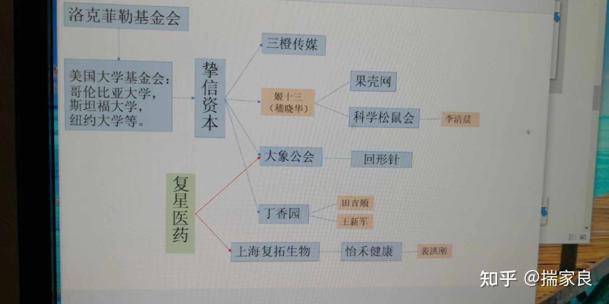

懂王呼吁支持者给自己和懂家军捐钱，但到目前为止，其实有一方势力给懂家军的中期选举捐了很多很多钱

民主党选情不利，所以想了个阴招，一面在地方上拼命撒钱给懂家军的候选人助选，帮助他们在共和党初选里打败其他派系的候选人

另一面在华盛顿搞公审懂王大会，希望一把把懂家军摁死，最后自己黄雀在后，坐收渔翁之利

### 政治剧

#### House of Cards《纸牌屋》

#### Yes, Prime Minister 《是，首相》

### dxys

与大象公会、回形针等背后的投资者都是挚信资本，而这个挚信资本懂的都懂。

### miniso 

**默认自己是日本品牌**

是个披着外国皮的货，崇洋媚外的家伙

### 可选链操作

[#](../_202105/~20210519.md)

 [可选链操作符 - JavaScript | MDN (mozilla.org)](https://developer.mozilla.org/zh-CN/docs/Web/JavaScript/Reference/Operators/Optional_chaining)
