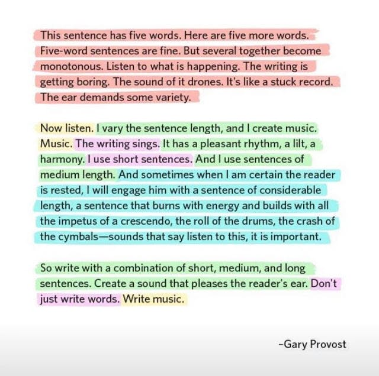
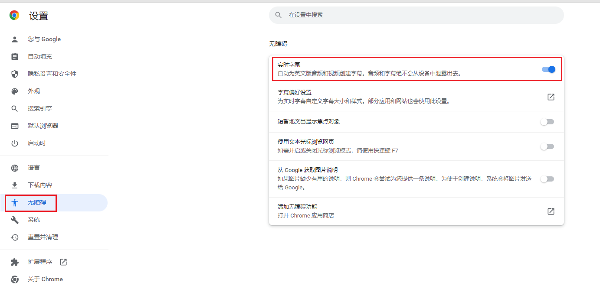
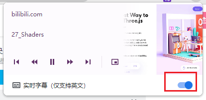

### 9个写作技巧

1. 删掉“我认为”、“我觉得”、“我相信”等

   你写的本来就代表你的观点，不需要再重申，另外这些词会弱化你文章的可信度

2. 先写标题

   最后写标题，导致全文主题散乱，想法不连贯，表达不专注。知道这个技巧后，从下笔第一秒我就知道自己要说什么，这样才能把它说好

3. 写出音乐感

   写作应该长短结合，像写曲子，让读者从视觉上和听觉上感觉到韵律

4.  “triad”（三合音）

   什么是三合音？

   这是另一个关于节奏感的技巧，我从 The Adweek Copywriting Handbook 这本书里学到。作者说他举例时，只举三个。因为这样读起来最有节奏感。

   “于谦老师有三大爱好，抽烟、喝酒和烫头。”

5. CTA = call to action

   这是一个广告常用术语，指的告诉读者如何行动。如果我们写的是非虚构类文字，最好包含至少一个 CTA

6. 一寸相框

   心中有个模糊的想法，却不知道如何动笔？

   我经常这样，一个解决办法就是，一寸相框。和我一样喜欢酗酒的 Anne Lamott 的写作建议：先写下眼前已经明确的，最想说的那个点子，不要考虑全文最后的呈现，先写下一句最想说的话，最想表达的点子，已经成型的想法。

7. 简单和清晰

   智慧的最高形式是什么？

   爱因斯坦认为是简单（simplicity）。当谈到写作时，他说：”为了更清楚地表达，我需要不断提醒自己，丝毫不要在意呈现的优雅。“

8. 不说副词

   你可以从每一篇写作建议里找到这一条，说明专业作家有多么在意这件事😄 。我也一直不断地从自己的草稿里删掉副词，或者换一个更准确的动词

9. 填满画布

   如果没有十足的气势，难免半途而废。作家 Steven Pressfield 的建议是，当开始写草稿时，应该一鼓作气，先填满画布。我们不能犹豫，因为犹豫就会败北。

### 谷歌实时视频字幕

播放时默认开启

关闭后如何再次打开?

### 三个新的搜索引擎，值得关注。

1、[Kagi](https://kagi.com/)

它提供收费搜索服务，免费账户可以每月搜索50次。保证没有广告、不保存用户信息，搜索质量很不错，不仅是英文搜索，中文搜索的结果也比较准确。

2、[yep](https://yep.com/)

这个搜索引擎的特点是，保证广告收入的90%会返回给内容的创作者。它的英文搜索质量还可以，中文不行。

3、[Neeva](https://neeva.com/)

没有广告，承诺不保存用户信息，由前谷歌工程师创建，搜索质量相当好。

### svg 动画

[广东省, 广州市 降水地图 | MSN 天气](https://www.msn.cn/zh-cn/weather/maps/precipitation/in-广东省,广州市?loc=eyJsIjoi5bm%2F5bee5biCIiwiciI6IuW5v%2BS4nOecgSIsImMiOiLkuK3ljY7kurrmsJHlhbHlkozlm70iLCJpIjoiQ04iLCJnIjoiemgtY24iLCJ4IjoiMTEzLjI2NDIzNjQ1MDE5NSIsInkiOiIyMy4xMjkwOTM3ODkwNzkxIn0%3D&weadegreetype=C&ocid=ansmsnweather&zoom=8)

降雨动画

### 左翼&右翼

以奥巴马为代表的民主党，主导平权，施行全民医保，甚至接收其他国家难民，被网友称为“白左”

以川普为首的共和党践行**传统美国价值观**，而且在世界上鼓吹**美国至上**，被叫做美国右派。
