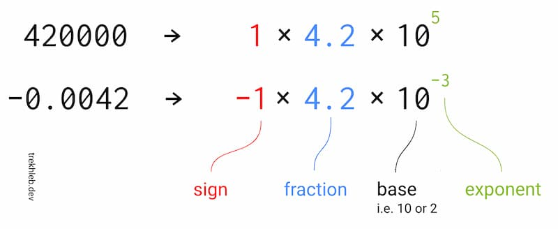
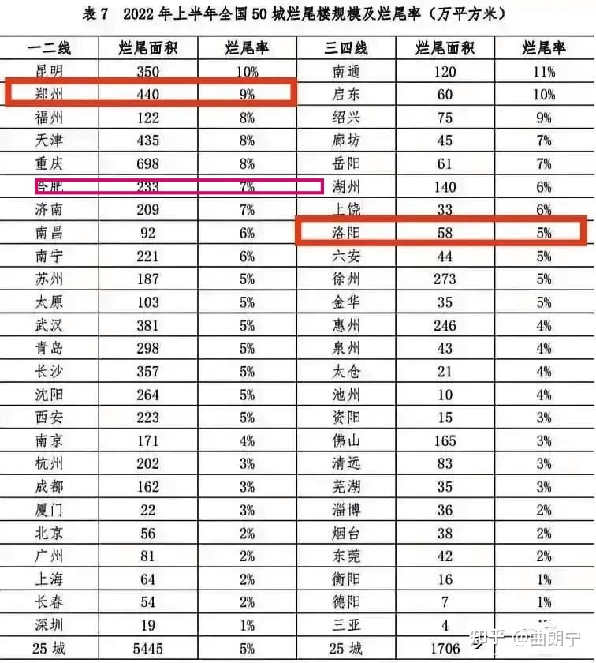
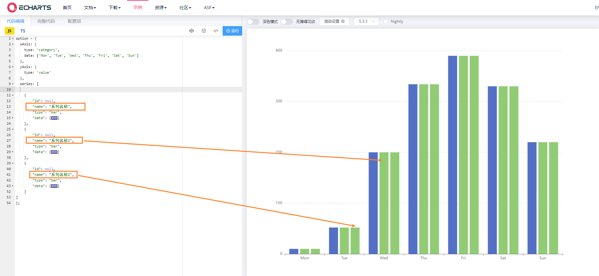

### [Nude UI](https://nudeui.com/)

著名前端开发者 Lea Verou 做的 Web Component 组件库，目前只有五六个表单组件，都是轻量级组件，非常易用，效果不错。

https://github.com/LeaVerou/nudeui

看看如何定义Web Component: 

[nudeui/button-group.js at main · LeaVerou/nudeui (github.com)](https://github.com/LeaVerou/nudeui/blob/main/button-group/button-group.js)

### [Naval Architecture – Bartosz Ciechanowski](https://ciechanow.ski/naval-architecture/)

船只运动原理

### [JavaScript 的浮点数格式](https://github.com/trekhleb/javascript-algorithms/tree/master/src/algorithms/math/binary-floating-point)（英文）

本文介绍了 JavaScript 的浮点数格式，JS 引擎底层到底是怎么存储一个数字的，图文并茂。

### 烂尾率

### Echarts 默认主题的颜色

https://echarts.apache.org/zh/option.html#color

### echarts 图表颜色重复

### keep-alive & v-if

### monaco-editor 

[Api playground](https://microsoft.github.io/monaco-editor/playground.html) 

API: https://microsoft.github.io/monaco-editor/api/modules/monaco.editor.html#create
