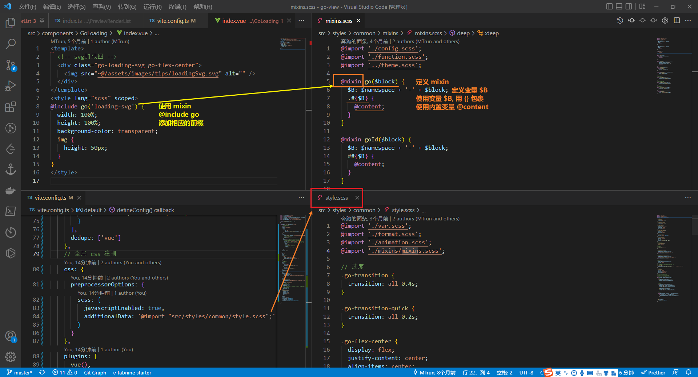
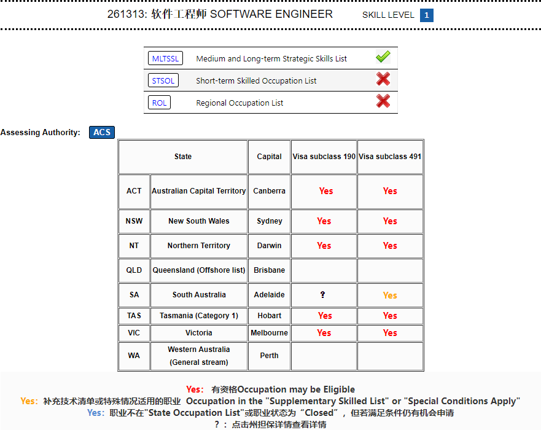

[toc]

### scss @mixin @include

在引用混合样式的时候，可以先将一段代码导入到混合指令中，然后再输出混合样式，额外导入的部分将出现在 `@content` 标志的地方

在创建的时候, 有一个内置 `@content` 变量能够表示其内容. 

### 年轻人不要再为房地产接盘 [(6 封私信) 国家统计局表示年轻人的失业率偏高，对此需要高度重视，造成这一现象的原因是什么？ - 知乎 (zhihu.com)](https://www.zhihu.com/question/537953306/answer/2611524068?utm_campaign=shareopn&utm_content=group3_Answer&utm_medium=social&utm_oi=572706585453924352&utm_psn=1546148110820343808&utm_source=wechat_session&s_r=0)

年轻人不要再为房地产接盘，你们不要害怕，担心以后不能成家不能生娃，不会的你们不要害怕，担心以后不能成家不能生娃，不会的

你们赚钱是为了让自己和家人，心爱的人活的更好。去做自己想做的事情，去学自己想学的爱好。去创业，去创新，去看看新疆西藏，去追求诗和远方。不要白活一生去供一套房子，不是把自己一生的心血和储蓄，贡献给资本家，让那些二代以后成为国民老公，某地四少，什么炮王。

**最成功的计划生育文案，不是一人超生全家坐牢。是你不买房，你丈母娘也不会把女儿嫁给你**

**22年生育已经负增长了，很明显，买房比坐牢还可怕**

> 评论: 

这几年一直在苦口婆心劝年轻人别急着买房，一开始他们都不听啊，现在才慢慢吃了瘪，上车的人遇到烂尾楼，裁员降薪的时候哭了，终于知道锅儿是铁打的了。

我也搞不懂，大部分普通人难道没想过会失业这个问题吗，还总觉得自己能安安稳稳干30年

我爸我妈，拼命干活一辈子，彻彻底底的劳动者，无条件爱国，无条件相信国家，也没看他们落着什么好，没看见国家给了他们什么东西，哦，养老保险还差点被人坑，辛辛苦苦一辈子，病没少生，钱没多挣，一辈子就在乡下建了个三十万的房子。我不是觉得爸妈不好，我很爱他们，但他们用一生的经历告诉了我，至少在中国，所谓劳动者，除了听起来光荣，没有半点好处。就算再为国家着想，分蛋糕也分不到你头上。你仅仅只是付出者，不是收获者。这辈子还是要过好自己，让自己开心，别的都是虚的。

### [(6 封私信) 移民 - 搜索结果 - 知乎 (zhihu.com)](https://www.zhihu.com/search?type=content&q=移民)

### [一年拿到绿卡，从此掉入“高福利陷阱” - 知乎 (zhihu.com)](https://zhuanlan.zhihu.com/p/443714827)

移民土澳

独立技术移民，也就是常说的189技术移民签证。无需州担保和雇主担保，移民成功后可以去澳洲任何地方工作、学习、生活，是一步到位的永居签证

**具体申请条件如下：**

1. 主申请人45周岁以下；

2. 申请人职业在澳洲移民职业列表MLTSSL上，且通过职业评估；

3. 主申请人雅思G类最低4个6；

4. EOI打分满足65分；

5. 无犯罪记录且无重大传染性疾病。

[技术移民MLTSSL职业列表 (andyyimin.com)](http://andyyimin.com/AU/occupation/lists/3268.html)

### 移民新西兰

https://www.v2ex.com/t/629329

### 移民美国

美国将允许商务和旅游签证的名义进入当地找工作，在签证申请人开始在美国从事任何工作之前，必须将旅游或商务签证更改为授权工作的签证，并且新的签证必须生效。

https://twitter.com/USCIS/status/1638543885168263168

简而言之，可以以商务/旅游名义申请商务/旅游签（B1/B2签证）进入美国。落地后申请工作签证转为逗留（此时依旧为中国国籍）。
工作同时可以申请绿卡，一般要排队5～6年。拿到绿卡后居住满5年即可以申请美国公民身份，同时可以注销中国国籍。
（退籍费共￥250，申请费￥50；退籍证书￥200）。

附：
美国移民局新移民指南：
https://www.uscis.gov/sites/default/files/document/guides/M-618_c.pdf
中国移民局公民个人出入境申请：
https://s.nia.gov.cn/mps/bszy/gmcrg/
美国驻华大使馆签证申请服务：
https://china.usembassy-china.org.cn/zh/visas-zh/
中国→美国 单程机票搜索：
https://www.tianxun.com/transport/flights/cn/us/

### 移民新加坡

[润去新加坡 (run2.sg)](https://run2.sg/)
