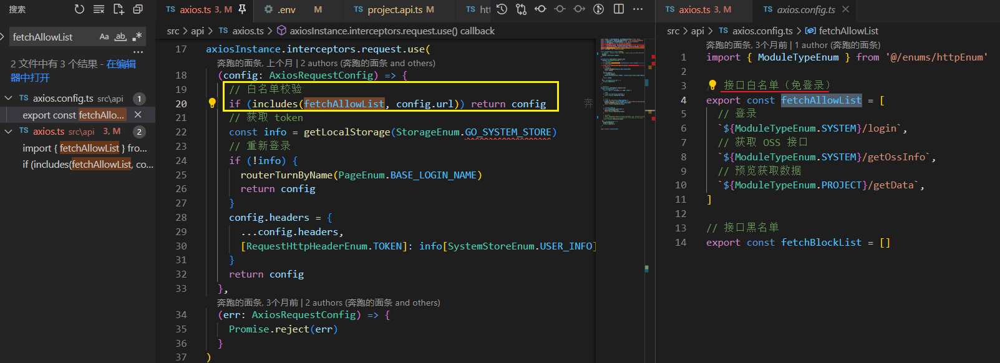

# [气候变化2021：物理科学基础|气候变化2021：物理科学基础 (ipcc.ch)](https://www.ipcc.ch/report/ar6/wg1/)

这份报告是罕见的例外，它写得非常明确尖锐，结论就是四个字："大难临头"。

报告认为，根据各种科学研究和观测结果，可以认定 **气候灾难已经发生了，并将继续加剧。** 人类现在所做的种种减碳努力，并不能避免灾难，只是为了不让最糟糕的结果发生。

报告描绘了非常可怕的全球变暖进程，地球的平均气温，目前比工业革命前上升了1.2度，估计未来一两年内就会上升1.5度。如果温室气体排放量继续增加，2050年前将会上升2度，本世纪末之前达到3度。

我们会遭遇什么样的灾难？联合国报告是这样描述的：

> "地球将变得干燥许多，整个生态系统被破坏，导致大规模物种灭绝，并使全球的粮食保障面临巨大风险。
>
> 以下五种灾难现象将会越来越严重：（1）高温，（2）干旱，（3）洪水，（4）飓风，（5）海平面上升。"

22年的气候也是异常的

### 空气湿度对人体的影响非常大，比如气温为31度时，如果湿度达到78%，人体实际感受到的温度相当于40度

### [DALL·E 2 (openai.com)](https://openai.com/dall-e-2/)

人工智能模型 [DALL·E 2](https://openai.com/dall-e-2/)

可以根据文本生成图片，有点像童话里面的"魔镜"。你告诉魔镜想看什么，它就向你展示什么。目前的[价格](https://www.163.com/dy/article/HCSNPB8F05118HA4.html)是15美元生成460张图片，平均每张图0.03美元（约为人民币两角）。

- DALL·E 2 can **create** original, realistic images and art from a
  text description. It can combine concepts, attributes, and styles.
- DALL·E 2 can **make realistic edits to existing images** from a natural language caption. It can add and remove elements while taking shadows, reflections, and textures into account.

- DALL·E 2 can **take an image and create different**
  variations of it inspired by the original.

# Receive SMS Online

不要用自己的手机号码注册，改用第三方网站提供给的手机号用于注册和登录。

这里给出两个国外第三方网站，一个免费，一个付费。各有所好，亲测非常好用，也一直在用。如果你用完觉得好用的话记得回来点个赞。

[Receive SMS Online | Temporary and Disposable Phone Numbers (smsreceivefree.com)](https://smsreceivefree.com/)

虚拟号码

收验证码的网站推荐: https://zhuanlan.zhihu.com/p/498698257

1. https://www.goinsms.xyz/sms.php

### 设置接口可访问白名单

只要在 request 拦截器中进行校验路径即可

### 为什么人类没有越来越闲？

很多人相信，随着科技的发展，未来的人们会有很多空闲时间，因为机器会干活。

这种观点是不对的。即使有高度智能的机器，未来的工人也不会空闲，可能还会更忙，至少资本主义制度是如此。

将近100年前的1930年，经济学家凯恩斯[预言](https://www.newstatesman.com/2020/08/why-bertrand-russells-argument-idleness-more-relevant-ever)，在一个世纪之内，生产力的提高将使发达国家的居民每周工作15个小时，还能保持体面的生活水平。

他的预测完全错误。今天，没有一个国家实现每周工作15小时，连接近的都没有，反而出现了996这样的工作制。我相信，再过100年，也不会有每周15小时工作制。

让我们想象一个假设的情景。一家工厂以前每天生产100个产品，随着技术进步，现在每天可以生产200个。如果能够全卖出去，那么工人的劳动时间并不会减少。

如果市场还是原来那样，只能卖出去100个，那么工厂就有50%的产能空出来了。这时，管理层有两个选择。

选择一：工人只工作半天，保持工资不变。

选择二：保留一半的工人，解雇其余的人。

现实中，一定是第二种选择，因为这样有利于增加利润。所以， **技术进步带来的收益，不会变为工人的空闲时间，而是变为一些工人更忙碌，另一些工人失业** ，真正的赢家就是资本家，增加的利润都归他们。

这就是当今世界正在发生的事情，空闲的工人最终会被解雇。IT 行业最明显，因为技术进步对这个行业影响最大。

资本主义追求利润最大化，一旦销售不能同步扩张，技术进步就必然导致裁员，那些失业的人如果不能及时找到工作，就会越来越穷。那些还在工作岗位的人则由于负担更多的生产力，而变得越来越忙。

### 信用卡取现功能

取现手续费大多在1%-3%之间，而且还有利息，按实际使用天数收费，每日利息为取现金额的万分之五，也就是常听到的月息1分5，折合年化利率更高。

套现手续费一般在0.6%只要在出账单后正常还款是很平常用信用卡消费一样，没有利息。如果套现后把账单分期，也会产生分期手续费，分期手续费因行而异，正常会比取现成本低一些，但也不会很低。

#### 取现和套现的区别是什么？

取现和套现只有一字之差，却有本质区别。套现是违法行为，而取现是正规合法服务

「取现」合法，合理，有额度限制，费率高，适合短期内有紧急资金诉求的正经人

「套现」非法，灰产重灾区，风险大，正经人别干

### 离大谱

