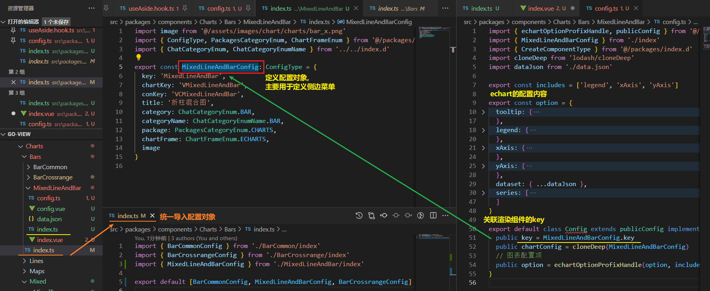

### 云 服务 VPN

https://www.guozeyu.com/2022/08/choose-a-web-service/


### 如何将目录下的 vue 组件一次性导出

```ts
import { defineAsyncComponent } from 'vue'
const modules = import.meta.glob('./*.vue')
const componentNameReg = /.*\/(.*)\.vue$/
const componentsMap: { [key: string]: any } = {}

for (const [path, importFunc] of Object.entries(modules)) {
  const matches = path.match(componentNameReg)
  if (matches) {
    componentsMap[matches[1]] = defineAsyncComponent(importFunc)
  }
}
export default { ...componentsMap }
```

使上面的导出内容与下面保持一致

```ts
// 设置项布局
import SettingItem from './SettingItem.vue'
import SettingItemBox from './SettingItemBox.vue'

export { SettingItemBox, SettingItem }
```


## export 命令

如果你希望外部能够读取模块内部的某个变量，就必须使用`export`关键字输出该变量。

下面是一个 JS 文件，里面使用`export`命令输出变量。

```javascript
// profile.js
export var firstName = 'Michael';
export var lastName = 'Jackson';
export var year = 1958;
```

上面代码是`profile.js`文件，保存了用户信息。

ES6 将其视为一个模块，里面用`export`命令对外部输出了三个变量。

`export`的写法，除了像上面这样，还有另外一种。

```javascript
// profile.js
var firstName = 'Michael';
var lastName = 'Jackson';
var year = 1958;

export { firstName, lastName, year };
```

上面代码在`export`命令后面，**使用大括号指定所要输出的一组变量**。 

> 大括号这里不能用对象的形式结构, 因为是一种固定的格式, 里面是变量
>
> ```js
> var firstName = 'Michael';
> var lastName = 'Jackson';
> var year = 1958;
> var object = { firstName, lastName, year };
> export default { ...object };
> ```
>
> 


### 如何在子组件中修改父组件状态


### 匿名组件


### Go-view添加图表


