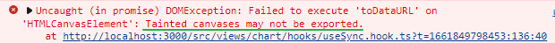

### html2canvas 背景图片缺失的问题

[niklasvh/html2canvas: Screenshots with JavaScript (github.com)](https://github.com/niklasvh/html2canvas)

#### How does it work?

The script renders the current page as a canvas image, by reading the DOM and the different styles applied to the elements.

It does **not require any rendering from the server**, as the whole image is created on the **client's browser**. However, as it is **heavily dependent on the browser**, this library is *not suitable* to be used in nodejs. It doesn't magically circumvent any browser content policy restrictions either, so **rendering cross-origin content will require a [proxy](https://github.com/niklasvh/html2canvas/wiki/Proxies) to get the content to the [same origin](http://en.wikipedia.org/wiki/Same_origin_policy).**

The script is still in a **very experimental state**, so I don't recommend using it in a production environment nor start building applications with it yet, as there will be still major changes made.

#### Limitations

All the images that the script uses need to reside under the [same origin](http://en.wikipedia.org/wiki/Same_origin_policy) for it to be able to read them without the assistance of a [proxy](https://html2canvas.hertzen.com/proxy/). Similarly, if you have other `canvas` elements on the page, which have been tainted ( *污染的意思* ) with **cross-origin content**, they will become dirty and **no longer readable** by html2canvas.

The script doesn't render plugin content such as Flash or Java applets.


```diff
html2canvas(range, {
     backgroundColor: null,
+    useCORS:true,
+    allowTaint:true
}).then(img => console.log(img.toDataURL()))
```

未设useCORS为true, 会报无法导出污染的canvas




### 学习仓库

前端: [buqiyuan/vue3-antd-admin: 基于vue-cli5.x/vite2.x + vue3.x + ant-design-vue3.x + typescript hooks 的基础后台管理系统模板 RBAC的权限系统, JSON Schema动态表单,动态表格,漂亮锁屏界面 (github.com)](https://github.com/buqiyuan/vue3-antd-admin)

后台: [nest-admin/README.md at main · buqiyuan/nest-admin (github.com)](https://github.com/buqiyuan/nest-admin/blob/main/README.md)
