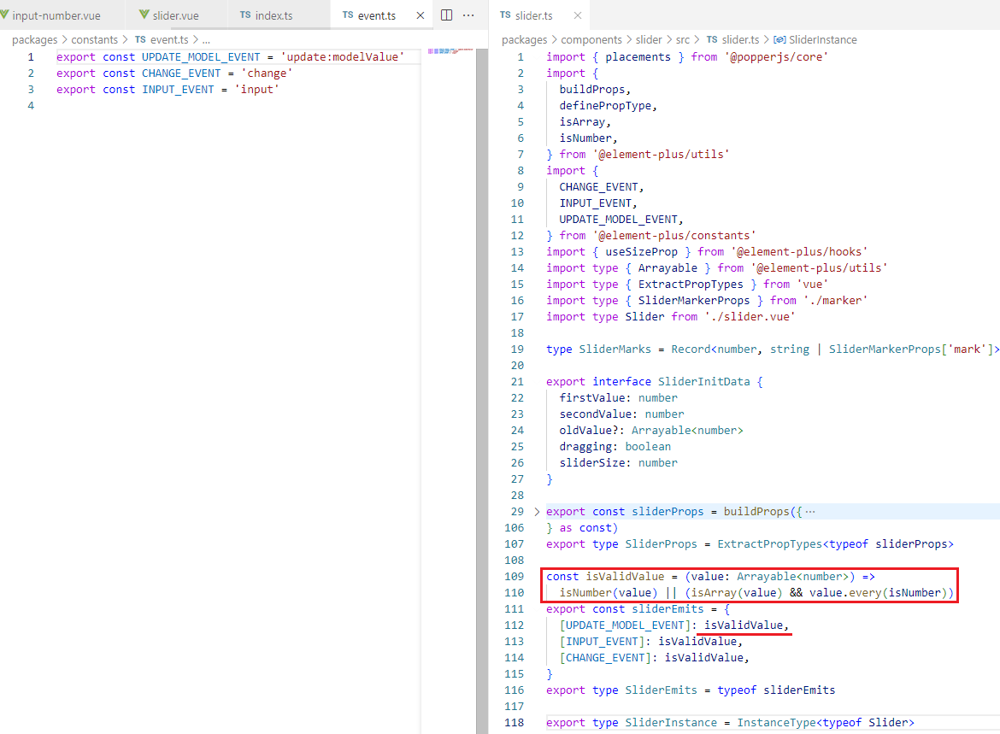
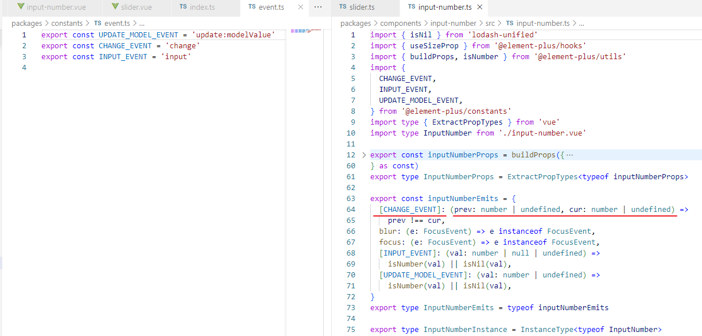

### 棚改货币化，涨价去库存

[中国房地产 -- 生死皆由“涨价去库存” - 知乎 (zhihu.com)](https://zhuanlan.zhihu.com/p/39550545)

棚改货币化，是一种变相的PSL（抵押补充贷款），金融界的老把戏，没什么太大新意。棚改原来主要是实物安置，我还记得90年代时，我家亲戚原来在上海黄浦区有一个12平米的房子，那是他们一家三口的栖身之地，后来响应政府号召，把房子给了国家，然后政府在浦东杨高路那里给他们家一套两室一厅80多平米的新房。这大概就是最初版本的棚改了吧。

到了2015年，这期间中国房地产的发展有多壮观，已经不需要我在这里赘述了。但是也出现了很大的问题，一线城市房价上天是一个问题，卖掉北上广深，买下整个美国已经不是笑谈。另外一个问题就是二线以下的城市，房子库存爆表。可能属于机密信息，官方没有发布自己的权威数据。各种民间统计的数字五花八门，有数字统计是98亿平米，也有数字显示127亿平米，但是基本上在100～110亿平米之间。相当于每个中国人都有8平米的房子，考虑到中国的城市化只有50%左右，相当于每个城市人要买16平米的房子才能消化掉当时的库存。

高层着急了，毕竟这些**房子说到底就是银行的钱**！**房地产商都是从银行借钱拿的地**，盖的房子。如果卖不掉，回不了款，就还不了银行钱，银行流动性紧张，这是要金融危机的节奏啊。

高层想出了一个这两年被认为是**绝妙之计的“棚改货币化”来“涨价去库存”**。这两者相辅相成，缺一不可，否则就玩不下去这个游戏。首先，央行向几个政策性银行发出通知（主要是国开行），同意他们拿地方政府的**棚改项目**做抵押**向央妈**借钱，借到的钱要给**地方政府棚改项目专款**专用。其次，政府示意地方政府逐渐走货币化安置的途径来做棚改项目。

于是这个资金循环就是：央妈 — 国开行 — 地方政府 — 棚户区居民 — 买库存的房子 — 开发商 — 开发商买地 — 地方政府 — 国开行 — 央妈。

这个方案猛一看，真是绝了，皆大欢喜啊！但是，再仔细看看，这中间的每个环节都有问题。

比如，地方政府把钱给了棚户区居民，如果房价没有上涨的预期，那么他们宁愿先租一段时间的房子，也不会买房。

**这就是“涨价去库存”是这个游戏的必要条件之一**。涨价，**手握大量现金的民众看到这么容易的赚钱机会，一哄而上。**三四线城市的房价两年之内涨了一两倍，而且也是必须要涨一两倍。开放商的房子库存水平迅速下降，要拿地盖新房。

如果把**地方政府看作是生意人**的话，他们要想不赔钱，卖地的收入一定不能小于发给那些棚改户居民的钱，否则就还不上国开行的贷款。

但是要想让棚改户动迁，**发给他们的钱一定不能少于让他们买一套房的钱**。所以，新的面粉价钱一定要高过面包价格才有可能，地价要超过楼板价才行，这也是房价必须要涨一到两倍的原因，否则这个游戏就玩不下去。

从开发商的角度，如果他们不傻，考虑到大环境，而且头脑清醒的话，在去库存之后的明智选择是套现走人，而不是继续拿地盖新房。因为如果去拿地建房的话，那么一两年之后，这就是**新的库存**，到时候有无人去购买是一个问题，除非这个游戏一直玩下去。当然，如果能一直这么玩下去也无妨，**大不了就是过一两年房价翻番即可**。

但是实际情况远比这复杂。

第一，地产商比政府想象的要精明，很多是套现走人。就看很多地方在卖地的时候，有多少**参与拍地**的都是地方性的不做房地产的国企就明白了。这些都是假拍，说白了就是托。大家心知肚明的演给上面去看，才能**继续拿到棚改资金**。如果棚改区的地卖不掉，上面的资金循环链条就断了，这个游戏也就是解救了一大批开发商而已。

第二，刚才介绍了这个游戏继续玩下去的**必要条件就是房价要快速上涨**，而且不能停，两三年就必须翻倍。这个速度，稍微有点头脑的人都应该明白这是不可能持续下去的。

正是看到这些情况，上层才**紧急叫停**这个游戏。

下面我们来推演一下会发生什么事情。棚改不发钱了，棚改户手上没钱，**不会去抢着买房**了，房价不涨了，其他无关的民众也不会急切的想上车买房，毕竟三四线城市的民众绝大部分已经有房，这次大家抢房也就是看着想捞一把而已，没几个真正的刚需，一定必须要买房的。**无人买房**，开放商拿地的意愿更低，地方政府拿到的棚户区腾出的土地卖不出去，欠国开行的3.8万亿也就一直还不上。国开行就还不了央妈的借款。不过好就好在国开行，连同农开行，进出口银行这都是政策性银行，倒闭不了，**央妈发出去的资金，也就成为多发的货币，全体国民来承担和消化这个货币通货膨胀的结果**。

其实道理很简单，虽然我很同情棚改户的居住条件，希望他们改善生活。但是想一想，**什么也不用干就住上了新房，这简直就是免费的午餐**。天下有免费的午餐吗？有！对你来看是免费，只是因为别人替你付了账而已。

另外，高层从开始也对这个游戏看的很明白，说白了，就是换时间而已，他们清楚的很。

**根据住建部的数据，2015年-2018年，全国棚改贷款总量高达4万亿。**

编辑于 **2018**-07-12 01:47

> 2022年初，房地产企业摇摇欲坠，年轻人苦不堪言，社会价值观扭曲，生育率急速下滑，失业率上升，居民消费萎缩，经济下行压力增大，叠加疫情和西方围堵，外忧内患，大锅管理员们焦头烂额。
> 本以为我们在创造历史，现在看来不过，不过是在以一种新的形式重复历史而已。

> 这里的去库存，不是单单靠棚改的，只是棚改，确实就像你想的，只是极限一换一。
> 当初是货币化安置，他带来的影响是房价上涨（安置款是定向补贴，必然推升房价），这会带来财富效应，刺激三四线城市的楼市，从而去库存。
> 棚改是药引，目的是吸引居民部门的钱

> 棚改货币化本质是炒热了房地产市场.
>
> 通过棚改货币化，一些人得到大量赔偿, 通常都是在当地买房或者去大城市给儿子付首付或者怎样，钱又流向了房地产
>
> 与棚改置换房相比，置换房没有产生流水。而棚改货币化，可以产生流水，制造一种房地产繁荣的假象

> 国内那次2015年轰轰烈烈的棚改去库存里面，已经是把普通中产的身家都给榨干了，现在你让那些普通中产去加杠杆买房，他们也扛不住了。
> 2015年这轮棚改去库存之前，国内的居民杠杆率只有38%多，等到了这轮去库存完了以后，居民杠杆率就已经达到了62%了。
> 楼市的库存是去了，中产的债务是背起来了。
> 现在楼市那么多政策，为什么大家总感觉像是在鼓励那些有钱人买房，那是因为实际上就是在鼓励那些有钱人买房。上面也知道，中产没钱了，背不动了。
> 现在还能背动楼市的，只有那些在楼市里面赚过钱的人，除了他们，中产扛不住的。
> 这也解释了为什么现在开发商的房子越修越大，以及那些普通二手房和老破小卖不动了，这部分需求已经很弱了，玩不动了

> 2016年我只能想起房价飞速上涨，那轮棚改货币化，涨价去库存炒房真是赚的断子绝孙的钱
>
> 我们把结婚人数和新生人口放一起看，两者是正相关的，从2016年到2021年，短短5年时间中国新生人口从1786万降到了1062万，降幅高达40.53%，登记结婚的对数也降低了33.18%。你知道低欲望、低的日本新生人口降低用了多少年吗？35年！!

> 计划生育是中华人民共和国的一项基本 国策 ，即按人口政策有计划的 生育 。. 1982年9月被定为基本国策，同年12月写入宪法。

### element-plus 组件参数 ts 做操

slider 与 input-number 公用 `change` 事件时

定义的函数类型不一样, 需要加 `|` 对参数进行控制
