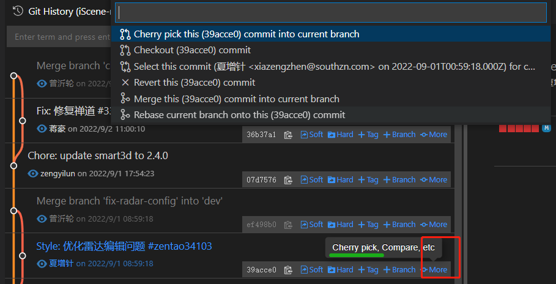
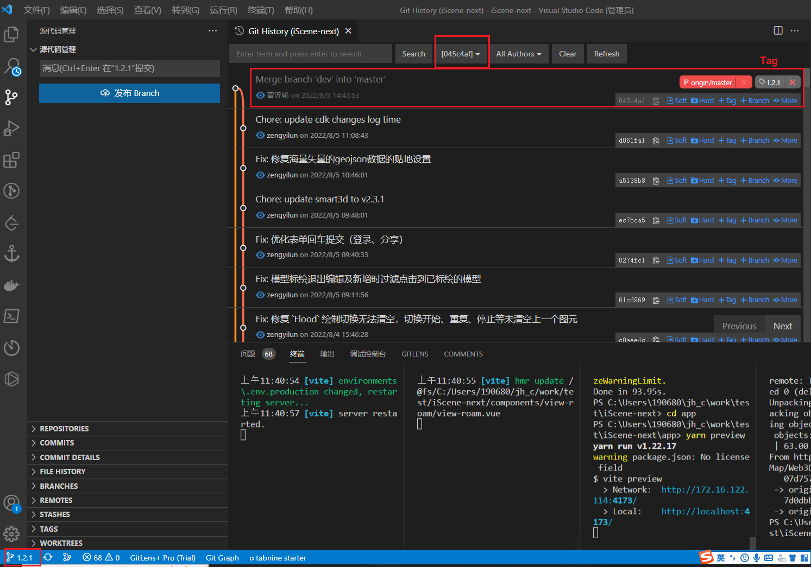
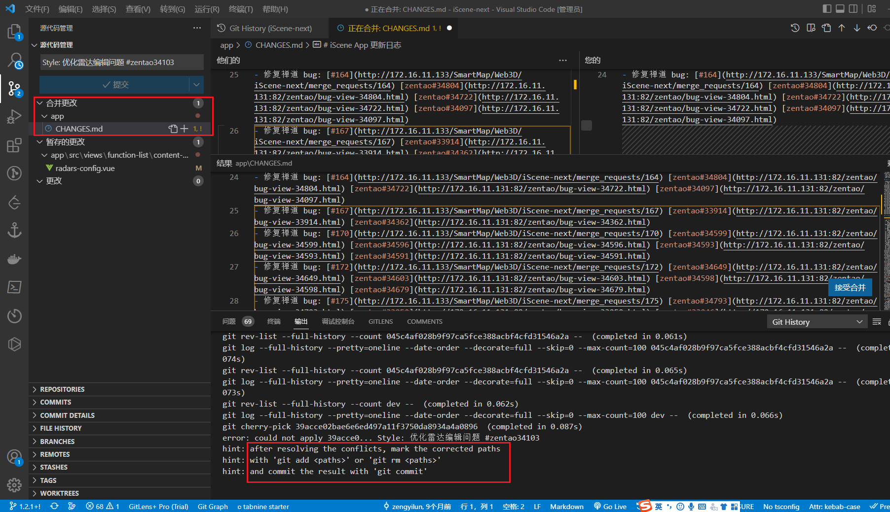
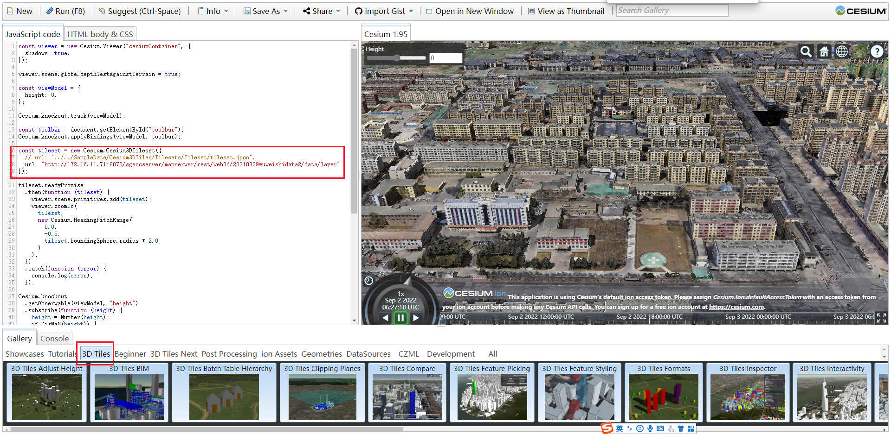

[toc]

### 代码混淆 Code obfuscation 

[Javascript obfuscation techniques by example – Trickster Dev](https://www.trickster.dev/post/javascript-obfuscation-techniques-by-example/)

`console.log("Hello, world! " + 123);`

1. Hexadecimal string encoding  16进制编码

   ```js
   console["\x6C\x6F\x67"]("\x48\x65\x6C\x6C\x6F\x2C\x20\x77\x6F\x72\x6C\x64\x21\x20"+ 123)
   ```

   

   ```
   '\251' // "©"
   '\xA9' // "©"
   '\u00A9' // "©"
   
   '\172' === 'z' // true
   '\x7A' === 'z' // true
   '\u007A' === 'z' // true
   ```

   在线代码混淆 [Javascript Obfuscator - Protects JavaScript code from stealing and shrinks size](https://javascriptobfuscator.com/Javascript-Obfuscator.aspx)

   反斜杠（\）在字符串内有特殊含义，用来表示一些特殊字符，所以又称为转义符。

   反斜杠还有三种特殊用法。

   （1）`\HHH`

   反斜杠后面紧跟三个八进制数（`000`到`377`），代表一个字符。`HHH`对应该字符的 Unicode 码点，比如`\251`表示版权符号。显然，这种方法只能输出256种字符。

   （2）`\xHH`

   `\x`后面紧跟两个十六进制数（`00`到`FF`），代表一个字符。`HH`对应该字符的 Unicode 码点，比如`\xA9`表示版权符号。这种方法也只能输出256种字符。

   （3）`\uXXXX`

   `\u`后面紧跟四个十六进制数（`0000`到`FFFF`），代表一个字符。`XXXX`对应该字符的 Unicode 码点，比如`\u00A9`表示版权符号。

   

2.  String Array Mapping

   ```js
   var _0x8b75=["Hello, world! ","log"];console[_0x8b75[1]](_0x8b75[0]+ 123)
   ```

   

3. Dead code injection (注入无用的代码)

   Dead or unreachable code can be injected to make the Javascript source code larger and more difficult to read without changing the functionality.

   ```shell
   $ defendjs --input hello.js --features dead_code --output .
   ```

   This turns our trivial JS code into bit of a mess:

   ```javascript
   (function () {
       function a(a, d) {
           var b = new Array(0);;
           var c = arguments;
           while (true)
               try {
                   switch (a) {
                   case 15229:
                       return;
                   case 21176:
                       function e(a, b) {
                           return Array.prototype.slice.call(a).concat(Array.prototype.slice.call(b));
                       }
                       function f() {
                           var a = arguments[0], c = Array.prototype.slice.call(arguments, 1);
                           var b = function () {
                               return a.apply(this, c.concat(Array.prototype.slice.call(arguments)));
                           };
                           b.prototype = a.prototype;
                           return b;
                       }
                       function g(a, b) {
                           return Array.prototype.slice.call(a, b);
                       }
                       function h(b) {
                           var c = {};
                           for (var a = 0; a < b.length; a += 2) {
                               c[b[a]] = b[a + 1];
                           }
                           return c;
                       }
                       function i(a) {
                           return a.map(function (a) {
                               return String.fromCharCode(a & ~0 >>> 16) + String.fromCharCode(a >> 16);
                           }).join('');
                       }
                       function j() {
                           return String.fromCharCode.apply(null, arguments);
                       }
                       console.log('Hello, world! ' + 123);
                       a = 15229;
                       break;
                   }
               } catch (b) {
                   $$defendjs$tobethrown = null;
                   switch (a) {
                   default:
                       throw b;
                   }
               }
       }
       a(21176, {});
   }())
   ```

   This IIFE function has two statements:

   1. Declaration of function `a()` that takes two parameters.
   2. Invocation of the function `a()` with first parameter value being 21176.

4. Scope obfuscation

   在上面注入无用的代码的基础上添加作用域

5. Control flow obfuscation

   

6. Mangling

   transformation that shortens variable and property names for optimization and obfuscation purposes

7. Code minification

8. 


### Cherry Pick

[Cherry-Pick | 一日一 Git](https://juejin.cn/post/6844903479421435918)

一个很常见的场景，就是想**在某个稳定版本上，添加一个刚开发完成的版本中的功能**。

就可以使用 Cherry-pick 命令，将这个功能相关的 commit 提取出来，合入稳定版本的分支上。

**从某个其他分支上拾取需要的提交节点合并到当前分支.**

Cherry-Pick 使用起来非常的简单：

```sh
git cherry-pick 
```

这里操作的就是需要 cherry-pick 的 commit-id

当执行完 cherry-pick 之后，将会自动**生成一个新的 commit  进行提交**，也就是会有一个新的 commit ID。





执行cherry pick后容易遇到冲突




### 富豪避税

世界上只有美国和厄立特里亚两个国家，是根据公民身份而不是居住地征税。只要你是美国人，不管住在哪里，都必须向美国政府交税。其它国家的规定是，本国公民如果住在其它国家，则无需向本国政府交税。

这导致大量的美国富豪放弃美国国籍，申请其它国家的公民。谷歌公司的创始人拉里佩奇就申请成为新西兰公民，前 CEO 埃里克·施密特（Eric Schmidt）申请成为塞浦路斯公民。


### github Trending tab 要被删

Heads up!

This Trending tab is being deprecated. Due to low usage of Trending Repositories and Trending Developers, this tab will no longer be available beginning September 30, 2022. For questions and feedback, please visit [GitHub Community](https://github.com/community/community/discussions/categories/general).


### 使用cesium加载工作数据测试


