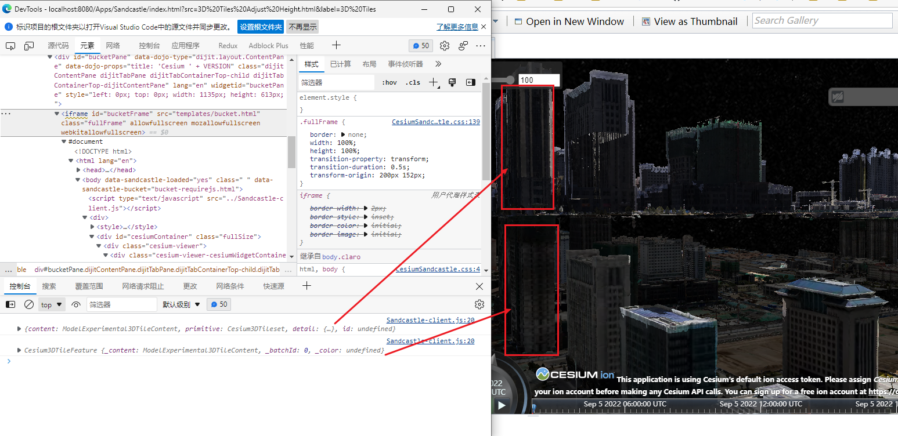
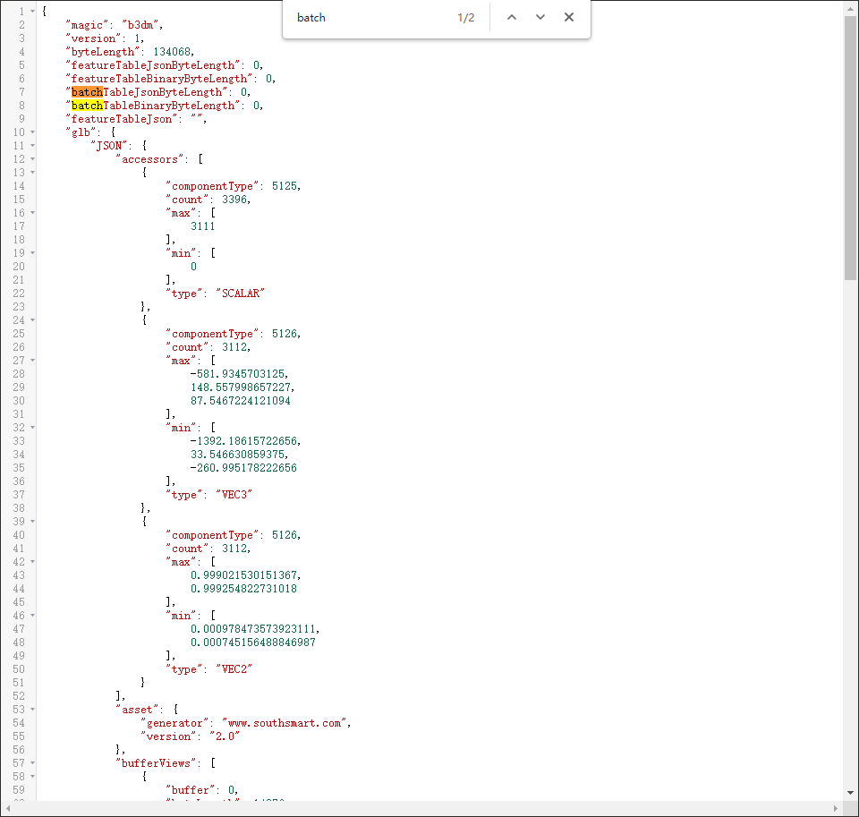
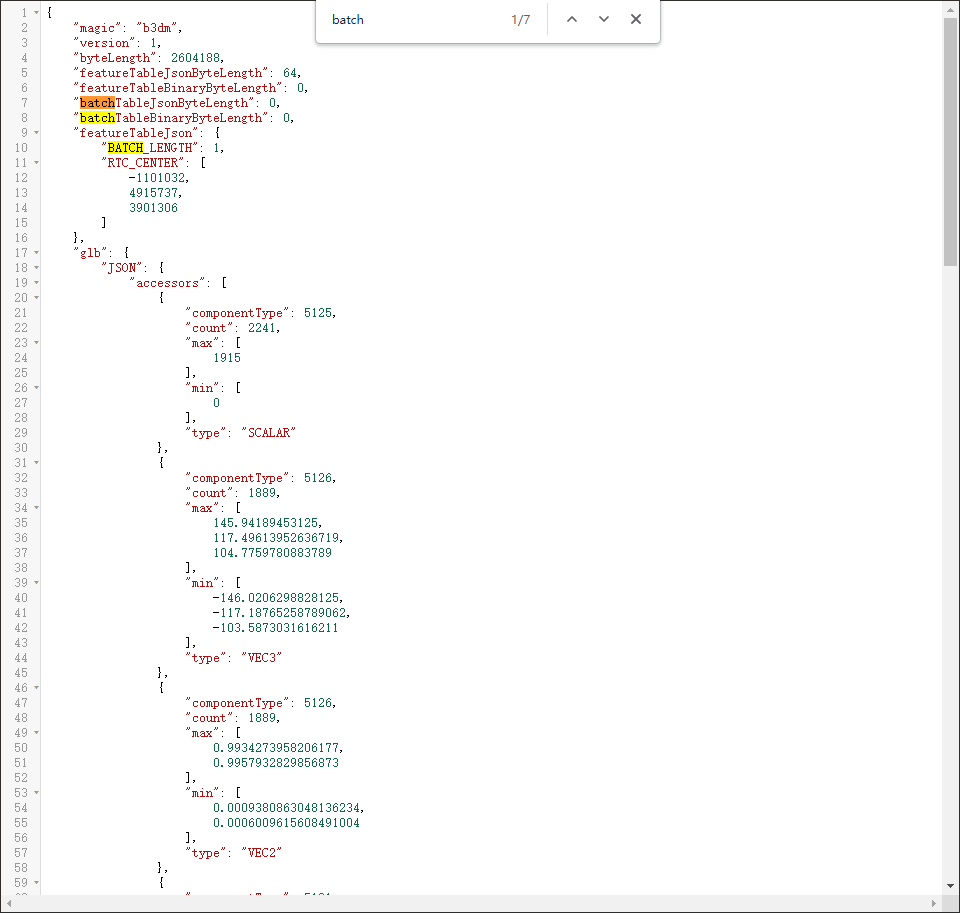
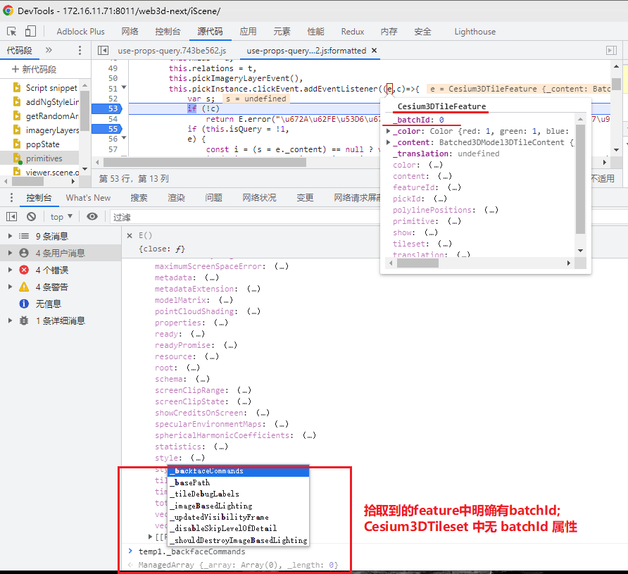

### pick 不同的返回结果类型

viewer.scene.pick

#### pick(windowPosition, width, height) → Object[Scene/Scene.js 3955](https://github.com/CesiumGS/cesium/blob/1.97/Source/Scene/Scene.js#L3955)

- Returns **an object with a `primitive` property** that contains **the first (top) primitive in the scene at a particular window coordinate** or undefined if nothing is at the location. Other properties may potentially be set depending on the type of primitive and may be used to further identify the picked object.

- When a feature of a 3D Tiles tileset is picked, `pick` returns a [`Cesium3DTileFeature`](https://cesium.com/learn/cesiumjs/ref-doc/Cesium3DTileFeature.html) object.

同样是3DTiles的倾斜数据, 怎么返回的结果不同

scene.pick 拾取结果: 数据带有batchId 就会返回3dTileFeature 

没有batchId的倾斜数据的 `.b3dm` 文件

有 `batchId` 的数据

场景交互:

batch id 是 feature 的属性，不是 3D tiles 的
