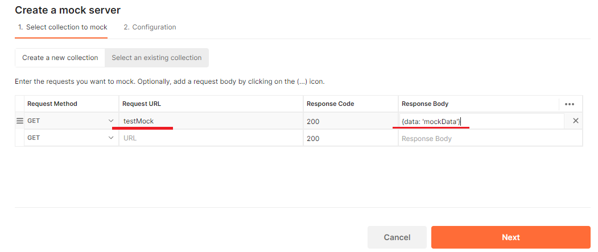
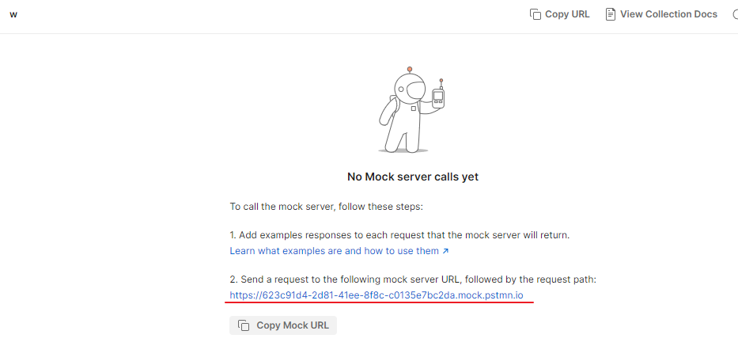
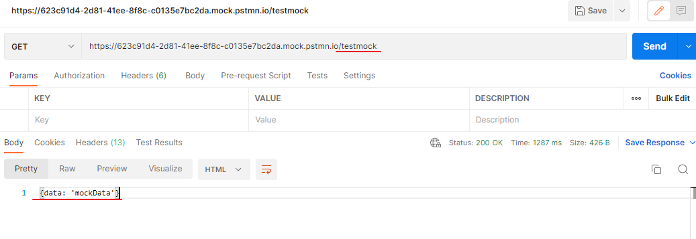
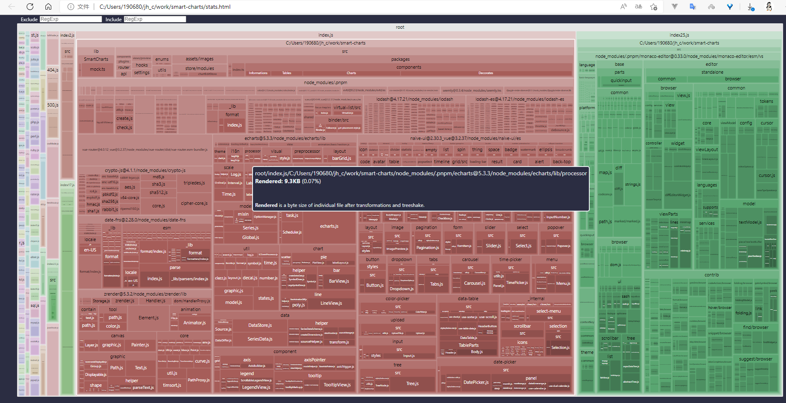

### [eslint-plugin-vue](https://eslint.vuejs.org/)

[vue/no-mutating-props | eslint-plugin-vue (vuejs.org)](https://eslint.vuejs.org/rules/no-mutating-props.html)


# Provide/Inject + TypeScript 使用


### [PLAYCODE - Javascript Playground](https://playcode.io/)

Easy & **Fast**: the fastest JavaScript coding experience ever made

支持 NPM Packages, 自动补全


### postman mockserver

定义请求地址和返回结果



通过给出的前缀访问






### Vue3 还能这么声明 ref 引用的变量

```vue
<tempalte>
<div ref="entityRef" class="go-preview-entity">
</tempalte>
<script setup lang="ts">
import { useHook } from 'useHook.hook';

const { entityRef } = useHook();
</script>
```

```ts
// useHook.hook.ts
export const useHook = () => {
    const entityRef = ref();
    
    onMounted(()=>{console.log(entityRef)};
    
    return {entityRef}
}
```


### rollup 打包分析插件 --vite

```ts
import { visualizer} from 'rollup-plugin-visualizer';
{
    // ...
    plugins: [vue(), visualizer()],
}
```

浏览器打开根目录下的 `stats.html` 文件


