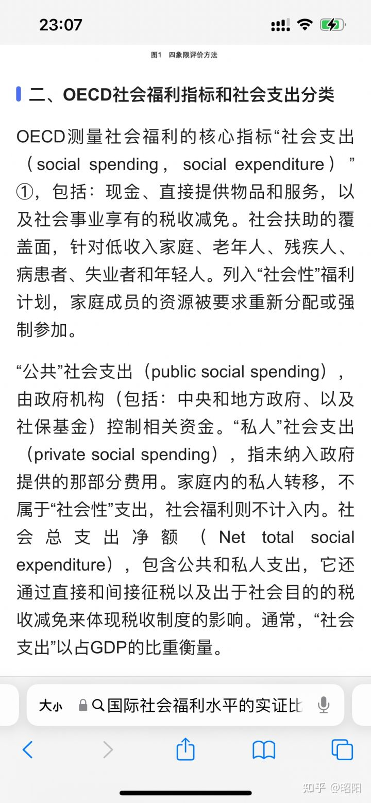
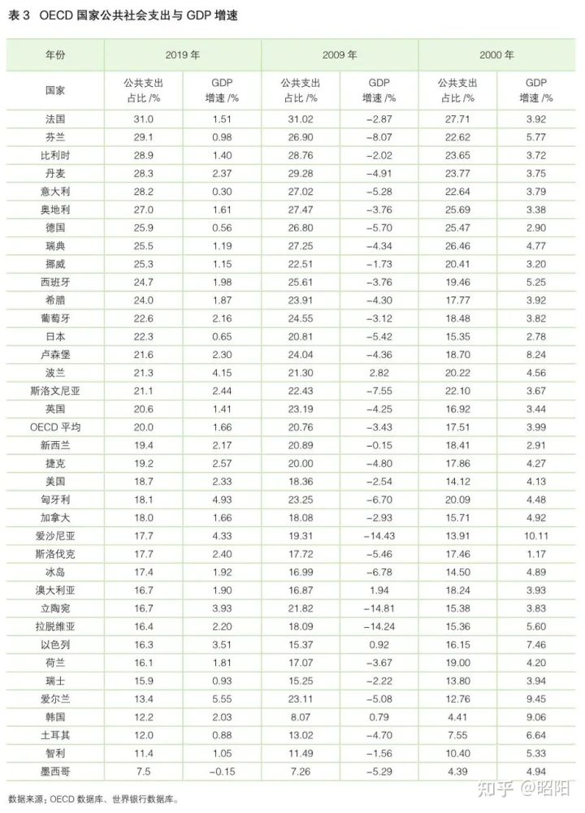

### 韩国刷新世界最低生育率纪录，遭废弃空置的中小学校

[韩国刷新世界最低生育率纪录，遭废弃空置的中小学校累计达到 1400 多所，哪些原因导致的？ - 知乎 (zhihu.com)](https://www.zhihu.com/question/550405917/answer/2650267544)

韩国的[生育率](https://www.zhihu.com/search?q=生育率&search_source=Entity&hybrid_search_source=Entity&hybrid_search_extra={"sourceType"%3A"answer"%2C"sourceId"%3A2650267544})现状是某大国的一面镜子。韩国早期错误的计划生育政策，而且后期调整生育政策为时已晚，鼓励生育政策出台过迟。实施相关配套[社会福利](https://www.zhihu.com/search?q=社会福利&search_source=Entity&hybrid_search_source=Entity&hybrid_search_extra={"sourceType"%3A"answer"%2C"sourceId"%3A2650267544})时错过了最佳时机，并且社会福利水平依然偏低导致的生育率过低和学校生源下降。

其实就欧洲高福利发达国家近些年逐渐回升的生育率情况来看，及时调整生育政策并出台相关社会保障配套，并持之以恒的进行长期投入。即便是在发达经济体社会里也是可以做到让生育率重新回升的。

韩国人是除了华人国家之外，思维方式跟某大国人最相似的国家。韩国的社会发展进程跟某大国也有很多相似之处，甚至可以说韩国早年走过的很多弯路，某大国在韩国之后，又把那些弯路走了一遍。

在OECD国家测量社会福利的核心指标“公共社会支出”里，韩国的公共社会支出在OECD发达国家中处于接近垫底的下游水平。自1990年到2017年，韩国的公共社会支出占GDP比重从2.6%增长到10.1%，2019年为12.2%，在OECD国家里仅高于土耳其，智利、墨西哥。在OECD组织中的发达国家里，韩国处于垫底水平。

解决低生育率只有两个办法，已经有无数国家提供了参照，实行高福利[社保](https://www.zhihu.com/search?q=社保&search_source=Entity&hybrid_search_source=Entity&hybrid_search_extra={"sourceType"%3A"answer"%2C"sourceId"%3A2650267544})政策或引进大量优质移民：

第一：大量引进外来优质移民入籍，改变本国民众不愿生的情况，但这很可能会造成族群矛盾。

第二：如果不想大量引进外来移民入籍，或者说是无法吸引优质的外来移民大量入籍。那就只剩下尽早实施高福利的社会保障制度这一个办法。并且对于高福利的[社会保障](https://www.zhihu.com/search?q=社会保障&search_source=Entity&hybrid_search_source=Entity&hybrid_search_extra={"sourceType"%3A"answer"%2C"sourceId"%3A2650267544})政策还需要长期投入，持之以恒。（注：参照北欧和法国，欧盟高福利发达国家的生育率都比某大国高）

我复盘下韩国提振生育率失败的简略过程，还有为此进行的努力和失败的原因，韩国是发达国家里提振生育率失败的典型。

2015年韩国人口密度约为每平方公里506人，2013年某大国平均人口密度为每平方公里143人。不管怎么看韩国的人口密度都远高于某大国。而且韩国国土面积里70%以上是山地，平原所占比例不到20%，而且[朝鲜半岛](https://www.zhihu.com/search?q=朝鲜半岛&search_source=Entity&hybrid_search_source=Entity&hybrid_search_extra={"sourceType"%3A"answer"%2C"sourceId"%3A2650267544})的矿产资源大都位于北方。可以说韩国所处的朝鲜半岛南部是出了名物产匮乏，地少人多。

因此60年代韩国政府跟我国ZF一样十分担心，资源匮乏，人口增长过快会导致严重的社会病。

因此韩国政府实行过一段时间非强制性的计划生育。该政策虽然不是强制性，但事实上韩国并没有发生某些人想象中的人口爆炸。而随着社会经济发展，韩国民众自发减少了生育。

到了90年代，韩国因低生育率导致的韩国少子化和人口老龄化趋势愈发明显。

因此20世纪90年代韩国政府又积极推行鼓励生育的政策，但为时已晚。韩国社会自生育率开始下降起，就再未显现出回升的趋势。

虽然韩国政府为愿意生育的家庭出台了大量社会福利，然而事实证明卵用都没有（注：因为韩国提供的育儿福利在发达国家里并不高，除非提供的社会福利能高到法国和北欧那种水平，有才可能挽回生育率。而且韩国错过了鼓励生育的最佳时机）

> 在韩国待过一段时间，所以对此有些了解，我简单介绍下，因为我对韩国社会的了解程度还不够深。所以我说的只是韩国政府为刺激生育出台的相关社会福利内容的一部分。
>
> 首先是加大医疗服务普及，目前韩国每千人病床的数字是12，某大国是4.3。这点某大国和韩国差距很大。
>
> 韩国为减轻育儿负担，韩国政府从2022年起向有0-1岁婴儿的家庭每月发放30万韩元（约合人民币1790元）的育儿补贴，并到2025年逐步上调至50万韩元（约合人民币3000元），并于生育时一次性发放200万韩元（约合人民币1.2万元）现金的“初次见面大礼包”。
>
> 韩国发放给孕妇的“国民幸福卡”可用限度将从目前的60万韩元上调至100万韩元（约合人民币6000元），供孕妇产检及生产时使用。
>
> 韩国为保障育儿时间，出台“3+3”制度，即未满12个月的子女父母均可申请3个月的育儿假，并每月获最高300万韩元（约合人民币1.8万元）的育儿补贴，政府欲通过此举将申请育儿假的人数从2019年的10.5万人增加至2025年的20万人。
>
> 韩国为缓解生育后出现的收入减少现象，将提高育儿假的基本收入标准。
>
> 韩国按照现行制度，育儿假的前1-3个月领取基本工资的80%，从第4个月起至第12个月领取基本工资的50%，今后将12个月内全部领取80%的基本工资。
>
> 韩国政府还计划将育儿假制度适用对象扩大至特殊从业者，包括艺术工作者、[自由职业](https://www.zhihu.com/search?q=自由职业&search_source=Entity&hybrid_search_source=Entity&hybrid_search_extra={"sourceType"%3A"answer"%2C"sourceId"%3A2650267544})者、个体户等均可申请育儿假，享受与普通劳动者相同的待遇。
>
> 韩国政府还出台多项面向多子女家庭的优惠政策，到2025年之前将为多子女家庭提供2.75万套专用[公租房](https://www.zhihu.com/search?q=公租房&search_source=Entity&hybrid_search_source=Entity&hybrid_search_extra={"sourceType"%3A"answer"%2C"sourceId"%3A2650267544})，将多子女家庭的标准从现行的3名以上放宽至2名。低收入家庭第三胎起大学学费全免，每年新增550家公立托儿所，力争5年后将公立保育率提高至50%。
>
> 韩国为保障[孕产期](https://www.zhihu.com/search?q=孕产期&search_source=Entity&hybrid_search_source=Entity&hybrid_search_extra={"sourceType"%3A"answer"%2C"sourceId"%3A2650267544})职场女性的各项权益，政府将要求企业公开男女员工在就业、薪资、晋升等方面的具体信息，还将出台惩罚性赔偿制度，防止职场性骚扰等。为确保儿童作为权利主体，将出台“出生通报制度”，医疗机构必须将所有新生儿无一遗漏地上报给国家有关机构。
>
> 另外，韩国政府为多子女家庭第二胎及以上孩子免除大学学费，扩大助学金领取范围。
>
> 根据韩国2017年《健康保险法》和《医疗补助修改案》，韩国15岁以下儿童住院，家长只需负担5%费用。
>
> 在儿童托育方面，韩国给予韩国有孩家庭近乎免费的托育政策。韩国政府在2013年通过了《婴幼儿保育法修订案》，将无偿托育对象由就学一年前的幼儿扩大至0-5岁的婴幼儿。此外，根据经合组织的数据，韩国的托育率超过55%，在亚洲国家中排名前列。
>
> 另外面对日益严峻的低生育率问题，韩国不少地方政府也推出了名目繁多的刺激生育政策，例如"生孩子免租金"政策。在韩国忠清南道峨山市，一正在建设中的社区推出优惠政策—业主 生一个孩子可减免公寓月租金的 50%，生两个孩子就可以完全免除月租，最长租期可达 10 年。（注：韩国租售同权）

90年代韩国**开始鼓励生育时，韩国的生育率远高于现在的中国**。

而发展到现在韩国对于鼓励生育的社会福利保障，相对于某大国来说，已经是相当完善。

当然需要注意的是某大国仍是发展中国家，所以社会福利制度不如发达国家福利水平中处于地板水平的韩国，也正常。重点在于某大国目前仍处于发展中国家阶段，这生育率就已经低于绝大多数发达国家。

韩国出台刺激生育的努力，终究走向了失败。从90年代到现在，韩国的生育率一直处于下降中，目前是全球最低。

不过未来这个宝座有可能会被某大国取代，毕竟某大国如今连发展中国家里的高收入水平都没达到，就已经喜提全球生育率最低国家之一（注：目前某大国生育率倒数第二，比韩国略高）

韩国失败背后的原因，是因为韩国生育政策调整错过了最佳时机，福利制度推出时间过晚，而且后续政策力度是长时间内挤牙膏式的出台和缓慢式的落实，因此对于韩国普通民众来说吸引力极低。

并且韩国目前的育儿社会福利，相对于韩国民众的社会育儿高成本来说，依然是杯水车薪。

而深层次的原因在于，随着经济和社会的发展，韩国年轻一代人受教育程度提高、思想意识更加开放、大城市生活成本增加、就业、工作压力增大等，导致[不婚主义](https://www.zhihu.com/search?q=不婚主义&search_source=Entity&hybrid_search_source=Entity&hybrid_search_extra={"sourceType"%3A"answer"%2C"sourceId"%3A2650267544})盛行，韩国大量年轻人不结婚、晚结婚、即便是结婚后也尽量少生甚至不生。在婚内生育文化下，年轻人不结婚自然不生育，谈何提高生育率。

当代韩国年轻人口少，而且普遍躺平，不愿意从事体力劳动。因此韩国引入了上百万外劳应对制造业等体力劳动行业的用工荒。但是韩国社会自身的保守排外，导致韩国对外劳入籍限制很严。并且韩国在发达国家中处于下游的社会福利保障水平，对优质外来移民的吸引力也很有限。

因此很难入籍的外劳只能解决韩国的劳动力问题，不能解决韩国社会的低生育率导致的人口下行问题。

对于韩国这种比较排外的单一民族国家来说，只有进一步加大社会福利水平，并且持续长时间投入，才有可能提振生育率。

我们没必要嘲讽韩国的低生育率现状，因为某大国调整生育政策错过最佳时机的时间，为时已晚的可能比韩国更夸张。韩国调整生育政策，鼓励生育的90年代时期韩国的生育率是远高于近年的某大国。韩国尚且错过了调整生育政策的最佳时机，更何况是近年才开始调整生育政策的某大国。而对于前段时间某种称福利主义是养懒汉的陷阱的说法，我之前也进行了评价

[国家发改委表示「婴幼儿无人照料是阻碍生育首要因素」，还有哪些信息需要关注？ - 知乎 (zhihu.com)](https://www.zhihu.com/question/548766488/answer/2631274991)

不同的是，欧洲发达国家在鼓励刺激生育这方面，却做的较为成功。究其原因是因为法国、德国、北欧等国。更早的意识到了生育率下降的危害，因此普遍早在20世纪70年代就开始出台一系列鼓励生育的福利保障政策。而且还凭借自身发达国家的条件吸引了大量外来优质移民入籍。因此近年欧洲发达国家的生育率处于回升状态。

2021年某大国生育率低至1.15，已经低于绝大部份发达国家的生育率，某大国如今是生育率最低的国家和地区之一。某大国极低的生育率在发展中国家里是极为罕见的个例。

就某大国人民的整体收入水平来说，某大国人民养育子女的成本几乎是全球最高。

由梁建章等联合多位学术专家设立的“育娲人口研究发布了《某大国生育成本报告》。报告以国家统计局发布的《某大国统计年鉴2020》为基础进行估算得出， 某大国家庭养育一个孩子到18岁的平均成本为48.5万元，为人均GDP的6.9倍，该倍数几乎是全球最高的。

> 讲人口问题的梁建章已经被封号

（注：请注意该报告并没有计算子女成年进入社会后结婚买房买车的花费）

如果把某大国人子女的结婚成本和买房成本也计算上，某大国人养育子女的投入成本，基本可以确定肯定是全球最高，没有之一。

> 我问她怎么看待韩国生育率低，她表示自己没想过这个问题，她还用疑惑的语气反问我，为什么某大国人喜欢关注国家生育率高低这类国家大事。她认为这是政府的事，跟民众没有关系。她如实说现实生活中她周边认识的韩国人里，没人会把提高国家生育率当成自己的义务和责任。

**国内如今的阶层固化也十分严重，可以说我国用几十年的时间就完成了欧洲发达国家几百年的阶层固化进程**

权贵富人的孩子一出生大概率就是罗马贵族的人生下限，而你的孩子一出生大概率就是骡马跪族的人生上限
