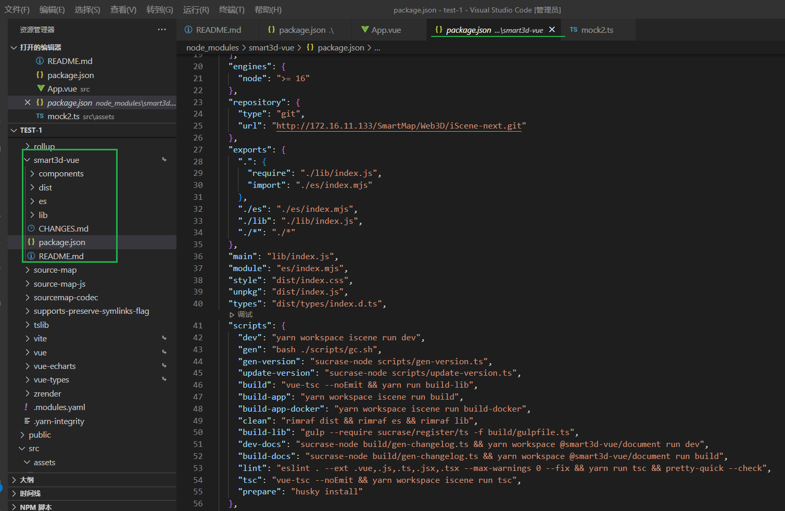
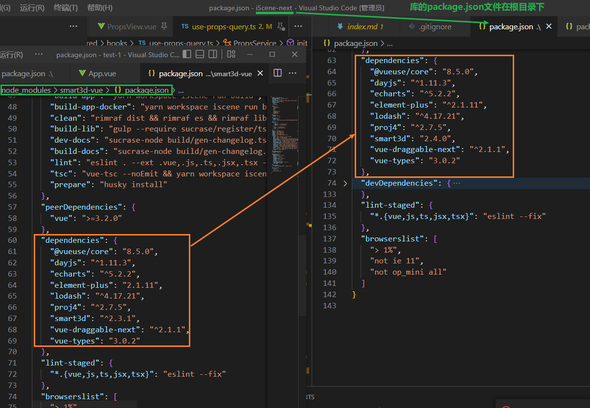
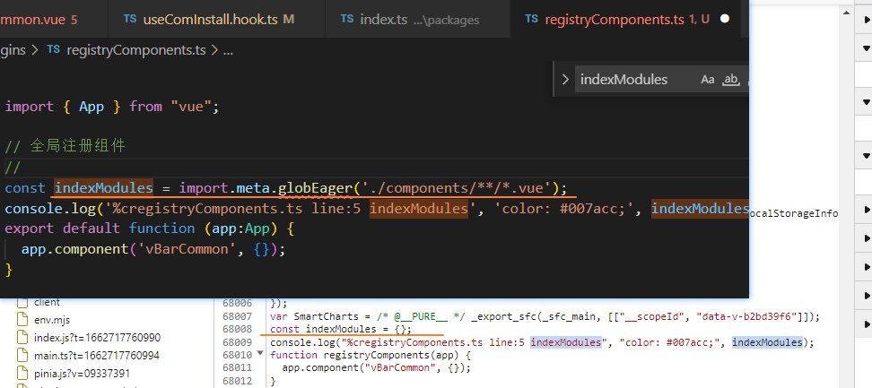

### 英女王伊丽莎白去世

### 一个仓库既是应用又需要打包库怎么设置

这个只有document

分离依赖

# 怎么发布 Vue.js 

[Vue 3.2 发布了，那尤雨溪是怎么发布 Vue.js 的？ - 掘金 (juejin.cn)](https://juejin.cn/post/6997943192851054606)

# Vite 是如何发布 npm 包的？

[Vite 是如何发布 npm 包的？ - 掘金 (juejin.cn)](https://juejin.cn/post/7064027320566317070)

### vite打包库时, 输出的结果中不能包含vite特有的API

`import.meta.globEager`

不然, 输出结果为空
