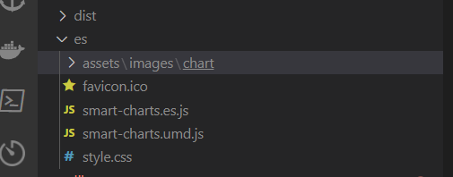

### Echart5 按需引入

不能再库中引入..

因为作用域不一样.


### Rollup 打包库

一个入口

输出多个不同标准 ['esm', 'umd']

如何配置?

```ts
build: {
        lib: {
          entry: resolve(__dirname, 'lib/index.ts'),
          name: 'SmartCharts',
          fileName: (ModuleFormat) => `smart-charts.${ModuleFormat}.js`,
          // formats: ['es', 'umd'],
        },
        outDir: OUTPUT_LIB_DIR, // 指定输出路径，要和库的包区分开
        rollupOptions: {
          // 确保外部化处理那些你不想打包进库的依赖
          external: ['vue', 'axios', 'vue-echarts', 'lodash', 'echarts'],
          output: {
            // 在 UMD 构建模式下为这些外部化的依赖提供一个全局变量
            globals: {
              vue: 'Vue',
              axios: 'axios',
              'vue-echarts': 'VueECharts',
              lodash: '_',
              echarts: 'Echarts',
            },
            // sourcemap: true, // 输出.map文件
          },
        },
      },
      plugins: [vue(), visualizer()],
```



