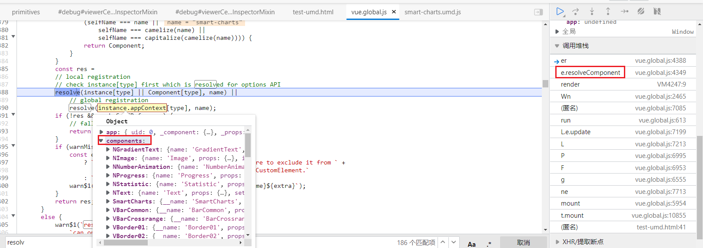
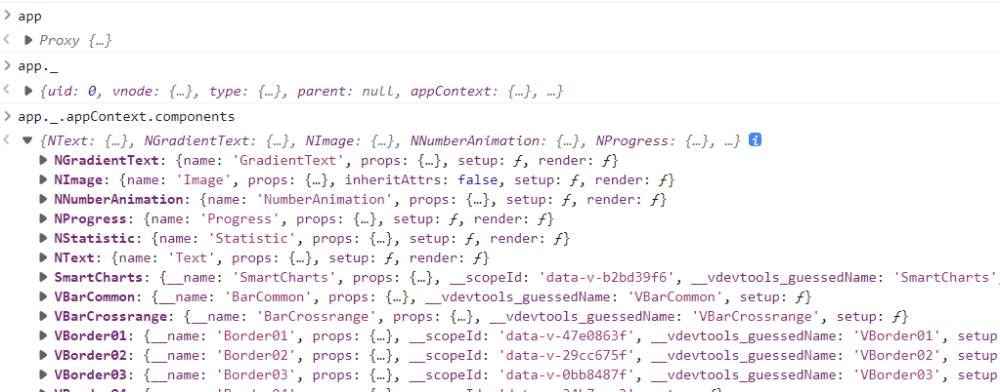

### Vue3 如何查看已经注册的全局组件

Vue2 可在 Vue.assets 中 看到






umd 需要通过访问 `_` 属性来获取吗? 很奇怪


### 使用打包umd库注册的组件一定要使用 `kabel-case` 组件名


### 剔除csdn的搜索结果

`-csdn` 不一定管用

` -site:csdn.net`


### smart-charts 参数处理

由于lib的入口组件使用prop传入参数且使用`provide`注入到内部组件.

所以

````html
<smart-charts :val="someValue" />
````

在smart-charts组件中处理了, 不影响后续组件使用 someValue 


如果不用 入口组件, 直接使用内部的 `Bar` 组件,

每个组件使用的 HOOK 是从 `inject` 中获取全局参数.. 

少了入口组件的逻辑则报错; 需要**手动补充依赖注入逻辑**..

> 这部分的逻辑可能需要修改


单个组件 & 组件配置 不冲突

