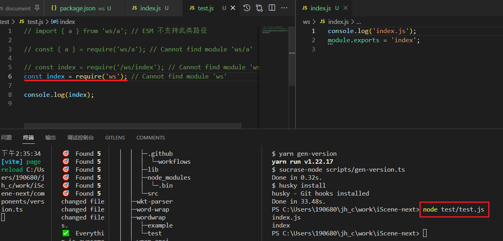

[TOC]

### npm update 命令

更新某个依赖包, 需要先把这个模块的版本号修改后再使用?


### iScene-next package.json 及 目录结构

```json
{
  "name": "smart3d-vue",
  "packageManager": "yarn@1.22.17",
  "version": "0.0.0-next",
  "description": "A web 3D client hight custom Scene for WebGL.",
  "author": "South Smart",
  "private": true,
  "workspaces": [
    "app",
    "document"
  ],
  "files": [
    "components",
    "dist",
    "es",
    "lib",
    "package.json",
    "README.md",
    "CHANGES.md"
  ],
  "engines": {
    "node": ">= 16"
  },
  "repository": {
    "type": "git",
    "url": "http://172.16.11.133/SmartMap/Web3D/iScene-next.git"
  },
  "exports": {
    ".": {
      "require": "./lib/index.js",
      "import": "./es/index.mjs"
    },
    "./es": "./es/index.mjs",
    "./lib": "./lib/index.js",
    "./*": "./*"
  },
  "main": "lib/index.js",
  "module": "es/index.mjs",
  "style": "dist/index.css",
  "unpkg": "dist/index.js",
  "types": "dist/types/index.d.ts",
  "scripts": {
    "dev": "yarn workspace iscene run dev",
    "gen": "bash ./scripts/gc.sh",
    "gen-version": "sucrase-node scripts/gen-version.ts",
    "update-version": "sucrase-node scripts/update-version.ts",
    "build": "vue-tsc --noEmit && yarn run build-lib",
    "build-app": "yarn workspace iscene run build",
    "build-app-docker": "yarn workspace iscene run build-docker",
    "clean": "rimraf dist && rimraf es && rimraf lib",
    "build-lib": "gulp --require sucrase/register/ts -f build/.ts",
    "dev-docs": "sucrase-node build/gen-changelog.ts && yarn workspace @smart3d-vue/document run dev",
    "build-docs": "sucrase-node build/gen-changelog.ts && yarn workspace @smart3d-vue/document run build",
    "lint": "eslint . --ext .vue,.js,.ts,.jsx,.tsx --max-warnings 0 --fix && yarn run tsc && pretty-quick --check",
    "tsc": "vue-tsc --noEmit && yarn workspace iscene run tsc",
    "prepare": "husky install",
    "postinstall": "yarn gen-version",
    "preinstall": "node ./build/yarn/check-yarn.js"
  },
  "peerDependencies": {
    "vue": ">=3.2.0"
  },
  "dependencies": {
    "...": "^...",
    "vue": "^3.2.6",
    "vue-tsc": "^0.2.2"
  },
  "lint-staged": {
    "*.{vue,js,ts,jsx,tsx}": "eslint --fix"
  },
  "browserslist": [
    "> 1%",
    "not ie 11",
    "not op_mini all"
  ]
}

```


package.json中与库相关的字段

```js
"exports": {
    ".": {
      "require": "./lib/index.js",
      "import": "./es/index.mjs"
    },
    "./es": "./es/index.mjs",
    "./lib": "./lib/index.js",
    "./*": "./*"
  },
  "main": "lib/index.js",
  "module": "es/index.mjs",
  "style": "dist/index.css",
  "unpkg": "dist/index.js",
  "types": "dist/types/index.d.ts",
```

[package.json 字段细节](https://docs.npmjs.com/cli/v8/configuring-npm/package-json)


### [workspaces](https://docs.npmjs.com/cli/v8/configuring-npm/package-json#workspaces) in packages.json

The optional `workspaces` field is an array of file patterns that describes locations within the local file system that the install client should look up to find each [workspace](https://docs.npmjs.com/cli/v8/using-npm/workspaces) that needs to be symlinked to the top level `node_modules` folder.

​	(描述了本地文件系统中的位置，安装客户端应查找该位置，以查找每个**workspace**，需要将**其**链接到顶层`node_modules' 文件夹。)

It can describe either the direct paths of the folders to be used as workspaces or it can define globs that will resolve to these same folders.

​	(描述要么用作工作区的文件夹的直接路径，也可以定义可以解析到这些相同文件夹的 glob。)

In the following example, all folders located inside the folder `./packages` will be treated as workspaces as long as they have valid `package.json` files inside them:

```json
{
  "name": "workspace-example",
  "workspaces": [
    "./packages/*"
  ]
}
```

See [`workspaces`](https://docs.npmjs.com/cli/v8/using-npm/workspaces) for more examples.


### [workspaces](https://docs.npmjs.com/cli/v8/using-npm/workspaces) 

**Workspaces** is a generic term that refers to the set of features in the npm cli that provides support to managing multiple packages from your local file system from within a singular top-level, root package.

​	**工作区**是一个通用术语，指的是 npm cli 中的一组功能，这些功能支持从单个顶级根包中管理本地文件系统中的多个包。

This set of features makes up for a much more streamlined workflow handling linked packages from the local file system. Automating the linking process as part of `npm install` and avoiding manually having to use `npm link` in order to add references to packages that should be symlinked into the current `node_modules` folder.

​	这组功能弥补了从本地文件系统处理链接包的更加简化的工作流程。将链接过程自动化作为一部分`npm install`并**避免手动使用`npm link`以添加对应符号链接**到当前 `node_modules`文件夹的包的引用。

We also refer to these packages being auto-symlinked during `npm install` as a single **workspace**, meaning it's a nested package within the current local file system that is explicitly defined in the [`package.json`](https://docs.npmjs.com/cli/v8/configuring-npm/package-json#workspaces) `workspaces` configuration.

​	我们还将这些自动符号链接的包`npm install`称为单个**工作区**，这意味着它是当前本地文件系统中的嵌套包，在配置 [`package.json`](https://docs.npmjs.com/cli/v8/configuring-npm/package-json#workspaces) `workspaces` 中明确定义。

### Defining workspaces

```json
{
  "name": "my-workspaces-powered-project",
  "workspaces": [
    "packages/a"
  ]
}
```

Given the above `package.json` example living at a current working directory `.` that contains a folder named `packages/a` that itself contains a `package.json` inside it, defining a Node.js package, e.g:

```sh
.
+-- package.json
`-- packages
   +-- a
   |   `-- package.json
```

The expected result once running `npm install` in this current working directory `.` is that the folder `packages/a` will get symlinked to the `node_modules` folder of the current working dir.

​	一旦再当前工作目录 `.` 下运行 `npm install` 命令后, 预期结果是 子文件夹 `packages/a` 会被链接到当前目录的 `node_modules` 文件夹中. 

​	这样就可以用于模块的检索了

​	子空间会 symlinked 到顶部空间的 `node_modules`

Below is a post `npm install` example, given that same previous example structure of files and folders:

```sh
.
+-- node_modules
|  `-- a -> ../packages/a
+-- package-lock.json
+-- package.json
`-- packages
   +-- a
   |   `-- package.json
```

运行 `npm install` 后可以看到 根目录 `./node_modules` 下增加了一下模块a, 其路径是连接到 `packages/a` 


只有顶部一个 node_modules 依赖目录吗? 工作空间 a 应该有自己的 node_modules 吧. 当然可以


**package.json**

```
{
  "private": true,
  "workspaces": ["workspace-a", "workspace-b"]
}
```

Note that the `private: true` is required! **Workspaces are not meant to be published**, so we’ve added this safety measure to make sure that nothing can accidentally expose them.

After this file has been created, create two new subfolders named `workspace-a` and `workspace-b`. In each of them, create another `package.json` file with the following content:


#### npm 工作区相关指令

You may automate the required steps to define a new workspace using [npm init](https://docs.npmjs.com/cli/v8/commands/npm-init). For example in a project that already has a `package.json` defined you can run:

```sh
npm init -w ./packages/a
```

This command will create the missing folders and a new `package.json` file (if needed) while also making sure to properly configure the `"workspaces"` property of your root project `package.json`.

 	创建丢失的文件夹和新`package.json` 文件（如果需要）

​	 确保正确配置 `"workspaces"`根项目的属性`package.json`。

>  npm init -w ./ws
>
> 然后跟 npm init 初始化一样的输入部分值


### 将依赖项添加到工作区

It's possible to **directly** add/remove/update dependencies of your **workspaces** using the [`workspace` config](https://docs.npmjs.com/cli/v8/using-npm/config#workspace).

assuming the following structure:

```sh
.
+-- package.json
`-- packages
   +-- a
   |   `-- package.json
   `-- b
       `-- package.json
```

If you want to add a dependency named `abbrev` from the registry as a dependency of your workspace **a**, you may use the **workspace config to tell the npm installer** that package should be added as a dependency of the provided workspace:

```sh
npm install abbrev -w a
```

-w WorkSpaceName

yarn 添加不知道是否为同样的参数

注意：其他安装命令，如`uninstall`,`ci`等也将尊重提供的`workspace`配置。


### 使用工作区

可以直接使用定义在工作空间中的模块

Given the [specifities of how Node.js handles module resolution](https://nodejs.org/dist/latest-v14.x/docs/api/modules.html#modules_all_together) it's possible to consume any defined workspace by its declared `package.json` `name`.

Continuing from the example defined above, let's also create a Node.js script that will require the workspace `a` example module, e.g:

```js
// ./packages/a/index.js
module.exports = 'a'

// ./lib/index.js
const moduleA = require('a'); // 直接引用工作空间
console.log(moduleA) // -> a
```


> test: 测试无法正确找到模块.. 不知道是否与工作区间的package.json设置相关
>
> 
>
> 

require 加载工作区间步骤

```
LOAD_AS_DIRECTORY(X)
1. If X/package.json is a file,
   a. Parse X/package.json, and look for "main" field.
   b. If "main" is a falsy value, GOTO 2.
   c. let M = X + (json main field)
   d. LOAD_AS_FILE(M)
   e. LOAD_INDEX(M)
   f. LOAD_INDEX(X) DEPRECATED
   g. THROW "not found"
2. LOAD_INDEX(X)
```


#### 基于 yarn 文档修改后可以正确获取工作空间的模块

https://yarn.bootcss.com/docs/workspaces

1. 将工作空间 ws 写入根目录下的`package.json`中的`dependencies` (可能是非必须)
2. yarn / npm install 重新安装



基于第一点我再创建一个工作空间确认


确认为添加到 依赖 中为不需要的操作.


### 在工作区的上下文中运行命令

You can use the `workspace` configuration option to run commands in the context of a configured workspace. 

Additionally, if your current directory is in a workspace, the `workspace` configuration is implicitly set, and `prefix` is set to the root workspace.

您可以使用`workspace`配置选项在已配置工作区的上下文中运行命令。

此外，如果您的当前目录位于工作区中，则`workspace` 配置是隐式设置的，并设置`prefix`为根工作区。


By running a command using the `workspace` option, it's possible to run the given command in the context of that specific workspace. 

​	使用`workspace`选项运行命令，可以在该特定工作区的上下文中运行给定的命令

```sh
npm run test --workspace=a
# 等同于
cd packages/a && npm run test
```

还可以在命令行中多次指定此参数以针对多个工作区

```sh
npm run test --workspace=a --workspace=b
```

也可以使用（复数）配置选项来启用相同的行为，在**所有**已配置工作区`workspaces`的上下文中运行该命令。

```sh
npm run test --workspaces
```

Commands will be run **in each workspace in the order** they appear in your `package.json`

跟定义的工作区间的顺序依次执行


