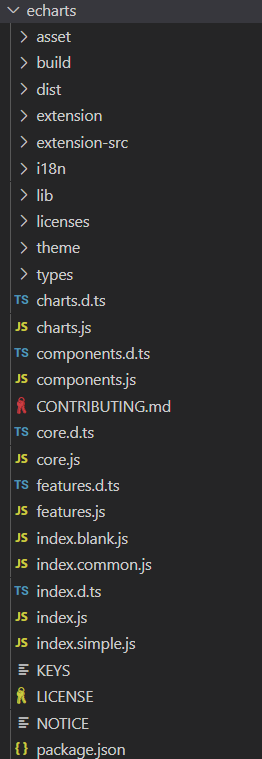

[TOC]

## yarn workspace

https://yarn.bootcss.com/docs/cli/workspaces

### CLI

#### yarn workspace

```sh
yarn workspace <workspace_name> <command>
```

Example:

```
yarn workspace awesome-package add react react-dom --dev
```

This will add `react` and `react-dom` as `devDependencies` in your `packages/awesome-package/package.json`.

If you want to remove a package:

```
yarn workspace web-project remove some-package
```

The example above would remove `some-package` from `packages/web-project/package.json`.


#### yarn workspaces

```sh
yarn workspaces run <command>
```

This will run the chosen Yarn command in each workspace.

```sh
yarn workspaces run test
```


### npm 镜像的设置与删除

查看:

```sh
npm config get registry
```

```sh
npm config list
```

设置:

```sh
npm config set registry https://registry.npm.taobao.org/
```

官方源地址: https://registry.npmjs.org/

删除:

```sh
npm config rm registry
```


### 发布 npm 包的坑

当名字与已有的包相似时, npm会提示添加 `@name`作为前缀, 并以私有包发布

> npm ERR! code E403
> npm ERR! 403 403 Forbidden - PUT https://registry.npmjs.org/smart-charts - Package name too similar to existing package smartcharts; try renaming your package to '@jianghao_gdufs/smart-charts' and publishing with 'npm publish --access=public' instead


## npm域级包

随着npm包越来越多，而且包名也只能是唯一的，如果一个名字被别人占了，那你就不能再使用这个名字；

假设我想要开发一个utils包，但是张三已经发布了一个utils包，那我的包名就不能叫utils了；

此时我们可以加一些连接符或者其他的字符进行区分，但是这样就会让包名不具备可读性。

在npm的包管理系统中，有一种`scoped packages`机制，用于将一些npm包以`@scope/package`的命名形式集中在一个命名空间下面，实现域级的包管理。

**域级**包不仅不用担心会和别人的包名重复，同时也能对功能类似的包进行统一的划分和管理；比如我们用vue脚手架搭建的项目，里面就有`@vue/cli-plugin-babel`、`@vue/cli-plugin-eslint`等等域级包。

我们在初始化项目时可以使用命令行来添加scope：

```bash
npm init --scope=username
```

相同域级范围内的包会被安装在相同的文件路径下，比如`node_modules/@username/`，可以包含任意数量的作用域包；安装域级包也需要指明其作用域范围：

```bash
npm install @username/package
```

在代码中引入时同样也需要作用域范围:

```javascript
require("@username/package")
```


> 发布收到的email:
>
> A new version of the package @jianghao_gdufs/smart-charts (3.0.0-alpha) was published at 2022-09-21T08:52:58.491Z from
> 61.144.116.56. The shasum of this package was  哈哈哈哈哈.


安装依赖查看内部内容


上图是在 `smart-charts` 根目录下发布的


再使用 `lib` 路径下 publish, 必须要修改其verison后才发布


发布后太快安装可能会报 npmjs 还没找到该版本, 需要查询可下载的版本


`pnpm view @jianghao_gdufs/smart-charts versions`

`[ '3.0.0-alpha', '3.0.0-alpha-1', '3.0.0-alpha-2', '3.0.0-alpha-3' ]`


修改 `lib/package.json` 的 `files` 并publish, 终于达到初步预期了

```json
"name": "@jianghao_gdufs/smart-charts",
"version": "3.0.0-alpha-3",
"files": ["package.json", "readme.md", "dist"],
```


后续还需要调整模块入口


### 测试发布的npm包


内部的 `esm` 模块


.. 为什么没有引入echarts模块呢?


#### echarts npm 依赖包 与 github 仓库




lib 应该是输出的代码内部.. 

`package.json` => `"release": "npm run build:lib && npm run build:i18n && npm run build && npm run build:esm && npm run build:extension",`

 `build/build.js`
