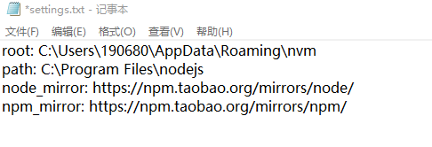
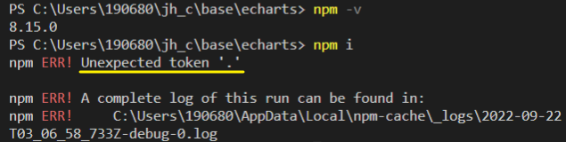
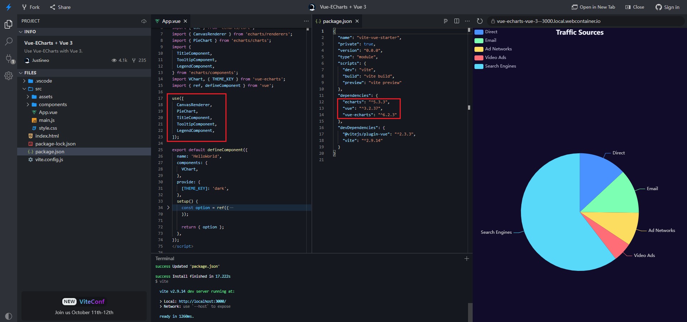

### 京东回收估价

### 二手

hipda,chiphell(门槛),数字尾巴，本站(v2)交易区

12k 买了一个 16 寸 16g/512 m1 pro

### 12 pro max

128g 4500 收
256g 5100 收

- 带 AC 的 256GB （ 23/1 月到期） 12PM 上个月出了 5600

### 13P

256g 6.3k (有瑕疵的可6k收) 电池or划痕

### 13

256g 电池健康：91% 4k 

### echarts

master分支不能用 `pnpm i` 安装依赖...

### nvm 下载node.js 超时

由于nvm默认的下载地址[http://nodejs.org/dist/](https://link.jianshu.com?t=http%3A%2F%2Fnodejs.org%2Fdist%2F)是外国外服务器，国内很慢可以使用淘宝的镜像

> node_mirror: [https://npm.taobao.org/mirrors/node/](https://link.jianshu.com?t=https%3A%2F%2Fnpm.taobao.org%2Fmirrors%2Fnode%2F)
>  npm_mirror: [https://npm.taobao.org/mirrors/npm/](https://link.jianshu.com?t=https%3A%2F%2Fnpm.taobao.org%2Fmirrors%2Fnpm%2F)

打nvm的安装路径把上面的镜像地址复制到settings.txt中就OK了。

https://www.jianshu.com/p/0e4f2bfadf3e

.. 使用 nvm 安装最新版的node.js后又有新问题

[nvm版本导致npm install报错 Unexpected token ‘.‘_别问我也不会的博客-CSDN博客](https://blog.csdn.net/weixin_47359038/article/details/124056312)

博客说是 nvm 1.1.7版本出现的.. 碰巧我就是

也使用`nrm` 模块管理注册地址

# ZRender

[ZRender](https://github.com/ecomfe/zrender) 是二维绘图引擎，它提供 Canvas、SVG、VML 等多种渲染方式。ZRender 也是 [ECharts](http://echarts.baidu.com/) 的渲染器。

https://ecomfe.github.io/zrender-doc/public/

https://ecomfe.github.io/zrender-doc/public/api.html

### smart-charts 打包的esm确实需要额外手动引入echarts

[Vue-ECharts + Vue 3 - StackBlitz](https://stackblitz.com/edit/vue-echarts-vue-3?file=src%2FApp.vue&file=package.json)

与vue-echarts一致

