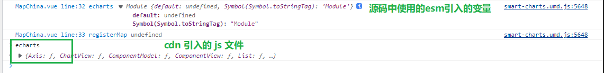
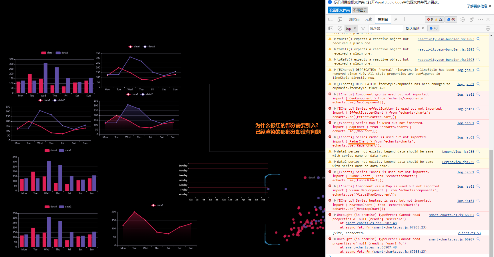
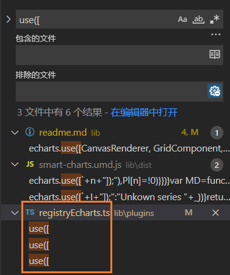
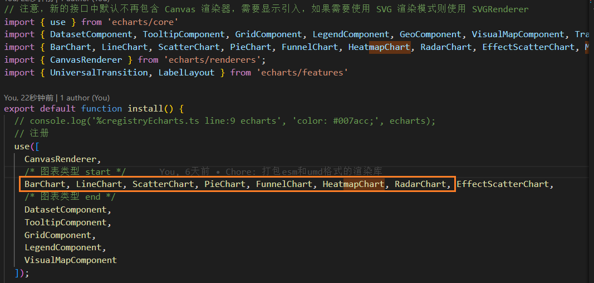

### vue-echarts 打包库

echarts 引入方式


### 可选链遇到变量key

```ts
const key = 'a';
const obj = { [key]: {} };
const val = obj?.[key]
```


### echarts 地图注册

打包umd库无法正确注册地图

原因在于



所以需要把map 注册到 window.echarts 中.


esm 打包的库 + 二次引用也会如此.. 怎么解决


### esm 作为依赖应用存在问题

只作为一个组件使用时, 不额外引入echarts..



明明都是一样的引入方式: 



统一引入模块的




### peerDependencies

[前端 - 一文搞懂peerDependencies_个人文章 - SegmentFault 思否](https://segmentfault.com/a/1190000022435060)

使用 `peerDependency` 来声明核心依赖库


当我们开发一个模块的时候，如果当前模块与所依赖的模块同时依赖一个第三方模块，并且依赖的是两个不兼容的版本时就会出现问题。

比如，你的项目依赖A模块和B模块的1.0版，而A模块本身又依赖B模块的2.0版。

大多数情况下，这不构成问题，B模块的两个版本可以并存，同时运行。但是，有一种情况，会出现问题，就是这种依赖关系将暴露给用户。

> node_modules
>
> - A
>   - B 2.0
> - B 1.0

**最典型的场景就是插件，比如A模块是B模块的插件**。用户安装的B模块是1.0版本，但是A插件只能和2.0版本的B模块一起使用。这时，用户要是将1.0版本的B的**实例传给A，就会出现问题**。因此，需要一种机制，在模板安装的时候提醒用户，如果A和B一起安装，那么B必须是2.0模块。

`peerDependencies`字段，就是用来供插件指定其所需要的主工具的版本。


peerDependencies不再会默认安装了。


#### [npm peerDependencies 文档](https://docs.npmjs.com/cli/v8/configuring-npm/package-json#peerdependencies)

In some cases, you want to express the compatibility of your package with a host tool or library, while not necessarily doing a `require` of this host. 

This is usually referred to as a *plugin*. Notably, your module may be exposing a specific interface, expected and specified by the host documentation.

For example:

```json
{
  "name": "tea-latte",
  "version": "1.3.5",
  "peerDependencies": {
    "tea": "2.x"
  }
}
```

This ensures your package `tea-latte` can be installed *along* with the second major version of the host package `tea` only. 

`npm install tea-latte` could possibly yield the following dependency graph:

`npm install tea-latte`可能会产生以下依赖关系图:

```bash
├── tea-latte@1.3.5
└── tea@2.2.0
```

- 上面的示例就是 `tea-latte` 包依赖`tea`
- 最终结果是安装扁平化的依赖 `应用` 使用的依赖 `tea-latte` 不再自己安装 `tea` 应用

In npm versions 3 through 6, `peerDependencies` were not automatically installed, and would raise a warning if an invalid version of the peer dependency was found in the tree. 


**Peer dependencies that should be installed**

安装依赖报错, 如何处理

```ts
Peer dependencies that should be installed:
  rollup@">=2.42.0 <3.0.0"  webpack@^5.0.0
```


### 打包库 smart-charts 遇到echarts相关的坑

1. 引入各自的包导致部分需要手动引入的 `xChart` 报错

   需要在 打包的 lib 的package.json中指定 `peerDependencies` 中使用 echarts

   同时需要在外部`应用`安装依赖 `echarts` 在 `dependencies`  中

   让 lib 引入与`应用`相同的包 .. **保持对象引用一致**

2. echarts的引入格式

   确定是否可以按需引用

   `registryEcharts.ts`

   ```ts
   // 引入 echarts 核心模块，核心模块提供了 echarts 使用必须要的接口。
   import { use, registerMap } from 'echarts/core';
   // 注意，新的接口中默认不再包含 Canvas 渲染器，需要显示引入，如果需要使用 SVG 渲染模式则使用 SVGRenderer
   // 引入 Canvas 渲染器，注意引入 CanvasRenderer 或者 SVGRenderer 是必须的一步
   import { CanvasRenderer } from 'echarts/renderers';
   // 引入提示框，标题，直角坐标系，数据集，内置数据转换器组件，组件后缀都为 Component
   import { DatasetComponent, TooltipComponent, GridComponent, LegendComponent, TitleComponent, GeoComponent, VisualMapComponent, TransformComponent } from 'echarts/components';
   // 引入柱状图图表，图表后缀都为 Chart
   import { BarChart, LineChart, ScatterChart, PieChart, FunnelChart, HeatmapChart, RadarChart, EffectScatterChart, MapChart } from 'echarts/charts';
   // 标签自动布局，全局过渡动画等特性
   import { UniversalTransition, LabelLayout } from 'echarts/features'
   
   import mapJson from './mapGeoJSON/map.json'
   
   
   export default function install() {
     // 注册
     use([
       CanvasRenderer,
       /* 图表类型 start */
       BarChart, LineChart, ScatterChart, PieChart, FunnelChart, HeatmapChart, RadarChart, EffectScatterChart,
       /* 图表类型 end */
       DatasetComponent,
       TooltipComponent,
       GridComponent,
       LegendComponent,
       TitleComponent,
       VisualMapComponent
     ]);
   
     // 地图
      use([
       MapChart,
       GeoComponent,
     ])
   
     registerMap('china', { geoJSON: mapJson as any, specialAreas: {} })
   
      use([
       TransformComponent,
       UniversalTransition,
       LabelLayout
     ])
   }
   ```

   `test-2/src/main.js`

   ```js
   import 'echarts';
   import SmartCharts from '@jianghao_gdufs/smart-charts'
   import '@jianghao_gdufs/smart-charts/dist/style.css'
   ```

   全局引入 echarts .. 不然无法正确渲染组件..

   > 目前不知道原因, 不确定是否可以优化

3. echarts 注册地图

   需要保持引用一致, 不一致则会报错: `需要先导入 GeoJSON`

   ```ts
   import mapJson from './map.json'
   import * as echarts from 'echarts'
   const { registerMap } = echarts;
   const register = (window as any).echarts?.registerMap || registerMap
   register('china', { geoJSON: mapJson as any, specialAreas: {} })
   ```

   为了兼容 `umd `, 需要读取全局变量 `echarts`.. 

   为了保持引用一致, 引用路径 `echarts`. 

   `echarts.registerMap`

   > 不是 `echarts/core`. 
   >
   > 试验出的结果, 不确定是否可以优化成按需引入...

4. 
