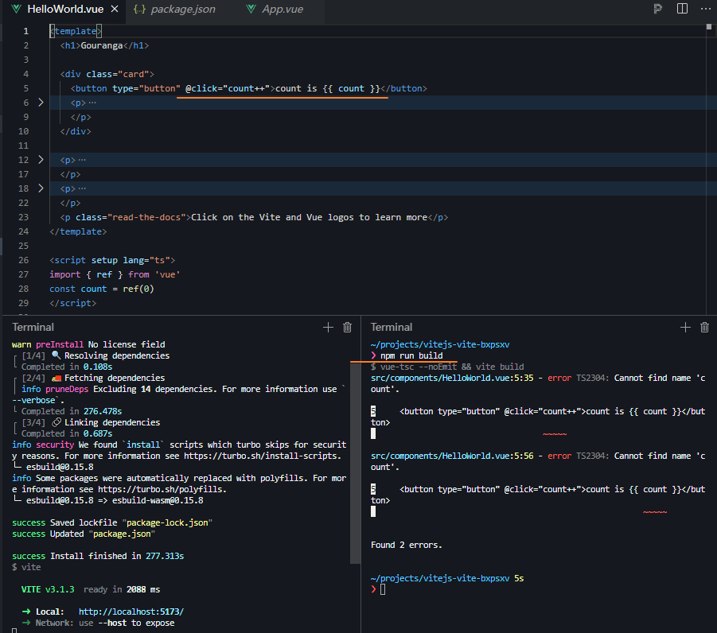

### vite build 报错

` error TS2304: Cannot find name 'xxx' `

在vue3里面搜 issue 有类似的案例 https://github.com/vuejs/core/issues/6718

重现地址: https://stackblitz.com/edit/vitejs-vite-bxpsxv?file=src%2Fcomponents%2FHelloWorld.vue,package.json,tsconfig.json&terminal=dev

并且时间比较近, 7天前

Create a component where the `template` tag is before the `script` tag and try to build with `npm run build`

移到前面也一样..

 -- 我修改为其他的变量名后不再报错.. 但是有其他的问题

感觉是vue-tsc的问题呀

我本地的 vue-tsc 版本 0.28.10 (go-view也是这个版本)

.. iScene-next 版本为0.2.3

-- (go-view也是这个版本)  是不是我修改了vue文件之后才不行?

#### 其他的问题

使用 vue-tsc 编译时 ts 报错

### 如何用 node 写轮子?

这估计需要看下图文了

https://github.com/johnsoncodehk/volar/blob/master/package.json

看volar仓库中可以发现使用了 `ts` , `vscode` 等其他的轮子
