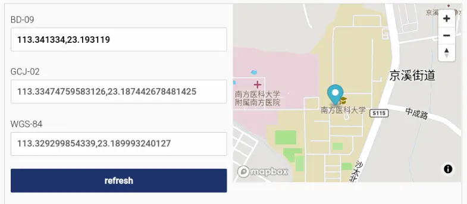

### [FightingDesign](https://github.com/FightingDesign/fighting-design)

[Button 按钮 | Fighting Design (tianyuhao.cn)](https://fighting.tianyuhao.cn/components/button.html)

一款个人开发者打造的 Vue3 组件库，已经有相当的规模

[中国坐标系简明指南](https://abstractkitchen.com/blog/a-short-guide-to-chinese-coordinate-system/)（英文）

中国的地图服务的坐标系需要转换，作者作为一个外国的网络地图开发者，介绍了这方面的情况。

# Automating a software company with GitHub Actions

[如何使用 GitHub Actions 自动化开发流程](https://posthog.com/blog/automating-a-software-company-with-github-actions)（英文）

作者介绍他们公司如何使用 GitHub Actions，将各种开发步骤自动化，举了很多例子，演示了测试、代码格式化、构建、部署的配置文件应该怎么写。
