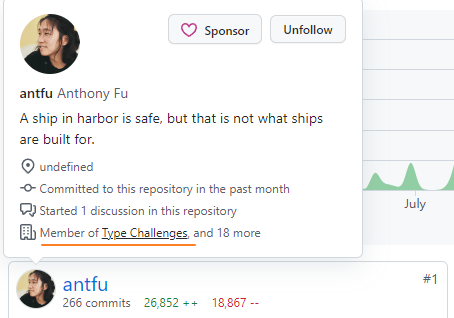
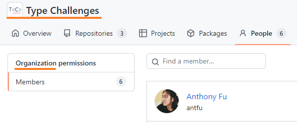

# 整理图形学相关学习材料

### 书籍

1. 虎书 [./fundamentals-of-computer-graphics-4th.pdf](./fundamentals-of-computer-graphics-4th.pdf)
2. [GAMES101-现代计算机图形学入门-闫令琪](https://www.bilibili.com/video/BV1X7411F744/?spm_id_from=333.788.top_right_bar_window_view_later.content.click)

### 视频

1. 

### 在线网站

1. [WebGL 理论基础 有中简(webglfundamentals.org)](https://webglfundamentals.org/webgl/lessons/zh_cn/)

2. [wgld.org | WebGL |](https://wgld.org/d/webgl/)  时间: 2012 年 2 月

## 整理 ts 学习材料

**github 仓库**

1. https://github.com/total-typescript/beginners-typescript-tutorial

2. antfu 大佬搞的.. [type-challenges](https://github.com/type-challenges/type-challenges/blob/main/README.zh-CN.md)

   

   

   想要完成挑战还是需要基础的..

3. 

**视频:**

1. [TS全解](https://www.bilibili.com/video/BV1qG411t7B8/?spm_id_from=333.788.top_right_bar_window_view_later.content.click)
