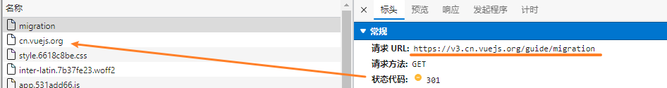

广东南方信息安全产业基地有限公司 - jd


### vue-demi

https://github.com/vueuse/vue-demi

**Vue Demi** (*half* in French) is a developing utility
allows you to write **Universal Vue Libraries** for Vue 2 & 3

https://antfu.me/posts/make-libraries-working-with-vue-2-and-3

开发兼容 Vue 2 / 3 项目的必备工具。原理是通过 postinstall 脚本自动根据环境 Vue 版本切换对应引用并抹平模块接口差异。


### [matter-js](https://brm.io/matter-js/)

*Matter.js* is a **2D physics engine** for the web

二维物理引擎 (基于canvas实现)

https://github.com/liabru/matter-js

[Matter.js Physics Engine API Docs - matter-js 0.18.0 (brm.io)](https://brm.io/matter-js/docs/)


### HTML的模板引擎：pug模板语法

Pug is **a high-performance template engine** heavily influenced by [Haml](http://haml.info/) and implemented with JavaScript for [Node.js](http://nodejs.org/) and browsers.

#### 解决的痛点

1. HTML标签必须进行闭合，如果不闭合的话容易报错。
2. HTML没有模板机制，如果不使用前端框架维护起来非常困难。

**`pug`和`HTML`**最大的不同在于它**拥有自己的语法，拥有循环、条件控制、定义变量等功能**。

可以说如果在没有前端框架的年代，这些功能是多么的有诱惑力，但是，近几年React、Vue的出现，**已经解决了这些痛点**。  (不需要深入学习了)

#### Rename from "Jade"

This project was formerly known as "Jade". However, it was revealed to us that "Jade" is a **registered** trademark (已注册商标...);

as a result, a rename was needed. 

After some discussion among the maintainers, **"Pug"** was chosen as the new name for this project. As of version 2, "pug" is the official package name.

Pug is a clean, whitespace sensitive syntax for writing HTML. Here is a simple example:

```sh
doctype html
html(lang="en")
  head
    title= pageTitle
    script(type='text/javascript').
      if (foo) bar(1 + 5);
  body
    h1 Pug - node template engine
    #container.col
      if youAreUsingPug
        p You are amazing
      else
        p Get on it!
      p.
        Pug is a terse and simple templating language with a
        strong focus on performance and powerful features.
```

Pug transforms the above to:

```html
<!DOCTYPE html>
<html lang="en">
  <head>
    <title>Pug</title>
    <script type="text/javascript">
      if (foo) bar(1 + 5);
    </script>
  </head>
  <body>
    <h1>Pug - node template engine</h1>
    <div id="container" class="col">
      <p>You are amazing</p>
      <p>
        Pug is a terse and simple templating language with a strong focus on
        performance and powerful features.
      </p>
    </div>
  </body>
</html>
```

docs: https://pugjs.org/language/conditionals.html


### 如何学习 vue3 的 core 仓库

如何debugger?

[如何调试vue3源码？ - 腾讯云开发者社区-腾讯云 (tencent.com)](https://cloud.tencent.com/developer/article/1944802)


### 状态码 301

永久重定向

原vue3文档地址重定向到新版



但是新版没有翻译完全... 怎么看回到旧版的内容呢??
