[TOC]

## vue-demi 源码调试

示例1 use-mouse:  依赖的是vue2.6.x版本, 代码中使用了组合式API的接口

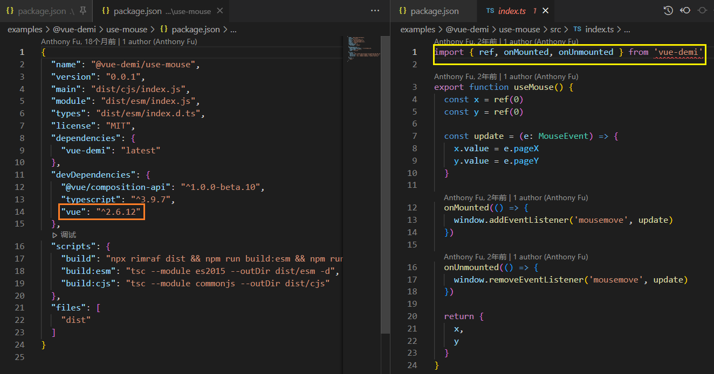

pnpm 安装依赖后看到其实是安装的 2.7.10 的vue

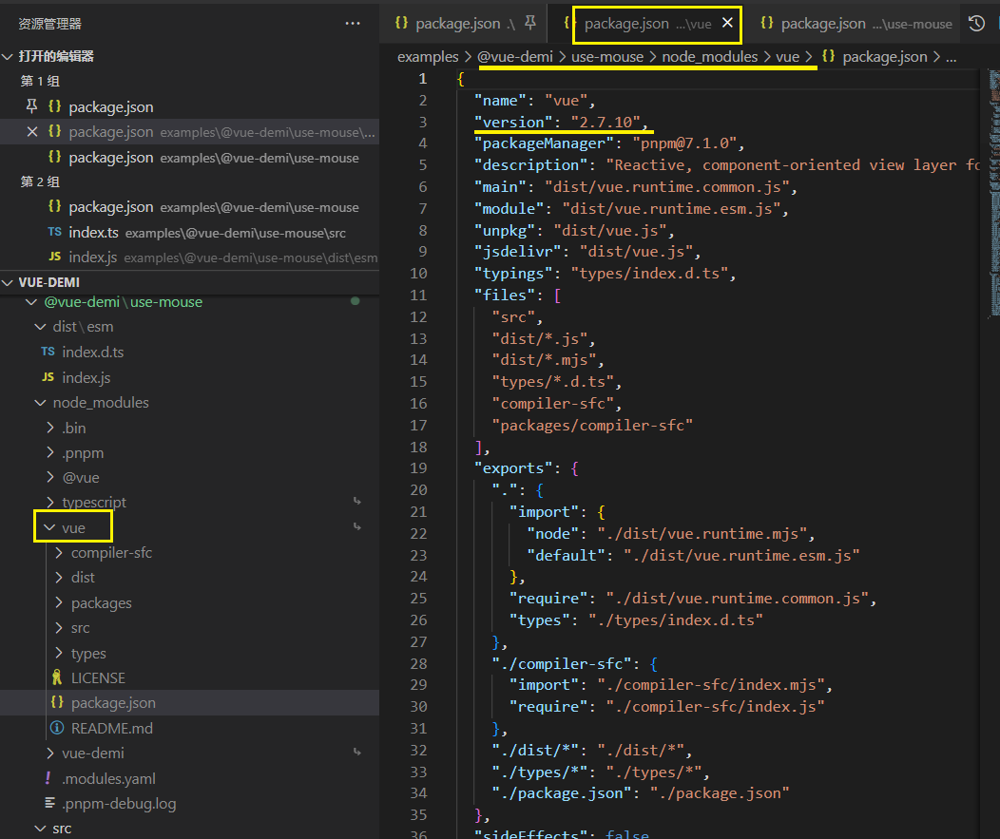

打包成库后能看到依赖的是 vue@2.7.10

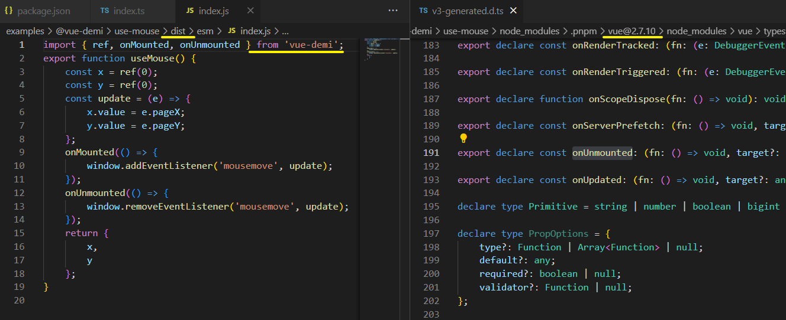

可以给 vue-cli / vite 使用. (分别对应2.6.x, 3.x)


使用vue-demi的方式

Add `vue` and `@vue/composition-api` to your plugin's peer dependencies to specify what versions you support.

```JSON
{
  "dependencies": {
    "vue-demi": "latest"
  },
  "peerDependencies": {
    "@vue/composition-api": "^1.0.0-rc.1",
    "vue": "^2.0.0 || >=3.0.0"
  },
  "peerDependenciesMeta": {
    "@vue/composition-api": {
      "optional": true
    }
  },
  "devDependencies": {
    "vue": "^3.0.0" // or "^2.6.0" base on your preferred working environment
  },
}
```

Import everything related to Vue from it, it will redirect to `vue@2` + `@vue/composition-api` or `vue@3` based on users' environments.

```js
import { ref, reactive, defineComponent } from 'vue-demi'
```


Publish your plugin and all is done! (发布插件)

> When using with [Vite](https://vitejs.dev/), you will need to opt-out the pre-bundling to get `vue-demi` work properly by
>
> ```
> // vite.config.js
> export default defineConfig({
>   optimizeDeps: {
>     exclude: ['vue-demi']
>  }
> })
> ```

在vite中使用需要排除 `vue-demi` 作为预构建的依赖.


逻辑: `package.json/scripts/postintall`

Run AFTER the package is installed.


## [npm scripts](https://docs.npmjs.com/cli/v8/using-npm/scripts)

The `"scripts"` property of your `package.json` file supports a number of built-in scripts and their preset life cycle events as well as arbitrary(任意的) scripts.

These all can be executed by running `npm run-script ` or `npm run ` for short. 

*Pre* and *post* commands with matching names will be run for those as well (e.g. `premyscript`, `myscript`, `postmyscript`). Scripts from dependencies can be run with `npm explore  -- npm run `.

简单理解就是执行一个命令会有生命周期钩子触发, 如果命中有`Pre/Post`前缀的脚本指令, 也会在相应生命周期阶段执行

### Pre & Post Scripts

To create "pre" or "post" scripts for any scripts defined in the `"scripts"` section of the `package.json`, simply create another script *with a matching name* and add "pre" or "post" to the beginning of them.


```json
{
  "scripts": {
    "precompress": "{{ executes BEFORE the `compress` script }}",
    "compress": "{{ run command to compress files }}",
    "postcompress": "{{ executes AFTER `compress` script }}"
  }
}
```

In this example `npm run compress` would execute these scripts as described.


### Life Cycle Scripts

There are some special life cycle scripts that happen only in certain situations. 
These scripts happen in addition to the `pre<event>`, `post<event>`, and `<event>` scripts.
除了`pre<event>`,`<event>`,`post<event>`会触发外,  特殊的生命周期脚本还有其他的脚本触发

详见: https://docs.npmjs.com/cli/v8/using-npm/scripts#life-cycle-operation-order

这里仅罗列 [`install`](https://docs.npmjs.com/cli/v8/using-npm/scripts#npm-install) 钩子触发的生命周期

#### [`npm install`](https://docs.npmjs.com/cli/v8/commands/npm-install)

These also run when you run `npm install -g <pkg-name> ` 

- `preinstall`
- `install`
- `postinstall`
- `prepublish`
- `preprepare`
- `prepare`
- `postprepare`

If there is a `binding.gyp` file in the root of your package and you haven't defined your own `install` or `preinstall` scripts, npm will default the `install` command to **compile** using node-gyp via `node-gyp rebuild`

  特殊的支持: 根目录有`building.gyp` + 未定义 `install&preinstall` 脚本 => npm 将默认`install`使用 node-gyp 编译命令`node-gyp rebuild`

These are run from the scripts of `<pkg-name>`


## 想触发 postinstall.js 这个脚本的debugger

直接运行 `postinstall` ..

选中命令并调试即可

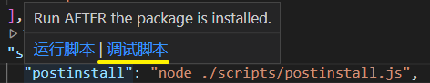


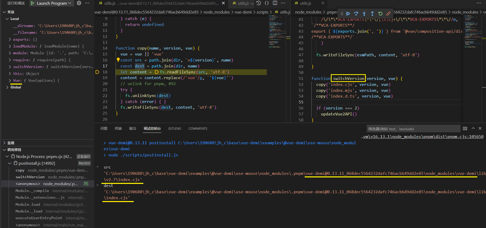

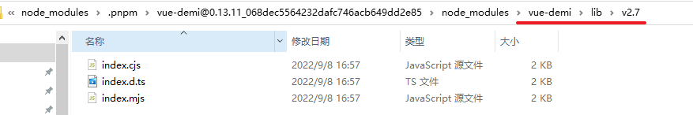

查询源文件, 打开可以见到`vue-demi`真正的处理

### 把2.7.x兼容可以使用 Vue3 的API

```js
// index.cjs
var VueModule = require('vue')

// get the real Vue https://github.com/vueuse/vue-demi/issues/192
var Vue = VueModule.default || VueModule

exports.Vue = Vue
exports.Vue2 = Vue
exports.isVue2 = true
exports.isVue3 = false
exports.install = function () {}
exports.warn = Vue.util.warn

// createApp polyfill
exports.createApp = function (rootComponent, rootProps) {
  var vm
  var provide = {}
  var app = {
    config: Vue.config,
    use: Vue.use.bind(Vue),
    mixin: Vue.mixin.bind(Vue),
    component: Vue.component.bind(Vue),
    provide: function (key, value) {
      provide[key] = value
      return this
    },
    directive: function (name, dir) {
      if (dir) {
        Vue.directive(name, dir)
        return app
      } else {
        return Vue.directive(name)
      }
    },
    mount: function (el, hydrating) {
      if (!vm) {
        vm = new Vue(Object.assign({ propsData: rootProps }, rootComponent, { provide: Object.assign(provide, rootComponent.provide) }))
        vm.$mount(el, hydrating)
        return vm
      } else {
        return vm
      }
    },
    unmount: function () {
      if (vm) {
        vm.$destroy()
        vm = undefined
      }
    },
  }
  return app
}

Object.keys(VueModule).forEach(function (key) {
  exports[key] = VueModule[key]
})
```

```js
// index.mjs
import Vue from 'vue'

var isVue2 = true
var isVue3 = false
var Vue2 = Vue
var warn = Vue.util.warn

function install() {}

// createApp polyfill
export function createApp(rootComponent, rootProps) {
  var vm
  var provide = {}
  var app = {
    config: Vue.config,
    use: Vue.use.bind(Vue),
    mixin: Vue.mixin.bind(Vue),
    component: Vue.component.bind(Vue),
    provide: function (key, value) {
      provide[key] = value
      return this
    },
    directive: function (name, dir) {
      if (dir) {
        Vue.directive(name, dir)
        return app
      } else {
        return Vue.directive(name)
      }
    },
    mount: function (el, hydrating) {
      if (!vm) {
        vm = new Vue(Object.assign({ propsData: rootProps }, rootComponent, { provide: Object.assign(provide, rootComponent.provide) }))
        vm.$mount(el, hydrating)
        return vm
      } else {
        return vm
      }
    },
    unmount: function () {
      if (vm) {
        vm.$destroy()
        vm = undefined
      }
    },
  }
  return app
}

export { Vue, Vue2, isVue2, isVue3, install, warn }
export * from 'vue'
```

- 导入 Vue 模块
- 导出一些标志
- 兼容 createApp这个Vue3的API
- install 方法
- 导出 Vue 模块和兼容处理

### 2.x -> Vue3

```js
import Vue from 'vue'
import VueCompositionAPI from '@vue/composition-api/dist/vue-composition-api.mjs'

function install(_vue) {
  _vue = _vue || Vue
  if (_vue && !_vue['__composition_api_installed__'])
    _vue.use(VueCompositionAPI)
}

install(Vue)

var isVue2 = true
var isVue3 = false
var Vue2 = Vue
var version = Vue.version

/**VCA-EXPORTS**/
export * from '@vue/composition-api/dist/vue-composition-api.mjs'
/**VCA-EXPORTS**/

export {
  Vue,
  Vue2,
  isVue2,
  isVue3,
  version,
  install,
}
```

除了引入Vue, 还引入了 `vue-composition-api`, 并作为插件安装

#### `install()`

Vue 2 中的 Composition API 作为插件提供，需要在使用前安装在 Vue 实例上。

通常，`vue-demi`会尝试自动安装它。

对于您可能需要确保正确安装插件的某些用途，`install()`API 作为`Vue.use(CompositionAPI)`的一个安全版本. 

`install()`在 Vue 3 环境中将是一个空函数（no-op）。

```js
import { install } from 'vue-demi'

install()
```

### 3.x => 3.x

啥也没做..

```js
import * as Vue from 'vue'

var isVue2 = false
var isVue3 = true
var Vue2 = undefined

function install() {}

export function set(target, key, val) {
  if (Array.isArray(target)) {
    target.length = Math.max(target.length, key)
    target.splice(key, 1, val)
    return val
  }
  target[key] = val
  return val
}

export function del(target, key) {
  if (Array.isArray(target)) {
    target.splice(key, 1)
    return
  }
  delete target[key]
}

export * from 'vue'
export {
  Vue,
  Vue2,
  isVue2,
  isVue3,
  install,
}
```


总结 Strategies

\- `<=2.6`: exports from `vue` + `@vue/composition-api` with plugin auto installing.

\- `2.7`: exports from `vue` (**Composition API is built-in in Vue 2.7**).

\- `>=3.0`: exports from `vue`, with polyfill of Vue 2's `set` and `del` API.

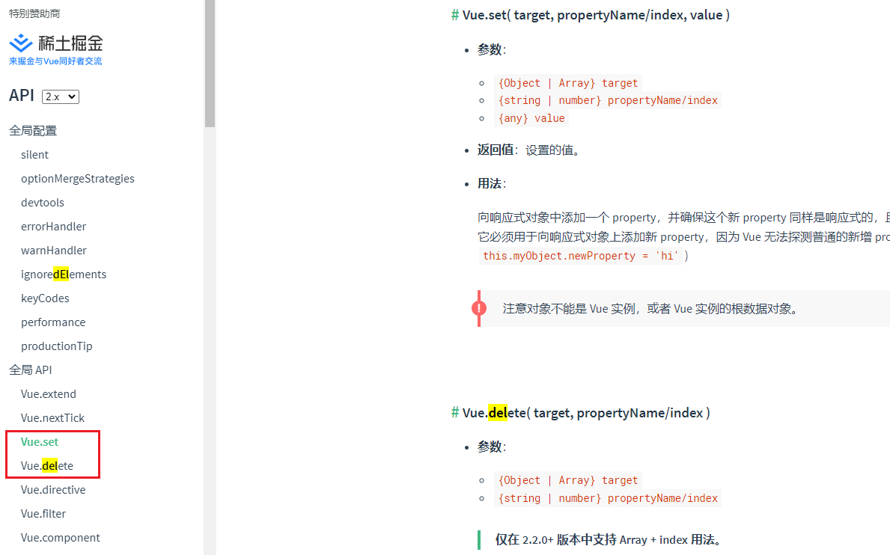


##### vue-demi 也支持命令行指令

```
npx vue-demi-switch
npx vue-demi-fix
```

### bin

```json
"bin": {
    "vue-demi-fix": "bin/vue-demi-fix.js",
    "vue-demi-switch": "bin/vue-demi-switch.js"
  }
```

[npm bin](https://docs.npmjs.com/cli/v8/configuring-npm/package-json#bin)

A lot of packages have one or more **executable files** that they'd like to **install into the PATH.** 

npm makes this pretty easy (in fact, it uses this feature to install the "npm" executable.)

npm让这变得非常容易（事实上，它使用这个功能来安装 "npm "可执行文件。）

To use this, supply a `bin` field in your package.json which is a map of command name to local file name. 

要使用这个功能，在你的package.json中提供一个 `bin` 字段，它是一个**命令名到本地文件名的映射**。

```json
// e.g.
"bin": {
    "vue-demi-fix": "bin/vue-demi-fix.js",
    "vue-demi-switch": "bin/vue-demi-switch.js"
  }
```


When this package is installed globally, that file will be **linked where global bins** go so it is available to **run by name**. 

当这个包被全局安装时，该文件将**被链接到全局bin**的位置，所以它可以**通过名字运行**。

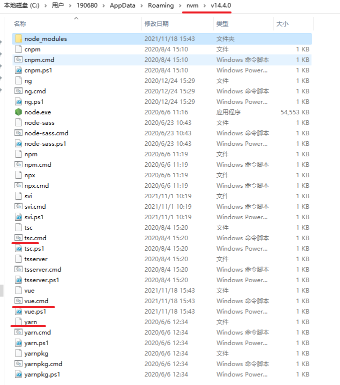

When this package is installed as a **dependency** in another package, the file will be **linked where it will be available to that package** either directly by `npm exec` or **by name in other scripts** when **invoking** them via `npm run-script`.

当这个软件包作为一个依赖项安装在另一个软件包中时，该文件将**被链接到该软件包**中，可以直接**通过npm exec或通过npm run-script调用其他脚本的名称**来使用。

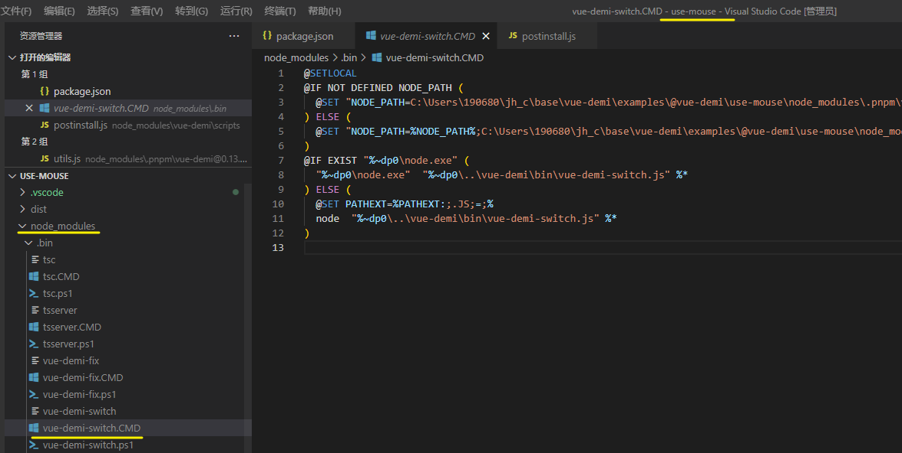

For example, <u>myapp</u> could have this:

```json
{
  "bin": {
    "myapp": "./cli.js"
  }
}
```

So, when you **install** <u>myapp</u>, it'll create a **symlink** <u>from</u> the `cli.js` script <u>to</u> `/usr/local/bin/myapp`.

If you have a single executable, and its name should be the name of the package, then you can just supply it as a string. For example:

```json
{
  "name": "my-program",
  "version": "1.2.5",
  "bin": "./path/to/program"
}
```

would be the same as this:

```json
{
  "name": "my-program",
  "version": "1.2.5",
  "bin": {
    "my-program": "./path/to/program"
  }
}
```

Please make sure that your file(s) referenced in `bin` starts with `#!/usr/bin/env node`, otherwise the scripts are started without the node executable!

确保你在 "bin "中引用的文件以 "#!/usr/bin/env node "开头，否则脚本启动时没有node可执行文件

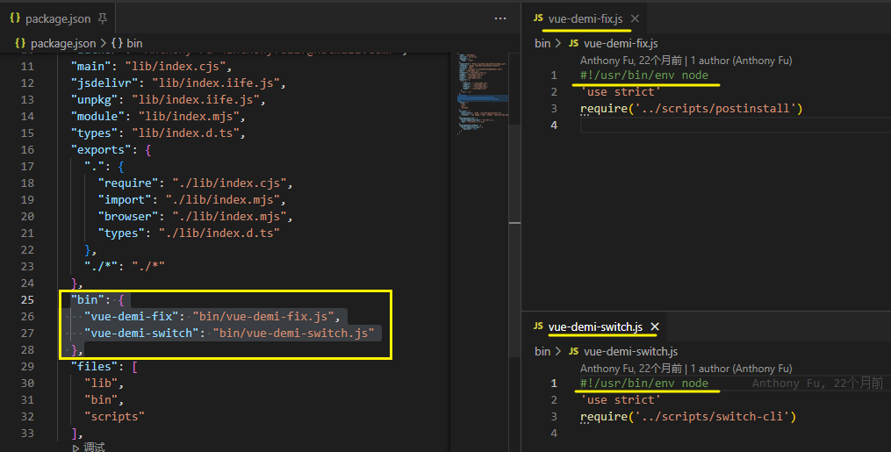

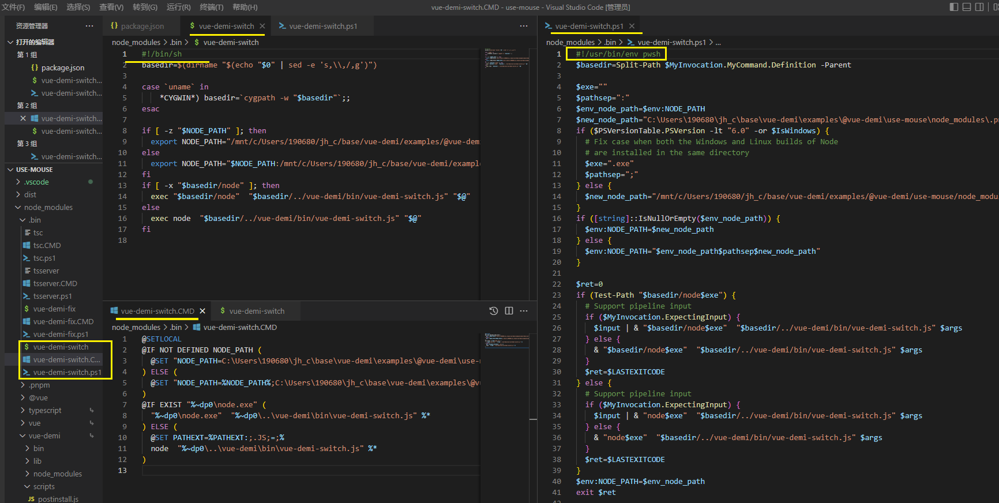

不确定实际情况是怎么样的...

`bin` 链接包中的脚本文件, 脚本文件需要指定环境 `\#!/usr/bin/env node`

install 之后会把这些 `bin` 转换成 `./node_modules/.bin` 下的可执行文件, **文件不再是可以看懂的 js 内容**, 并且适配不同的系统 (windows: `.cmd`, unix: `无后缀`, powershll: `pssw`)

bin字段不是在自己项目的package.json文件里面，而是在库的源代码中的package.json里面，用于在安装时**创建软链指向bin中的地址**

转换过程不需要过度关注, 可关注库中的 脚本文件 ( .js 文件)


执行bin **可执行文件**, 运行 node.js 脚本..?


#### [npm Docs Executables](https://docs.npmjs.com/cli/v8/configuring-npm/folders#executables)

When in **global** mode, executables are linked into `{prefix}/bin` on Unix, or directly into `{prefix}` on Windows. Ensure that path is in your **terminal's** `PATH` environment to run them.

在**全局**模式下，可执行文件在Unix下被链接到`{prefix}/bin`，在Windows下直接链接到`{prefix}`。确保该路径在**终端**的`PATH`环境中，以便运行它们。

When in **local** mode, executables are linked into `./node_modules/.bin` so that they can be made available to scripts run through npm. (For example, so that a test runner will be in the path when you run `npm test`.)

在本地模式下，**可执行文件被链接**到`./node_modules/.bin`中，这样它们就可以被**通过npm运行的脚本**使用。(例如，当你运行`npm test`时，测试运行器会在路径中。)

#### 符合实际工作流程的理解

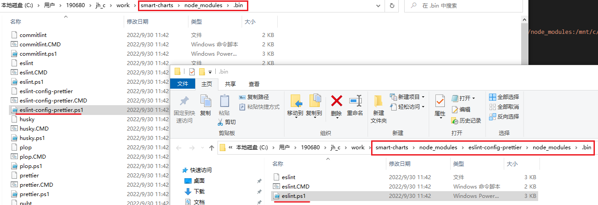

### npm run 

[npm scripts 使用指南](http://ruanyifeng.com/blog/2016/10/npm_scripts.html)

每当执行`npm run`，就会自动**新建一个 Shell**，在这个 Shell 里面执行指定的脚本命令。

只要是 Shell（一般是 Bash）可以运行的命令，就可以写在 npm 脚本里面。

**比较特别的是，`npm run`新建的这个 Shell，会将当前目录的`node_modules/.bin`子目录加入`PATH`变量，执行结束后，再将`PATH`变量恢复原样**。

在node_modules/.bin/里面的脚本，其实都做了**软链接**到对应的module里。比如

\# ls -al

lrwxr-xr-x 1 xxxx staff 19 Jun 3 17:02 babel -> ../babel-cli/bin/babel.js

这样执行时才会执行对应模块里的脚本。


这意味着，当前目录的`node_modules/.bin`子目录里面的所有脚本，都可以直接用脚本名调用，而不必加上路径。

比如，当前项目的依赖里面有 Mocha，只要直接写`mocha test`就可以了。

> ```javascript
> "test": "mocha test"
> ```

而不用写成下面这样。

> ```javascript
> "test": "./node_modules/.bin/mocha test"
> ```


### dayjs Moment.js

2kb			16.7kb min gz 
