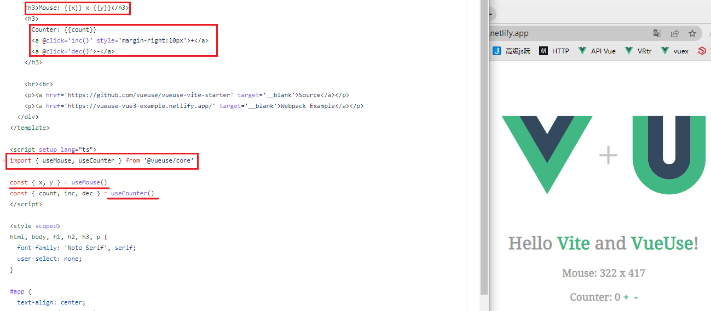
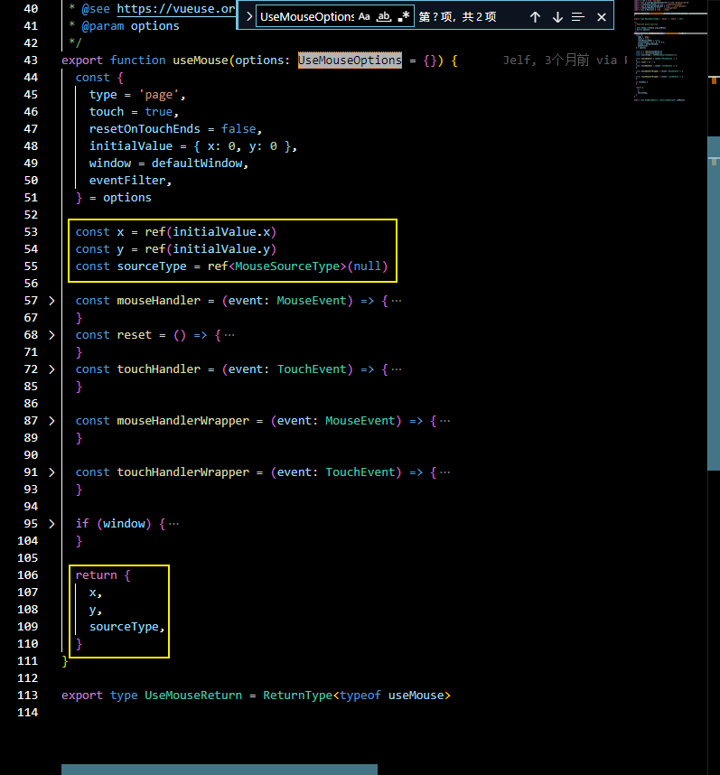
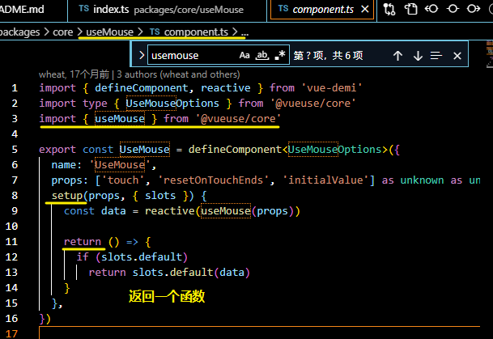
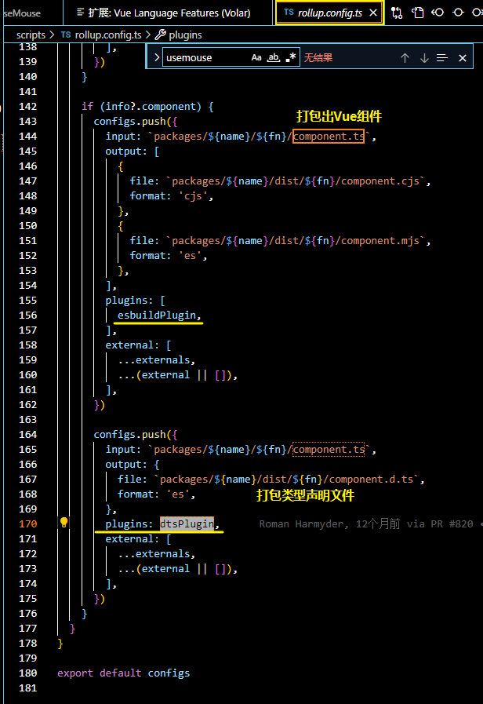
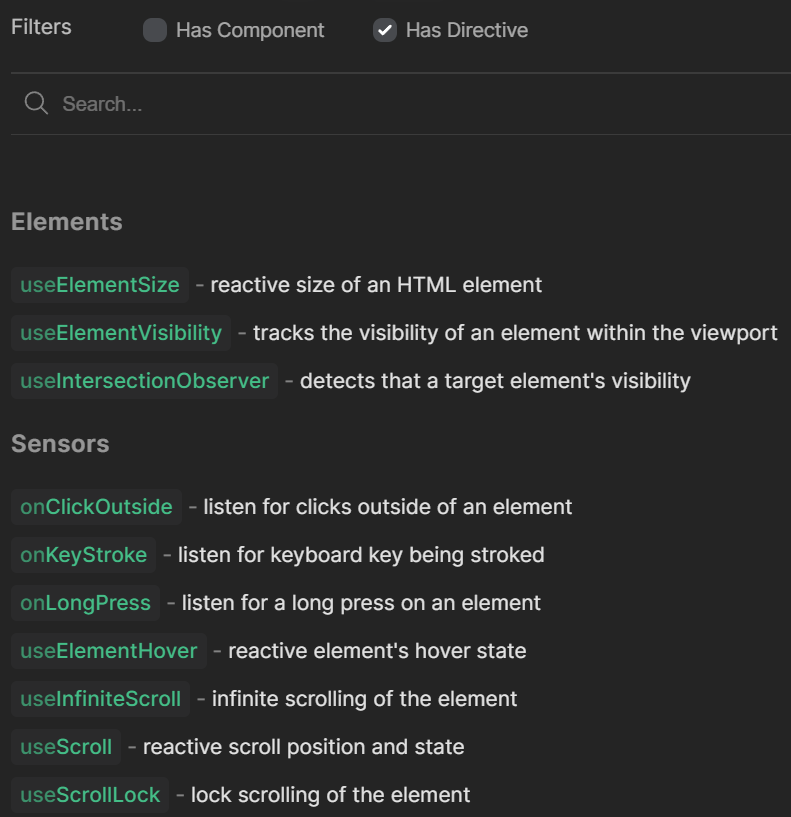
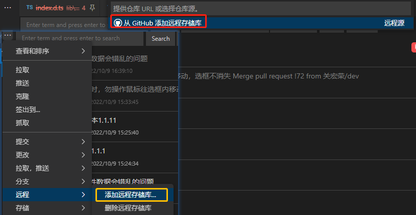
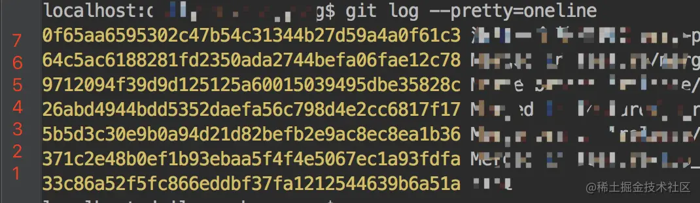

[toc]

### VueUse

组织: organizations https://github.com/vueuse

 [**Interactive docs & demos**](https://vueuse.org/)

VueUse is a collection of utility functions based on [Composition API](https://v3.vuejs.org/guide/composition-api-introduction.html). 

vueuse里面全是比较实用的方法，抽离成hooks

基础示例 [useMouse](https://vueuse.org/core/useMouse/): 



- 从@vueuse/core导入hook
- 执行hook, 并解构其返回值 (获得响应式返回值)

## [Type Declarations](https://vueuse.org/core/useMouse/#type-declarations)

查看hook接收的参数

```ts
export interface UseMouseOptions extends ConfigurableWindow,ConfigurableEventFilter {
  type?: "page" | "client"
  touch?: boolean
  resetOnTouchEnds?: boolean
  initialValue?: Position
}
// 返回类型: 响应式数据
export declare type MouseSourceType = "mouse" | "touch" | null
export declare function useMouse(options?: UseMouseOptions): {
  x: Ref<number>
  y: Ref<number>
  sourceType: Ref<MouseSourceType>
}
export declare type UseMouseReturn = ReturnType<typeof useMouse>
```



## Source[#](https://vueuse.org/core/useMouse/#source)

[Source](https://github.com/vueuse/vueuse/blob/main/packages/core/useMouse/index.ts) • [Demo](https://github.com/vueuse/vueuse/blob/main/packages/core/useMouse/demo.vue) • [Docs](https://github.com/vueuse/vueuse/blob/main/packages/core/useMouse/index.md)

可以分别查看源码, demo 和 文档(内部的index.md, 而不是 vitepress 基于 ts 注释生成的文档)


还可以当组件用, 真是没有想到,  看源码是 基于 hook 封装了一层 render



但是接收的prop与hook的参数不同 这里是接受3个参数了

This function also provides a renderless component version via the `@vueuse/components` package.

> #### [components](https://vueuse.org/guide/components.html)
>
> In v5.0, we introduced a new package, `@vueuse/components` providing **renderless component** versions of composable functions.

同名组件和hook, 引入时需要区分, 另写别名

- import { onClickOutside } from '@vueuse/core'
- import { OnClickOutside } from '@vueuse/components'

使用组件时需要安装 componets

`$ npm i @vueuse/core @vueuse/components`

```html
<UseMouse v-slot="{ x, y }">
  x: {{ x }}
  y: {{ y }}
</UseMouse>
```

#### renderless component


rollup 打包配置导出组件包




## VueUse Function Category

- State
- Elements
- Brower
- Sensors
- Network
- Animation
- Component
- Watch
- Reactivity
- Array
- Time
- Utilities
- @...
- @Sound
  - useSound 播放MP3音频 [demo](https://sound.vueuse.org/#hover)

#### 指令 

部分hook提供了指令




### 如何方便的同步 go-view 的代码

添加远程仓库, 两种方式

- git 命令

  添加原作者项目的 remote 地址， 然后将代码 fetch 过来 
  git remote add sri https://github.com/kraih/mojo 
  **git fetch sri** 
  ‘sri’相当于一个**别名** 
  查看本地项目目录： git remote -v 

- vscode 

  

  设置别名

  `git fetch <name>`之后, 可以基于远程的分支创建新的本地分支


### cherry pick

文档: https://git-scm.com/docs/git-cherry-pick

#### SYNOPSIS

```sh
git cherry-pick [--edit] [-n] [-m <parent-number>] [-s] [-x] [--ff]
		  [-S[<keyid>]] <commit>…
git cherry-pick (--continue | --skip | --abort | --quit)
```

Given one or more existing commits, apply the change each one introduces, recording a new commit for each. This requires your working tree to be clean (no modifications from the HEAD commit).

给出一个或多个现有的提交，应用每个提交所带来的变化，为每个提交记录一个新的提交。这需要您的工作树是干净的（没有对 HEAD 提交的修改）。

往期记录: [#](../_202209/~20220902.md)

`git cherry pick<commit>`…

三个点 [Dotted Range Notations](https://git-scm.com/docs/gitrevisions#_dotted_range_notations)

The *...* (three-dot) Symmetric Difference Notation

A similar notation *r1...r2* is called symmetric difference of *r1* and *r2* and is defined as *r1 r2 --not $(git merge-base --all r1 r2)*. It is the set of commits that are reachable from either one of *r1* (left side) or *r2* (right side) but not from both.

...（三点式）对称差分符号
类似的符号r1...r2被称为r1和r2的对称差，定义为r1 r2 --not $(git merge-base --all r1 r2) 。它是可以从r1（左侧）或r2（右侧）中的任何一个到达的提交的集合，但不能从两个都到达。

#### 高级用法

1. 增加 -x 参数，表示保留原提交的作者信息进行提交。

```sh
git cherry-pick -x <commit_id>
```

2. 增加 -x 参数 -e

   -e  --edit
   
   With this option, *git cherry-pick* will let you **edit** the **commit message** prior to committing.

3. 将一个连续的时间序列内的 commit ，设定一个开始和结束的 commit ，进行 cherry-pick 操作。

   ```sh
   git cherry-pick <start-commit-id>…<end-commit-id>
   ```

   它的范围就是 start-commit-id 到 end-commit-id 之间所有的 commit，但是它这是一个 (左开，右闭] 的区间，也就是说，它将不会包含 start-commit-id 的 commit。

   如果想要包含 start-commit-id 的话，就需要使用 ^ 标记一下，就会变成一个 [左闭，右闭] 的区间，具体命令如下。

   ```sh
   git cherry-pick <start-commit-id>^...<end-commit-id>
   ```

   

   git 命令中，对于 commit-id 的操作，都只需要使用前五位就可以了。

   ```
   git cherry-pick 371c2…971209 // (2,5]
   git cherry-pick 371c2^…971209 // [2,5]
   ```

#### SEQUENCER SUBCOMMANDS

- --continue

  Continue the operation in progress using the information in `.git/sequencer`. Can be used to continue after resolving conflicts in a failed cherry-pick or revert. 

  冲突后继续

- --skip

  Skip the current commit and continue with the rest of the sequence.

- --quit

  Forget about the current operation in progress. Can be used to clear the sequencer state after a failed cherry-pick or revert.

  忘记当前正在进行的操作。可以用来在cherry-pick或revert失败后清除顺序器的状态。

- --abort

  Cancel the operation and return to the pre-sequence state.


cherry-pick 提交后的信息会保留原提交的 (包括时间和提交作者)

可以重置

使用amend命令修改commit信息（注： amend命令只会修改最后一次commit的信息，之前的commit需要使用rebase）

`$ git commit --amend --reset-author`
