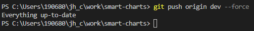

[toc]

# [VitePress](https://vitepress.vuejs.org/) 

Vite & Vue Powered Static Site Generator

Simple, powerful, and performant. Meet the modern SSG framework you've always wanted.

# What is VitePress?[#](https://vitepress.vuejs.org/guide/what-is-vitepress#what-is-vitepress)

VitePress is [VuePress](https://vuepress.vuejs.org/)' little brother, built on top of [Vite](https://vitejs.dev/).

VitePress Docs [config.ts](https://github.com/vuejs/vitepress/blob/main/docs/.vitepress/config.ts)


### 强推代码到另一个远程分支

强推到远程分支:  git push origin 分支名 --force



没有起作用, 似乎是推送到了本地分支关联的远程分支上, 这里代码是同步的..

我想推到另外一个远程分支. 完全不同的提交节点


如果你没有将分支名称作为 `git push` 命令的参数，则默认选择主分支。

如果要将更改推送到的分支不同，请指定它。否则，你可能会收到错误消息。

如果本地分支名称与远程分支名称不同，也可能会出现此问题。确保使用正确的名称。

```bash
git push origin local-branchname:remote-branchname
```

Done!


# Vitest

[Why Vitest | Guide | Vitest](https://cn.vitest.dev/guide/why.html)

cn: https://vitejs.cn/vitepress/ 版本不够新

> --Evan You [twitter](https://twitter.com/youyuxi/status/1618628437555695616) 2023年1月28日10:11:48
>
> Migrated Vue 3's entire test suite from Jest to Vitest in one day, 175 test files / 2647 test cases. A couple of small issues, but I found workarounds - 99% of test code remained exactly the same, and almost everything in Jest has an equivalent.
>
> 由翻译自 英语
>
> 一天内将 Vue 3 的整个测试套件从 Jest 迁移到 Vitest，175 个测试文件 / 2647 个测试用例。 有几个小问题，但我找到了解决方法——99% 的测试代码保持完全相同，而且 Jest 中几乎所有内容都有等效代码。
