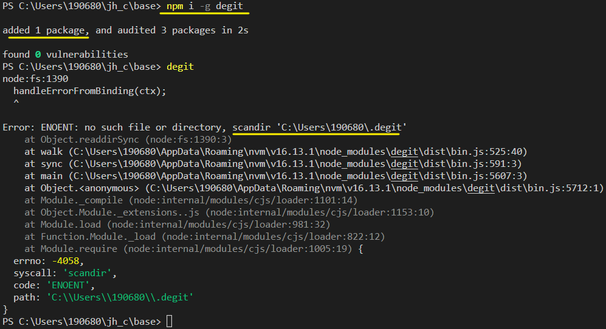
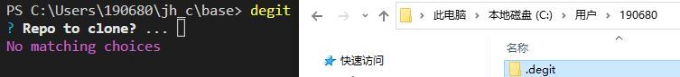
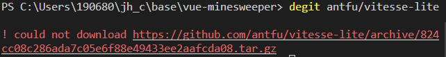
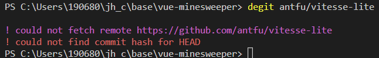
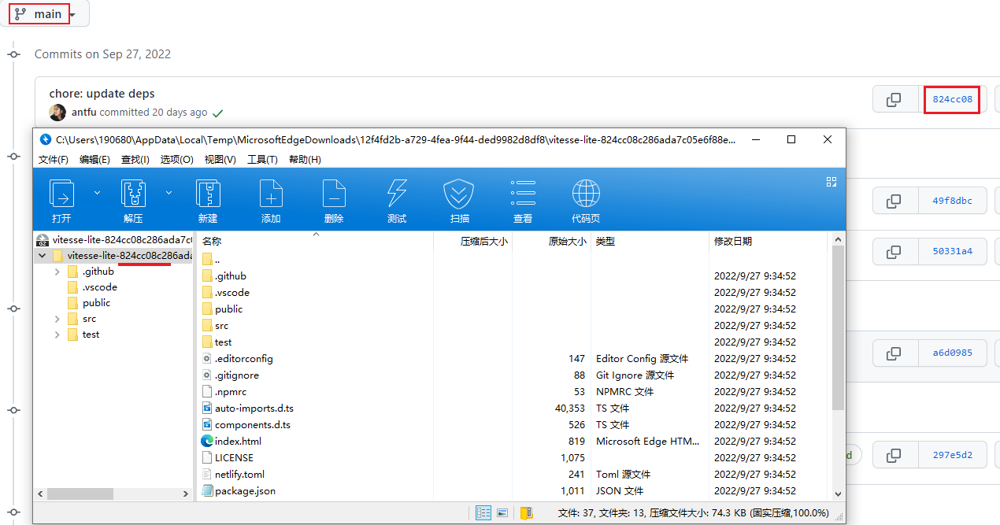

[TOC]

## degit

[Rich-Harris/degit: Straightforward project scaffolding (github.com)](https://github.com/Rich-Harris/degit)

Straightforward project scaffolding (直接的项目脚手架)

pnpm install degit -g 

> 手动添加一个文件夹不然报错(windows)





> usage
>
> ```sh
> degit user/repo
> 
> # these commands are equivalent
> degit github:user/repo
> degit git@github.com:user/repo
> degit https://github.com/user/repo
> ```


移除 git commit 信息 clone 一个仓库

find the latest commit on https://github.com/some-user/some-repo and download the associated tar file to `~/.degit/some-user/some-repo/commithash.tar.gz`

much quicker than using `git clone`, because you're not downloading the entire git history

> degit 会对 git 仓库进行复制。当你运行 degit something-user/some-repo 时，它会在 https://github.com/some-user/some-repo 上找到最新的提交，并下载相关的 tar 文件到 ~/.degit/some-user/some-repo/commithash.tar.gz，如果它不存在于本地的话。(这比使用 git clone 要快得多，因为你不是在下载整个 git 历史。）

`mkdir vue-minesweeper`  && `cd vue-minesweeper`

`degit antfu/vitesse-lite`

 (受限于网络环境, degit也不怎么快)


在git bash 里执行`degit antfu/vitesse-lite` 倒是很快的

这个链接可以直接在浏览器打开并下载, 下载的内容是main分支最近一次commit的内容 (没有 .git )




#### Question: How is that different from using "--depth 1" [#](https://github.com/Rich-Harris/degit/issues/7)

> using `git clone --depth 1` which will cause getting only the last commit
>
> And for the branches I believe git has a solution for that too using `git clone -b  `

A: A few differences:

- If you `git clone`, you get a `.git` folder that pertains to the project template, rather than your project. 

  You can easily forget to re-init the repository, and end up confusing yourself

- Caching (if you already have a `.tar.gz` file for a specific commit, you don't need to fetch it again)

- Less to type (`degit user/repo` instead of `git clone --depth 1 git@github.com:user/repo`)

- Future capabilities — [interactive mode #4](https://github.com/Rich-Harris/degit/issues/4), [friendly onboarding and postinstall scripts #6](https://github.com/Rich-Harris/degit/issues/6)

> 如果你用git克隆，你会得到一个与项目模板有关的.git文件夹，而不是你的项目。你很容易忘记重新启动版本库，最后把自己搞糊涂了。
>
> 缓存（如果你已经有一个 特定提交 的.tar.gz文件，你就不需要再去取它了）
>
> 更少的输入（用degit user/repo代替git clone --depth 1 git@github.com:user/repo）。
>
> 未来的能力 - 互动模式，友好的onboarding和安装后脚本


# eslint + prettier 

debuff WHEN mix two styles format

## 替代方案[#](https://antfu.me/posts/why-not-prettier-zh#替代方案)

在我的工作流中，ESLint 对确保代码质量来说不可或缺。如果 ESLint 已经能够进行代码格式化，那么对我来说最好的解决方案就是一次性都由它处理。

从结果来看，使用 ESLint 其实也可以非常简单：

```sh
npm i -D @antfu/eslint-config 
// .eslintrc {  "extends": "@antfu" } 
```

这样就可以了。


# starter template

## [Vitesse](https://github.com/antfu/vitesse)

快速地*Vitesse* 创建 Web 应用

预配置了一些库or插件

### UI 框架

- [UnoCSS](https://github.com/antfu/unocss) - 高性能且极具灵活性的即时原子化 CSS 引擎

### Icons

- [Iconify](https://iconify.design/) - 使用任意的图标集，浏览：[🔍Icônes](https://icones.netlify.app/)
- [UnoCSS 的纯 CSS 图标方案](https://github.com/antfu/unocss/tree/main/packages/preset-icons)

### 插件

- Vue Router

  - [`vite-plugin-pages`](https://github.com/hannoeru/vite-plugin-pages) - 以文件系统为基础的路由
  - [`vite-plugin-vue-layouts`](https://github.com/JohnCampionJr/vite-plugin-vue-layouts) - 页面布局系统

- [Pinia](https://pinia.vuejs.org/) - 直接的, 类型安全的, 使用 Composition api 的轻便灵活的 Vue 状态管理

- [`unplugin-vue-components`](https://github.com/antfu/unplugin-vue-components) - 自动加载组件

- [`unplugin-auto-import`](https://github.com/antfu/unplugin-auto-import) - 直接使用 Composition API 等，无需导入

- [`vite-plugin-pwa`](https://github.com/antfu/vite-plugin-pwa) - PWA

- `vite-plugin-vue-markdown`

   

  \- Markdown 作为组件，也可以让组件在 Markdown 中使用

  - [`markdown-it-prism`](https://github.com/jGleitz/markdown-it-prism) - [Prism](https://prismjs.com/) 的语法高亮
  - [`prism-theme-vars`](https://github.com/antfu/prism-theme-vars) - 利用 CSS 变量自定义 Prism.js 的主题

- Vue I18n

   

  \- 国际化

  - [`vite-plugin-vue-i18n`](https://github.com/intlify/bundle-tools/tree/main/packages/vite-plugin-vue-i18n) - Vue I18n 的 Vite 插件

- [VueUse](https://github.com/antfu/vueuse) - 实用的 Composition API 工具合集

- [`vite-ssg-sitemap`](https://github.com/jbaubree/vite-ssg-sitemap) - 站点地图生成器

- [`@vueuse/head`](https://github.com/vueuse/head) - 响应式地操作文档头信息

### 编码风格

- 使用 Composition API 地 [`` SFC 语法](https://github.com/vuejs/rfcs/pull/227)
- [ESLint](https://eslint.org/) 配置为 [@antfu/eslint-config](https://github.com/antfu/eslint-config), 单引号, 无分号.

### 开发工具

- [TypeScript](https://www.typescriptlang.org/)

- [Vitest](https://github.com/vitest-dev/vitest) - 基于 Vite 的单元测试框架

- [Cypress](https://cypress.io/) - E2E 测试

- [pnpm](https://pnpm.js.org/) - 快, 节省磁盘空间的包管理器

- `vite-ssg`

   

  \- 服务端生成

  - [critters](https://github.com/GoogleChromeLabs/critters) - 关键 CSS 生成器

- [Netlify](https://www.netlify.com/) - 零配置的部署

- VS Code 扩展

  - [Vite](https://marketplace.visualstudio.com/items?itemName=antfu.vite) - 自动启动 Vite 服务器
  - [Volar](https://marketplace.visualstudio.com/items?itemName=Vue.volar) - Vue 3 `` IDE 支持
  - [Iconify IntelliSense](https://marketplace.visualstudio.com/items?itemName=antfu.iconify) - 图标内联显示和自动补全
  - [i18n Ally](https://marketplace.visualstudio.com/items?itemName=lokalise.i18n-ally) - 多合一的 I18n 支持
  - [ESLint](https://marketplace.visualstudio.com/items?itemName=dbaeumer.vscode-eslint)


由于这个模板的业务场景非常的局限，下面提供了一个精心策划的列表，列出了社区维护的具有不同偏好和功能集的衍生项目。

- [vitesse-lite](https://github.com/antfu/vitesse-lite) - Vitesse 的轻量版本
- [vitesse-nuxt3](https://github.com/antfu/vitesse-nuxt3) - Vitesse 的 Nuxt 3 版本
- [vitesse-nuxt-bridge](https://github.com/antfu/vitesse-nuxt-bridge) - Vitesse 的 Nuxt2 桥接版本
- [vitesse-webext](https://github.com/antfu/vitesse-webext) - 开箱即用的浏览器扩展 vite 模板


### vitesse-lite 的 vite 关于自动导入配置

```ts
/// <reference types="vitest" />

import { defineConfig } from 'vite'
import Vue from '@vitejs/plugin-vue'
import Components from 'unplugin-vue-components/vite'
import AutoImport from 'unplugin-auto-import/vite'

export default defineConfig({
  // ...
  plugins: [
    Vue({
      reactivityTransform: true,
    }),

    // https://github.com/antfu/unplugin-auto-import
    AutoImport({
      imports: [
        'vue',
        'vue/macros',
        'vue-router',
        '@vueuse/core',
      ],
      dts: true,
      dirs: [
        './src/composables',
      ],
      vueTemplate: true,
    }),

    // https://github.com/antfu/vite-plugin-components
    Components({
      dts: true,
    }),
    // ...
  ],
})
```

- [`unplugin-auto-import`](https://github.com/antfu/unplugin-auto-import) - Directly use Vue Composition API and others without importing (直接使用Vue Composition API及其他，无需导入)
- [`unplugin-vue-components`](https://github.com/antfu/unplugin-vue-components) - components auto import

带来的效果:  不用手动引入组合式API + 不用引入组件


## unplugin-auto-import

Auto import APIs on-demand for Vite, Webpack, Rollup and esbuild. With TypeScript support. Powered by [unplugin](https://github.com/unjs/unplugin).

------

without

```
import { computed, ref } from 'vue'
const count = ref(0)
const doubled = computed(() => count.value * 2)
```

with

```
const count = ref(0)
const doubled = computed(() => count.value * 2)
```

------

without

```
import { useState } from 'react'
export function Counter() {
  const [count, setCount] = useState(0)
  return <div>{ count }</div>
}
```

with

```
export function Counter() {
  const [count, setCount] = useState(0)
  return <div>{ count }</div>
}
```

### Install & Usage [#](https://github.com/antfu/unplugin-auto-import#install)

```
npm i -D unplugin-auto-import
```

```
// vite.config.ts
import AutoImport from 'unplugin-auto-import/vite'

export default defineConfig({
  plugins: [
    AutoImport({ /* options */ }),
  ],
})
```

### [Configuration](https://github.com/antfu/unplugin-auto-import#install)


## unplugin-vue-components

On-demand(按需) components auto importing for Vue

### Install & Usage [#](https://github.com/antfu/unplugin-vue-components#installation)

```ts
// vite.config.ts
import Components from 'unplugin-vue-components/vite'

export default defineConfig({
  plugins: [
    Components({ /* options */ }),
  ],
})
```

Use components in templates as you would usually do, it will import components on demand, and there is no `import` and `component registration` required anymore! If you register the parent component asynchronously (or lazy route), the auto-imported components will be code-split along with their parent.

> 像平时一样在模板中使用组件，它将按需导入组件，而且不再需要`import'和`component registration`了! 
>
> 如果你异步注册父级组件（或懒惰路由），自动导入的组件将与它们的父级组件一起被代码拆分。

It will automatically turn this

```vue
<template>
  <div>
    <HelloWorld msg="Hello Vue 3.0 + Vite" />
  </div>
</template>

<script>
export default {
  name: 'App'
}
</script>
```

into this

```vue
<template>
  <div>
    <HelloWorld msg="Hello Vue 3.0 + Vite" />
  </div>
</template>

<script>
import HelloWorld from './src/components/HelloWorld.vue'

export default {
  name: 'App',
  components: {
    HelloWorld
  }
}
</script>
```

Note By default this plugin will import components in the `src/components` path. You can customize it using the `dirs` option.

注意 在默认情况下，该插件将导入src/components路径下的组件。你可以使用dirs选项来定制它。


# windi CSS

[windicss/windicss: Next generation utility-first CSS framework. (github.com)](https://github.com/windicss/windicss)

如果你已经熟悉了Tailwind CSS，可以把Windi CSS看作是Tailwind的一个需求替代品，它提供更快的加载时间，与Tailwind v2.0完全兼容 并有一堆额外的很酷的功能。

## Why Windi CSS

作者的一段话应该可以说明他创建Windi CSS的动机。

当我的项目变得更大，大约有几十个组件时，最初的编译时间达到了3s，而用Tailwind CSS的热更新时间超过了1s。- @voorjaar

通过扫描你的HTML和CSS并按需生成实用程序，Windi CSS能够在开发中提供更快的加载时间和快速的HMR，而且在生产中不需要清除。
