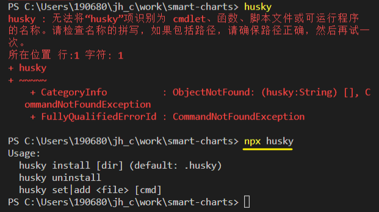
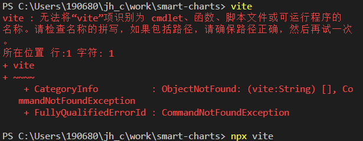

[TOC]

# antfu sponsors

My name is Anthony Fu, a fanatical open sourceror. Working at [NuxtLabs](https://nuxtlabs.com/).

**Creator** of [Slidev](https://github.com/slidevjs/slidev), [VueUse](https://github.com/vueuse/vueuse), [UnoCSS](https://github.com/antfu/unocss), [Vitesse](https://github.com/antfu/vitesse), [Type Challenges](https://github.com/type-challenges/type-challenges) and [a few others](https://antfu.me/projects).
Core team member of [Vue](https://vuejs.org/), [Nuxt](http://nuxtjs.org/) and [Vite](http://vitejs.dev/).
Team member of [Windi CSS](https://windicss.org/), [wenyan-lang 文言](https://wy-lang.org/) and [Intlify](https://github.com/intlify).

Dreaming up ideas and making them come true is where my passion lies. See [my project list here](https://antfu.me/projects).

A few highlights:

- [Vitest](https://github.com/vitest-dev/vitest) - A blazing fast unit-test framework powered by Vite
- [UnoCSS](https://github.com/antfu/unocss) - The instant on-demand atomic CSS engine
- [VueUse](https://github.com/antfu/vueuse) - Collection of essential Vue Composition Utilities for Vue 2 and 3
- [Vitesse](https://github.com/antfu/vitesse) - An opinionated Vite starter template and its plugins
- [unplugin](https://github.com/unjs/unplugin) - Unified plugin system for Vite, Rollup, and Webpack
- [Slidev](https://github.com/slidevjs/slidev) - Presentation Slides for Developers
- [Type Challenges](https://github.com/type-challenges/type-challenges) - Collection of challenges that helps you learn and master the TypeScript's type system
- [Icônes](https://github.com/antfu/icones) - Icon Explorer for any icon set with Instant searching


**Your sponsorship means a lot to me. It will help me sustain my projects actively and make more of my ideas come true. Much appreciated! 💖 🙏**

------

### My current focus:

- Help to improve [Nuxt 3](https://v3.nuxtjs.org/) and its ecosystem
- Bringing the exciting new features from Vue 3 (Composition API, , etc.) to Vue 2 ecosystem``
- Maintaining [Vite](https://github.com/vitejs/vite), [Vitesse](https://github.com/antfu/vitesse) and some plugins
- Maintaining and improving all [my projects](https://antfu.me/projects)
- New ideas from time to time 💡

### 🐣 [Sponsor Program](https://github.com/antfu-sponsors/hi)

**I have started a [Sponsor Program](https://github.com/antfu-sponsors/hi)**, for sponsors reaching certain tiers to have *early access* to my WIP works and may **participate with the discussions and decision making** in the early stage of those projects. Find more details in [this page](https://github.com/antfu-sponsors/hi).

> Joining this program requires a manual invitation from me, which usually takes around 24h for me to respond after you start sponsoring with the required tiers. If somehow I missed it, please send a DM to my [Twitter](https://twitter.com/antfu7) with your GitHub id. Thanks!

###### Upcoming

- [Zeitreise](https://twitter.com/antfu7/status/1504639906232307712) - Time traveling for the Web
- [reTypewriter](https://twitter.com/antfu7/status/1505236765447458817) - Automated typewriter for presentation


# 现有作品

**Creator** of [Slidev](https://github.com/slidevjs/slidev), [VueUse](https://github.com/vueuse/vueuse), [UnoCSS](https://github.com/antfu/unocss), [Vitesse](https://github.com/antfu/vitesse), [Type Challenges](https://github.com/type-challenges/type-challenges) and [a few others](https://antfu.me/projects).

### Slidev

[#](../_202204/~20220420.md)

[Slidev](https://cn.sli.dev/)


### retypewriter

[antfu/retypewriter: Replay the steps of your changes at ease. (github.com)](https://github.com/antfu/retypewriter)


# npx 

[npx | npm Docs (npmjs.com)](https://docs.npmjs.com/cli/v7/commands/npx)

Run a command from a local or remote npm package

[npx - npm (npmjs.com)](https://www.npmjs.com/package/npx)

可以直接执行 package.json 的scripts中使用的命令





**npx 想要解决的主要问题，就是调用项目内部安装的模块。**

[npx 使用教程 - 阮一峰的网络日志 (ruanyifeng.com)](https://www.ruanyifeng.com/blog/2019/02/npx.html)

比如，项目内部安装了测试工具 [Mocha](https://www.ruanyifeng.com/blog/2015/12/a-mocha-tutorial-of-examples.html)。

> ```bash
> $ npm install -D mocha
> ```

一般来说，调用 Mocha ，只能在项目脚本和 package.json 的[`scripts`](https://www.ruanyifeng.com/blog/2016/10/npm_scripts.html)字段里面， 如果想在命令行下调用，必须像下面这样。

> ```bash
> # 项目的根目录下执行
> $ node-modules/.bin/mocha --version
> ```

npx 就是想解决这个问题，**让项目内部安装的模块用起来更方便**，只要像下面这样调用就行了。

```bash
$ npx mocha --version
```

npx 的原理很简单，就是运行的时候，会到`node_modules/.bin`路径和环境变量`$PATH`里面，**检查命令是否存在**。


**npx 还能避免全局安装的模块。**

`create-react-app`这个模块是**全局安装**，**npx 可以运行它，而且不进行全局安装**。

> ```bash
> $ npx create-react-app my-react-app
> ```

上面代码运行时，npx 将`create-react-app`下载到一个临时目录，使用以后再删除。所以，以后再次执行上面的命令，会重新下载`create-react-app`。

注意，只要 npx 后面的模块无法在本地发现，就会下载同名模块。


利用 npx 可以下载模块这个特点，可以指定某个版本的 Node 运行脚本。它的窍门就是使用 npm 的 [node 模块](https://www.npmjs.com/package/node)。

> ```bash
> $ npx node@0.12.8 -v
> v0.12.8
> ```

上面命令会使用 0.12.8 版本的 Node 执行脚本。原理是从 npm 下载这个版本的 node，使用后再删掉。

某些场景下，这个方法**用来切换 Node 版本**，要比 nvm 那样的版本管理器方便一些。


### [ViteConf](https://viteconf.org/)

Oct 11-12

录像呢?


### [DNS 查询原理详解 - 阮一峰的网络日志 (ruanyifeng.com)](https://www.ruanyifeng.com/blog/2022/08/dns-query.html)
