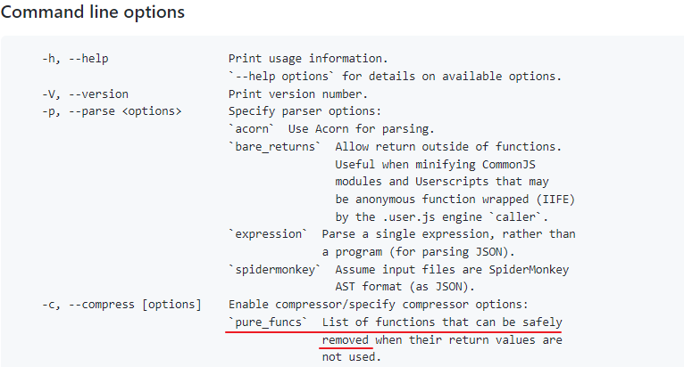

### /* #__PURE__ */

[terser/terser: 🗜 JavaScript parser, mangler and compressor toolkit for ES6+ (github.com)](https://github.com/terser/terser)


是给terser使用的

其中terser认可的行内注释一般有3种：

```js
/*@__INLINE__*/ - forces a function to be inlined somewhere.
/*@__NOINLINE__*/ - Makes sure the called function is not inlined into the call site.
/*@__PURE__*/ - Marks a function call as pure. That means, it can safely be dropped.
```

可以把@换成#。
inline表示内联，会强制把标记的函数里依赖的函数内敛在里面。
而noinline则相反，不会把函数拆成内容内联进函数体内。
最后的pure则是用的最多的。会告诉编辑器，如果没用到这玩意，可以放心删了。

